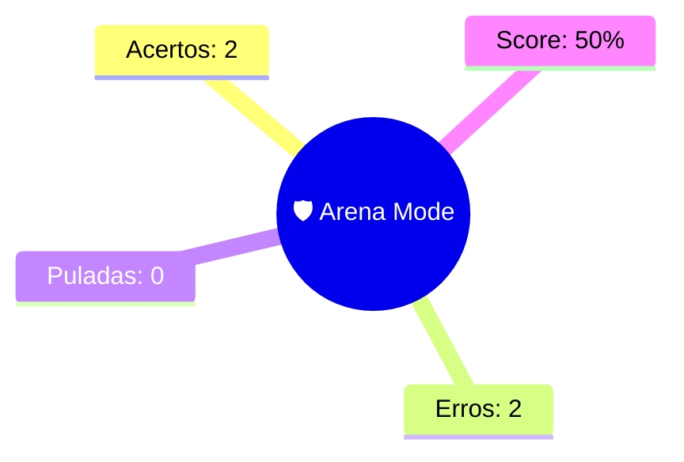

--- 
status: #revisao_arena 
topico: [[Arena Mode]] 
data: 01-07-2026
---

> [!abstract] 🛡️ Relatório de Batalha: [[Arena Mode]]
> Hierarquia de enunciado preservada. #vavilov_engine

> [!danger] Questão 1 | PONTO DE ATENÇÃO
> **ENUNCIADO:**
> São fundamentos jurídicos apontados para a responsabilidade pela perda do tempo produtivo do consumidor, EXCETO:
> 
> **SUA RESPOSTA:** Nenhuma das alternativas anteriores, pois A, B e C representam corretamente fundamentos citados na aula.
> **GABARITO:** [[a cláusula geral de dano injusto (art. 927 do Código Civil).]]
> 
> --- 
> **Conceitos:** [[Direito do Consumidor]] | [[Responsabilidade civil pelo fato do serviço]] | 🎯 6a458406f51fd816e336ee6f

> [!success] Questão 2 | DOMINADO
> **ENUNCIADO:**
> A responsabilidade civil pela perda do tempo produtivo do consumidor pode ser definida como a assunção, pelo consumidor, de:
> 
> **SUA RESPOSTA:** deveres e custos operacionais para a solução de falha na prestação do serviço, que o desviam de suas atividades diárias.
> 
> --- 
> **Conceitos:** [[Direito do Consumidor]] | [[Responsabilidade civil pelo fato do serviço]] | 🎯 6a458406f51fd816e336ee6e

> [!success] Questão 3 | DOMINADO
> **ENUNCIADO:**
> No julgamento do REsp 1.737.412/SE (STJ, j. 05/02/2019), envolvendo espera excessiva em fila de instituição financeira, o STJ reconheceu a configuração de:
> 
> **SUA RESPOSTA:** dano moral coletivo, relacionado à integridade psico-física da coletividade, bem de natureza transindividual, permitindo a aplicação da teoria do desvio produtivo do consumidor sob a vertente coletiva.
> 
> --- 
> **Conceitos:** [[Direito do Consumidor]] | [[Responsabilidade civil pelo fato do serviço]] | 🎯 6a458406f51fd816e336ee71

> [!danger] Questão 4 | PONTO DE ATENÇÃO
> **ENUNCIADO:**
> Segundo a doutrina de Marcos Dessaune, adotada pelo STJ, a perda do tempo produtivo do consumidor é classificada como:
> 
> **SUA RESPOSTA:** um novo tipo de dano - o desvio produtivo do consumidor.
> **GABARITO:** [[dano exclusivamente patrimonial, apurável por perícia contábil.]]
> 
> --- 
> **Conceitos:** [[Direito do Consumidor]] | [[Responsabilidade civil pelo fato do serviço]] | 🎯 6a458406f51fd816e336ee70

---
### 🧠 Mapa Mental
