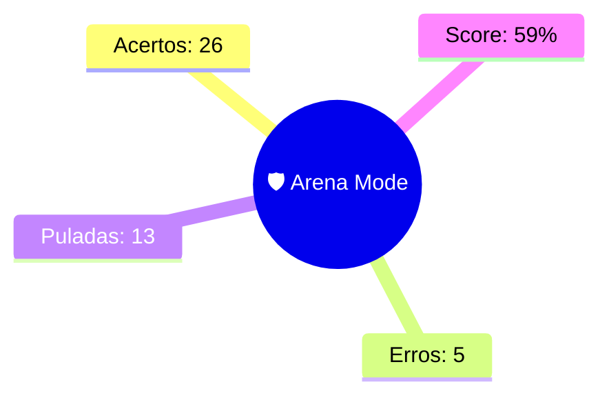

--- 
status: #revisao_arena 
topico: [[Arena Mode]] 
data: 08-07-2026
---

> [!abstract] 🛡️ Relatório de Batalha: [[Arena Mode]]
> Hierarquia de enunciado preservada. #vavilov_engine

> [!success] Questão 1 | DOMINADO
> **ENUNCIADO:**
> O poder normativo da Administração Pública caracteriza-se pela edição de atos gerais e abstratos. A característica que define especificamente o ato normativo como "abstrato" é o fato de:
> 
> **SUA RESPOSTA:** produzir efeitos em várias circunstâncias sucessivas, regulando situações futuras de forma contínua.
> 
> --- 
> **Conceitos:** [[DIREITO ADMINISTRATIVO]] | [[Poder Normativo/Reculamentar e Poder Hierárquico]] | 🎯 6a47cc7c02f87960ff6059fc

> [!success] Questão 2 | DOMINADO
> **ENUNCIADO:**
> > [!abstract] Contexto:
> > Processo Administrativo (Lei nº 9.784/1999)
> 
> **ITEM:**
> A Lei nº 9.784/1999 regula o processo administrativo no âmbito federal. Com base em suas disposições gerais, assinale a alternativa compatível com a norma:
> 
> **SUA RESPOSTA:** Nos processos administrativos, aplica-se a referida Lei de forma subsidiária e supletiva apenas se não houver lei específica dispondo sobre o tema (como a Lei nº 8.112/1990 para os processos disciplinares).
> 
> --- 
> **Conceitos:** [[DIREITO ADMINISTRATIVO]] | [[Atos Normativos]] | 🎯 6a4ee38abebc013aa9256a6f

> [!neutral] Questão 3 | EM BRANCO
> **ENUNCIADO:**
> A atuação do Estado no controle social divide-se em Polícia Administrativa e Polícia Judiciária. A distinção clássica entre essas duas manifestações de polícia baseia-se primordialmente na área de incidência e no caráter da atuação. Nesse contexto, a Polícia Administrativa:
> 
> **SUA RESPOSTA:** Pulei
> 
> --- 
> **Conceitos:** [[DIREITO ADMINISTRATIVO]] | [[Polícia Administrativa X Polícia Judiciária]] | 🎯 6a47ce5a02f87960ff605a00

> [!success] Questão 4 | DOMINADO
> **ENUNCIADO:**
> Ao se analisar a prerrogativa da Administração Pública de condicionar o uso e o gozo de bens em benefício da coletividade, nota-se características específicas. Discricionariedade, autoexecutoriedade e coercibilidade são atributos do poder: [cite: 1]
> 
> **SUA RESPOSTA:** de polícia.
> 
> --- 
> **Conceitos:** [[DIREITO ADMINISTRATIVO]] | [[Poderes em Espécie]] | 🎯 6a47cb3d02f87960ff6059f8

> [!danger] Questão 5 | PONTO DE ATENÇÃO
> **ENUNCIADO:**
> | #resposta #questão #direito_administrativo #poderes_administrativos *[[]]* *[[2022]]* *[[Procurador]]* **ENUNCIADO:** O abuso de poder pode se manifestar tanto por condutas comissivas quanto omissivas. A inércia da autoridade pública competente em anular um ato administrativo eivado de vício insanável, após devidamente provocada, configura:
> 
> **SUA RESPOSTA:** undefined
> **GABARITO:** [[Abuso de poder na modalidade omissiva.]]
> 
> --- 
> **Conceitos:** [[DIREITO ADMINISTRATIVO]] | [[Poderes Administrativos]] | 🎯 6a47c70102f87960ff6059ef

> [!success] Questão 6 | DOMINADO
> **ENUNCIADO:**
> O instituto da delegação de competência é crucial para a dinâmica administrativa e desconcentração de funções. Sobre a competência (sujeito), assinale a correta:
> 
> **SUA RESPOSTA:** A competência administrativa é de exercício irrenunciável, mas admite delegação parcial, exceto para a edição de atos normativos, decisão de recursos administrativos e matérias de competência exclusiva.
> 
> --- 
> **Conceitos:** [[DIREITO ADMINISTRATIVO]] | [[Requisitos/elementos]] | 🎯 6a4ee107bebc013aa9256a5f

> [!success] Questão 7 | DOMINADO
> **ENUNCIADO:**
> A doutrina aponta que os agentes públicos estão submetidos a deveres fundamentais no exercício de suas funções. O dever de buscar a maior efetividade possível na atuação estatal, com o menor gasto de recursos públicos, corresponde diretamente ao:
> 
> **SUA RESPOSTA:** Dever de Eficiência.
> 
> --- 
> **Conceitos:** [[DIREITO ADMINISTRATIVO]] | [[Poderes Administrativos]] | 🎯 6a47cf2c02f87960ff605a03

> [!success] Questão 8 | DOMINADO
> **ENUNCIADO:**
> O exercício do poder de polícia desdobra-se em fases que compõem o chamado "ciclo de polícia". A fase do ciclo que consiste na anuência prévia da Administração para que o particular exerça determinada atividade, como a emissão de uma Carteira Nacional de Habilitação (CNH), é denominada:
> 
> **SUA RESPOSTA:** Consentimento de polícia.
> 
> --- 
> **Conceitos:** [[DIREITO ADMINISTRATIVO]] | [[Ciclo de Polícia e Deveres]] | 🎯 6a47cea102f87960ff605a01

> [!success] Questão 9 | DOMINADO
> **ENUNCIADO:**
> Jonas, oficial de justiça, encaminhava-se à sede da Comarca Alfa com o objetivo de iniciar as atividades no plantão judiciário. Contudo, durante o trajeto, determinado agente de trânsito, constatando que Jonas realizou ultrapassagem em local proibido, acabou por multá-lo. Registre-se que a multa aplicada pelo agente de trânsito não teve qualquer relação com as funções públicas desempenhadas por Jonas. Nesse cenário, considerando os entendimentos doutrinário e jurisprudencial dominantes, a atuação do agente de trânsito é uma manifestação do poder: [cite: 1]
> 
> **SUA RESPOSTA:** de polícia.
> 
> --- 
> **Conceitos:** [[DIREITO ADMINISTRATIVO]] | [[Poderes em Espécie]] | 🎯 6a47cb3d02f87960ff6059f6

> [!success] Questão 10 | DOMINADO
> **ENUNCIADO:**
> O juízo de conveniência e oportunidade pelo administrador público decorre do exercício do poder: [cite: 1]
> 
> **SUA RESPOSTA:** discricionário.
> 
> --- 
> **Conceitos:** [[DIREITO ADMINISTRATIVO]] | [[Poderes em Espécie]] | 🎯 6a47cb3d02f87960ff6059f5

> [!success] Questão 11 | DOMINADO
> **ENUNCIADO:**
> Um Secretário de Estado decide delegar ao seu Secretário-Executivo Adjunto a competência para a edição de atos de caráter normativo essenciais ao detalhamento das regras internas da pasta. Nos termos do art. 13 da Lei nº 9.784/1999 (Processo Administrativo Federal), tal delegação de competência é:
> 
> **SUA RESPOSTA:** Inválida, pois a edição de atos de caráter normativo não pode ser objeto de delegação.
> 
> --- 
> **Conceitos:** [[DIREITO ADMINISTRATIVO]] | [[Poder Normativo/Reculamentar e Poder Hierárquico]] | 🎯 6a47cc7c02f87960ff6059fb

> [!danger] Questão 12 | PONTO DE ATENÇÃO
> **ENUNCIADO:**
> > [!abstract] Contexto:
> > TÓPICO: Espécies de Atos Administrativos (Normativos, Ordinatórios, Negociais e Enunciativos)
> 
> **ITEM:**
> Os Atos Enunciativos são aqueles pelos quais a Administração atesta ou certifica um fato ou emite opinião. Identifique a correspondência adequada:
> 
> **SUA RESPOSTA:** A Certidão comprova uma situação de fato ou direito que ainda não está registrada nos arquivos do órgão, baseando-se apenas em inspeção no local.
> **GABARITO:** [[A Administração pode emitir um Atestado para comprovar que um servidor se encontra doente, fato que a Administração tomou conhecimento, mas que ainda não constava em seus registros prévios.]]
> 
> --- 
> **Conceitos:** [[DIREITO ADMINISTRATIVO]] | [[Espécies]] | 🎯 6a4ee30bbebc013aa9256a6e

> [!success] Questão 13 | DOMINADO
> **ENUNCIADO:**
> Certo fiscal de vigilância sanitária, ao constatar alimentos severamente estragados e impróprios em um supermercado, procede à apreensão e destruição imediata dos produtos, sem solicitar ordem judicial prévia. Esse agir fundamenta-se precipuamente no atributo da:
> 
> **SUA RESPOSTA:** Autoexecutoriedade.
> 
> --- 
> **Conceitos:** [[DIREITO ADMINISTRATIVO]] | [[Atributos dos Atos Administrativos]] | 🎯 6a4ee13bbebc013aa9256a62

> [!success] Questão 14 | DOMINADO
> **ENUNCIADO:**
> Considerando a Teoria do Fato Jurídico aplicada ao Direito Administrativo, assinale a alternativa que diferencia corretamente os institutos:
> 
> **SUA RESPOSTA:** O ato administrativo diferencia-se do mero ato da Administração por consistir em uma declaração do Estado, ou de quem o represente, sob regime de direito público, dotada de prerrogativas e sujeições.
> 
> --- 
> **Conceitos:** [[DIREITO ADMINISTRATIVO]] | [[Teoria do Fato Jurídico]] | 🎯 6a4ee0cabebc013aa9256a5d

> [!danger] Questão 15 | PONTO DE ATENÇÃO
> **ENUNCIADO:**
> A doutrina clássica de Direito Administrativo por vezes estabelece diferenciações nomenclaturais importantes. Sob a ótica da corrente mais moderna adotada pelo material G7, ao se distinguir Poder Regulamentar de Poder Normativo, conclui-se que o Poder Normativo seria:
> 
> **SUA RESPOSTA:** a prerrogativa restrita e privativa do Presidente da República para expedir decretos executivos.
> **GABARITO:** [[uma categoria mais ampla que o Regulamentar, abarcando as diversas espécies de atos gerais (resoluções, regimentos, portarias normativas) expedidos por inúmeras autoridades.]]
> 
> --- 
> **Conceitos:** [[DIREITO ADMINISTRATIVO]] | [[Poder Normativo/Reculamentar e Poder Hierárquico]] | 🎯 6a47cc7c02f87960ff6059fe

> [!success] Questão 16 | DOMINADO
> **ENUNCIADO:**
> As autoridades competentes da Administração Pública verificaram que, após a regular formalização de determinado contrato administrativo com a sociedade Begônia, a contratada descumpriu as cláusulas estabelecidas no contrato, de modo que, mediante o devido processo administrativo, a ela foi aplicada a respectiva sanção, de modo proporcional, com fulcro na Lei nº 14.133/2021. Nesse contexto, a aplicação da sanção em comento corresponde à manifestação do(s) poder(es) #direito_administrativo #poderes_administrativos #poder_disciplinar: | #resposta #questão #direito_administrativo#poderes_administrativos : [cite: 1]
> 
> **SUA RESPOSTA:** disciplinar, diante da relação de sujeição especial entre o contratante e o contratado.
> 
> --- 
> **Conceitos:** [[DIREITO ADMINISTRATIVO]] | [[Poderes em Espécie]] | 🎯 6a47cb3d02f87960ff6059f3

> [!danger] Questão 17 | PONTO DE ATENÇÃO
> **ENUNCIADO:**
> Todo agente público que utiliza, arrecada, guarda, gerencia ou administra bens e valores públicos tem o dever inafastável de demonstrar a correta aplicação desses recursos. Além disso, a conduta do gestor deve sempre ser pautada pela moralidade e pela boa-fé. Esses conceitos referem-se, respectivamente, aos deveres de:
> 
> **SUA RESPOSTA:** Publicidade e Prestação de Contas.
> **GABARITO:** [[Prestação de Contas e Probidade.]]
> 
> --- 
> **Conceitos:** [[DIREITO ADMINISTRATIVO]] | [[Deveres]] | 🎯 6a47cf7b02f87960ff605a04

> [!success] Questão 18 | DOMINADO
> **ENUNCIADO:**
> A Administração Pública, para alcançar o interesse público, necessita de ferramentas ou instrumentos, que são consubstanciados nos poderes administrativos. Sobre as considerações iniciais e a instrumentalidade desses poderes, é correto afirmar que:
> 
> **SUA RESPOSTA:** são instrumentos para um fim, configurando-se como um "poder-dever", ou seja, imposições irrenunciáveis à Administração.
> 
> --- 
> **Conceitos:** [[DIREITO ADMINISTRATIVO]] | [[Poderes Administrativos]] | 🎯 6a47ce2702f87960ff6059ff

> [!success] Questão 19 | DOMINADO
> **ENUNCIADO:**
> > [!abstract] Contexto:
> > Processo Administrativo (Lei nº 9.784/1999)
> 
> **ITEM:**
> Considerando os institutos de organização e competência estabelecidos pela referida lei federal, é correto afirmar:
> 
> **SUA RESPOSTA:** As decisões tomadas por um agente por força de delegação são juridicamente consideradas como editadas pelo próprio delegado, e não pela autoridade delegante.
> 
> --- 
> **Conceitos:** [[DIREITO ADMINISTRATIVO]] | [[Atos Normativos]] | 🎯 6a4ee38abebc013aa9256a70

> [!success] Questão 20 | DOMINADO
> **ENUNCIADO:**
> | #resposta #questão #direito_administrativo #poderes_administrativos *[[FCC]]* *[[2023]]* *[[Analista Judiciário]]* **ENUNCIADO:** A concessão de licença-paternidade a um servidor público que preenche todos os requisitos exigidos em lei é um exemplo de ato que decorre do poder:
> 
> **SUA RESPOSTA:** Vinculado.
> 
> --- 
> **Conceitos:** [[DIREITO ADMINISTRATIVO]] | [[Poderes Administrativos]] | 🎯 6a47c70102f87960ff6059f2

> [!danger] Questão 21 | PONTO DE ATENÇÃO
> **ENUNCIADO:**
> Sobre os mecanismos de desfazimento dos atos administrativos, assinale a alternativa que delineia adequadamente as diferenças e consequências estruturais:
> 
> **SUA RESPOSTA:** A caducidade verifica-se exclusivamente quando a Administração emite um novo ato com efeitos diretamente opostos a um ato anterior, culminando em sua extinção.
> **GABARITO:** [[A cassação ocorre pontualmente quando o destinatário do ato deixa de cumprir ou descumpre requisitos fundamentais que deveriam permanecer atendidos para a regular manutenção do ato.]]
> 
> --- 
> **Conceitos:** [[DIREITO ADMINISTRATIVO]] | [[Formas de extinção]] | 🎯 6a4ee171bebc013aa9256a64

> [!success] Questão 22 | DOMINADO
> **ENUNCIADO:**
> O desvio de poder (ou desvio de finalidade) ocorre com precisão quando:
> 
> **SUA RESPOSTA:** O agente pratica o ato visando a um fim diverso daquele previsto, explícita ou implicitamente, na regra de competência legal que o ampara.
> 
> --- 
> **Conceitos:** [[DIREITO ADMINISTRATIVO]] | [[Requisitos/elementos]] | 🎯 6a4ee107bebc013aa9256a61

> [!success] Questão 23 | DOMINADO
> **ENUNCIADO:**
> > [!abstract] Contexto:
> > TÓPICO: Classificações dos Atos Administrativos
> 
> **ITEM:**
> A classificação quanto à formação (ou manifestação de vontade) distingue os atos em simples, complexos e compostos. Nesse contexto, assinale a correta:
> 
> **SUA RESPOSTA:** O ato complexo resulta da união de vontades autônomas de dois ou mais órgãos diferentes, formando um único ato, a exemplo da aposentadoria sujeita a confirmação pelo Tribunal de Contas.
> 
> --- 
> **Conceitos:** [[DIREITO ADMINISTRATIVO]] | [[01 - Projects/Ativo/01.01 - GOW/DIREITO ADMINISTRATIVO/======aula 6======/Atos administrativos-/Classificações/Classificações]] | 🎯 6a4ee299bebc013aa9256a6a

> [!success] Questão 24 | DOMINADO
> **ENUNCIADO:**
> | #resposta #questão #direito_administrativo #poderes_administrativos *[[FGV]]* *[[2023]]* *[[Analista Judiciário]]* **ENUNCIADO:** Determinado prefeito municipal, visando prejudicar um desafeto político, determina a desapropriação do imóvel deste, alegando utilidade pública para a construção de uma praça, embora houvesse terrenos vazios e mais adequados de propriedade do município na mesma rua. O ato é viciado por:
> 
> **SUA RESPOSTA:** Desvio de poder.
> 
> --- 
> **Conceitos:** [[DIREITO ADMINISTRATIVO]] | [[Poderes Administrativos]] | 🎯 6a47c70102f87960ff6059ed

> [!success] Questão 25 | DOMINADO
> **ENUNCIADO:**
> Assinale a alternativa correta sobre a prerrogativa interna da Administração Pública para escalonar funções. Os poderes de comando, de fiscalização, de obediência, de delegação e de avocação decorrem do poder: [cite: 1]
> 
> **SUA RESPOSTA:** Hierárquico.
> 
> --- 
> **Conceitos:** [[DIREITO ADMINISTRATIVO]] | [[Poderes em Espécie]] | 🎯 6a47cb3d02f87960ff6059f7

> [!success] Questão 26 | DOMINADO
> **ENUNCIADO:**
> > [!abstract] Contexto:
> > TÓPICO: Classificações dos Atos Administrativos
> 
> **ITEM:**
> Analisando as classificações quanto aos efeitos e ao alcance, assinale a opção que reflete fielmente o Direito Administrativo:
> 
> **SUA RESPOSTA:** Atos externos alcançam os particulares e dependem de publicação na imprensa oficial para surtir efeitos, uma vez que ultrapassam os muros da Administração.
> 
> --- 
> **Conceitos:** [[DIREITO ADMINISTRATIVO]] | [[01 - Projects/Ativo/01.01 - GOW/DIREITO ADMINISTRATIVO/======aula 6======/Atos administrativos-/Classificações/Classificações]] | 🎯 6a4ee299bebc013aa9256a6b

> [!success] Questão 27 | DOMINADO
> **ENUNCIADO:**
> | #resposta #questão #direito_administrativo #poderes_administrativos *[[CESPE]]* *[[2021]]* *[[Promotor]]* **ENUNCIADO:** Segundo a jurisprudência consolidada do Supremo Tribunal Federal acerca das limitações estatais, a delegação do poder de polícia a pessoas jurídicas de direito privado é:
> 
> **SUA RESPOSTA:** Possível, desde que integrantes da Administração Pública indireta de capital social majoritariamente público que prestem exclusivamente serviço público em regime não concorrencial.
> 
> --- 
> **Conceitos:** [[DIREITO ADMINISTRATIVO]] | [[Poderes Administrativos]] | 🎯 6a47c70102f87960ff6059f0

> [!success] Questão 28 | DOMINADO
> **ENUNCIADO:**
> Em caráter excepcional e por motivos relevantes devidamente justificados, um Desembargador atrai para si temporariamente a competência atribuída a um órgão hierarquicamente inferior para decidir sobre determinado processo administrativo. No âmbito do Direito Administrativo e da Lei nº 9.784/1999, esse fenômeno é denominado:
> 
> **SUA RESPOSTA:** Avocação.
> 
> --- 
> **Conceitos:** [[DIREITO ADMINISTRATIVO]] | [[Poder Normativo/Reculamentar e Poder Hierárquico]] | 🎯 6a47cc7c02f87960ff6059fa

> [!success] Questão 29 | DOMINADO
> **ENUNCIADO:**
> A Teoria dos Motivos Determinantes vincula a Administração aos fundamentos de fato e de direito por ela declarados. Sobre o tema, é correto afirmar:
> 
> **SUA RESPOSTA:** Se o administrador exonerar um servidor ocupante de cargo em comissão sob a justificativa formal de falta de verba, e posteriormente restar comprovado que havia recursos abundantes, o ato será nulo por vício no motivo.
> 
> --- 
> **Conceitos:** [[DIREITO ADMINISTRATIVO]] | [[Requisitos/elementos]] | 🎯 6a4ee107bebc013aa9256a60

> [!success] Questão 30 | DOMINADO
> **ENUNCIADO:**
> No que tange à possibilidade de delegação do poder de polícia a particulares, a jurisprudência e a doutrina majoritárias admitem que possam ser delegados aos particulares (pessoas jurídicas de direito privado não integrantes da Administração) atos de polícia restritos aos aspectos meramente materiais e executórios. Dentre as fases do ciclo de polícia, enquadram-se como delegáveis a esses particulares:
> 
> **SUA RESPOSTA:** A fiscalização e o consentimento (em seus aspectos materiais).
> 
> --- 
> **Conceitos:** [[DIREITO ADMINISTRATIVO]] | [[Ciclo de Polícia e Deveres]] | 🎯 6a47cece02f87960ff605a02

> [!success] Questão 31 | DOMINADO
> **ENUNCIADO:**
> O Diretor de um departamento técnico da Polícia Federal resolve delegar parte de sua competência a outro departamento que não lhe é hierarquicamente subordinado, motivando o ato em razão de circunstâncias de índole estritamente territorial. Conforme a regência normativa da delegação administrativa, a referida medida:
> 
> **SUA RESPOSTA:** é lícita, pois a delegação pode ocorrer a outros órgãos ou titulares, ainda que estes não lhe sejam hierarquicamente subordinados.
> 
> --- 
> **Conceitos:** [[DIREITO ADMINISTRATIVO]] | [[Poder Normativo/Reculamentar e Poder Hierárquico]] | 🎯 6a47cc7c02f87960ff6059fd

> [!success] Questão 32 | DOMINADO
> **ENUNCIADO:**
> No que concerne aos poderes da Administração, tem-se que o poder disciplinar: [cite: 1]
> 
> **SUA RESPOSTA:** atinge aqueles que possuem vínculo jurídico com a Administração, como, por exemplo, os que com ela contratam, não se restringindo aos servidores.
> 
> --- 
> **Conceitos:** [[DIREITO ADMINISTRATIVO]] | [[Poderes em Espécie]] | 🎯 6a47cb3d02f87960ff6059f4

> [!neutral] Questão 33 | EM BRANCO
> **ENUNCIADO:**
> > [!abstract] Contexto:
> > TÓPICO: ETÓPICO: Planos de Constituição do Ato Administrativo (Perfeição, Validade e Eficácia)
> > spécies, Classificações e Processo Administrativo
> 
> **ITEM:**
> Sobre o plano da eficácia e as condições suspensivas dos atos administrativos, é correto afirmar:
> 
> **SUA RESPOSTA:** Pulei
> 
> --- 
> **Conceitos:** [[DIREITO ADMINISTRATIVO]] | [[Planos de constituição]] | 🎯 6a4ee255bebc013aa9256a69

> [!neutral] Questão 34 | EM BRANCO
> **ENUNCIADO:**
> Em relação à abrangência dos atos praticados pelo Estado e seus agentes, avalie as assertivas e assinale a correta:
> 
> **SUA RESPOSTA:** Pulei
> 
> --- 
> **Conceitos:** [[DIREITO ADMINISTRATIVO]] | [[Teoria do Fato Jurídico]] | 🎯 6a4ee0cabebc013aa9256a5e

> [!neutral] Questão 35 | EM BRANCO
> **ENUNCIADO:**
> O Presidente da República, visando enxugar a máquina pública e otimizar a estrutura governamental, edita decreto extinguindo diversos cargos públicos que se encontravam vagos. Segundo a Constituição Federal e a doutrina administrativa, tal ato representa o exercício do poder:
> 
> **SUA RESPOSTA:** Pulei
> 
> --- 
> **Conceitos:** [[DIREITO ADMINISTRATIVO]] | [[Poder Normativo/Reculamentar e Poder Hierárquico]] | 🎯 6a47cc7c02f87960ff6059f9

> [!neutral] Questão 36 | EM BRANCO
> **ENUNCIADO:**
> | #resposta #questão #direito_administrativo #poderes_administrativos *[[FGV]]* *[[2021]]* *[[Advogado]]* **ENUNCIADO:** A fiscalização sanitária municipal, ao inspecionar um restaurante, constata a presença de alimentos com o prazo de validade vencido. Imediatamente, o fiscal apreende e destrói os alimentos, sem solicitar prévia autorização judicial. A atuação do agente é respaldada pelo atributo do(a):
> 
> **SUA RESPOSTA:** Pulei
> 
> --- 
> **Conceitos:** [[DIREITO ADMINISTRATIVO]] | [[Poderes Administrativos]] | 🎯 6a47c70102f87960ff6059f1

> [!neutral] Questão 37 | EM BRANCO
> **ENUNCIADO:**
> > [!abstract] Contexto:
> > TÓPICO: Espécies, Classificações e Processo Administrativo
> 
> **ITEM:**
> Conforme os ditames da Lei Federal nº 9.784/1999, que estrutura e regula o processo administrativo no âmbito federal, assinale a correta:
> 
> **SUA RESPOSTA:** Pulei
> 
> --- 
> **Conceitos:** [[DIREITO ADMINISTRATIVO]] | [[Formas de extinção]] | 🎯 6a4ee1a2bebc013aa9256a67

> [!neutral] Questão 38 | EM BRANCO
> **ENUNCIADO:**
> > [!abstract] Contexto:
> > TÓPICO: Espécies de Atos Administrativos (Normativos, Ordinatórios, Negociais e Enunciativos)
> 
> **ITEM:**
> A Administração Pública utiliza Atos Negociais para conceder direitos ao particular, anuindo com seu interesse. Sobre esses atos, é correto afirmar:
> 
> **SUA RESPOSTA:** Pulei
> 
> --- 
> **Conceitos:** [[DIREITO ADMINISTRATIVO]] | [[Espécies]] | 🎯 6a4ee30bbebc013aa9256a6d

> [!neutral] Questão 39 | EM BRANCO
> **ENUNCIADO:**
> | #resposta #questão #direito_administrativo #poderes_administrativos *[[CESPE]]* *[[2024]]* *[[Analista]]* **ENUNCIADO:** Um Técnico Judiciário, ao verificar uma infração disciplinar gravíssima cometida por um colega, decide, por conta própria, aplicar a penalidade de demissão, fundamentando sua decisão na moralidade administrativa. Ocorre que a lei atribui essa competência exclusivamente à autoridade máxima do órgão. A conduta do Técnico configura:
> 
> **SUA RESPOSTA:** Pulei
> 
> --- 
> **Conceitos:** [[DIREITO ADMINISTRATIVO]] | [[Poderes Administrativos]] | 🎯 6a47c70102f87960ff6059ee

> [!neutral] Questão 40 | EM BRANCO
> **ENUNCIADO:**
> > [!abstract] Contexto:
> > TÓPICO: Espécies de Atos Administrativos (Normativos, Ordinatórios, Negociais e Enunciativos)
> 
> **ITEM:**
> No tocante aos Atos Ordinatórios, que decorrem precipuamente do poder hierárquico, assinale a afirmativa correta:
> 
> **SUA RESPOSTA:** Pulei
> 
> --- 
> **Conceitos:** [[DIREITO ADMINISTRATIVO]] | [[Espécies]] | 🎯 6a4ee30bbebc013aa9256a6c

> [!neutral] Questão 41 | EM BRANCO
> **ENUNCIADO:**
> A cobrança de multa de trânsito não paga espontaneamente pelo infrator, que invariavelmente exige o posterior ajuizamento de execução fiscal, demonstra materialmente que:
> 
> **SUA RESPOSTA:** Pulei
> 
> --- 
> **Conceitos:** [[DIREITO ADMINISTRATIVO]] | [[Atributos dos Atos Administrativos]] | 🎯 6a4ee13bbebc013aa9256a63

> [!neutral] Questão 42 | EM BRANCO
> **ENUNCIADO:**
> > [!abstract] Contexto:
> > TÓPICO: ETÓPICO: Planos de Constituição do Ato Administrativo (Perfeição, Validade e Eficácia)
> > spécies, Classificações e Processo Administrativo
> 
> **ITEM:**
> A doutrina analisa o ato administrativo sob três planos fundamentais: perfeição, validade e eficácia. Assinale a alternativa que descreve corretamente a relação entre esses planos:
> 
> **SUA RESPOSTA:** Pulei
> 
> --- 
> **Conceitos:** [[DIREITO ADMINISTRATIVO]] | [[Planos de constituição]] | 🎯 6a4ee255bebc013aa9256a68

> [!neutral] Questão 43 | EM BRANCO
> **ENUNCIADO:**
> Em relação aos limites materiais e fáticos ao poder-dever de revogação da Administração Pública, NÃO comporta revogação:
> 
> **SUA RESPOSTA:** Pulei
> 
> --- 
> **Conceitos:** [[DIREITO ADMINISTRATIVO]] | [[Formas de extinção]] | 🎯 6a4ee171bebc013aa9256a65

> [!neutral] Questão 44 | EM BRANCO
> **ENUNCIADO:**
> > [!abstract] Contexto:
> > TÓPICO: Espécies, Classificações e Processo Administrativo
> 
> **ITEM:**
> Segundo a classificação tradicional dos atos administrativos consolidada pela doutrina pátria, as licenças e as autorizações amoldam-se à espécie de atos:
> 
> **SUA RESPOSTA:** Pulei
> 
> --- 
> **Conceitos:** [[DIREITO ADMINISTRATIVO]] | [[Formas de extinção]] | 🎯 6a4ee1a2bebc013aa9256a66

---
### 🧠 Mapa Mental
