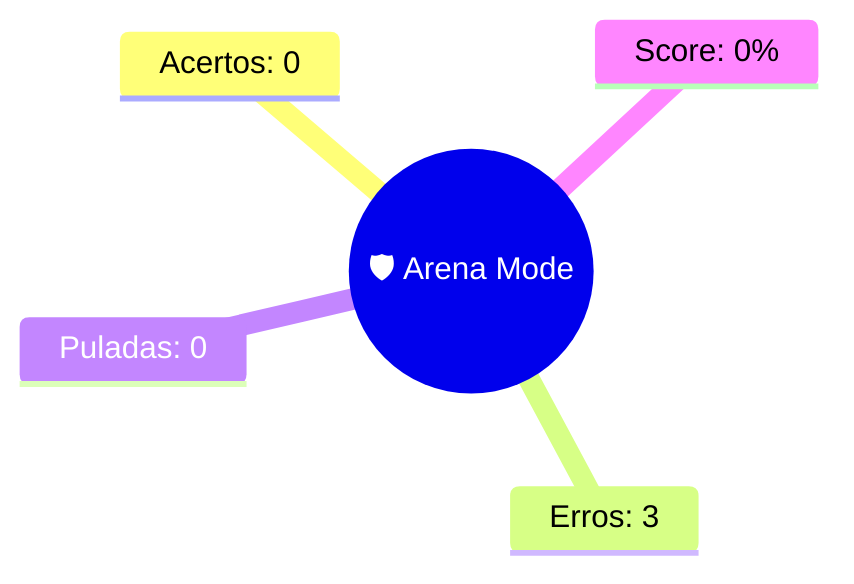

--- 
status: #revisao_arena 
topico: [[Arena Mode]] 
data: 10-10-2026
---

> [!abstract] 🛡️ Relatório de Batalha: [[Arena Mode]]
> Hierarquia de enunciado preservada. #vavilov_engine

> [!danger] Questão 1 | PONTO DE ATENÇÃO
> **ENUNCIADO:**
> Autor de ação direta de inconstitucionalidade requer a sua conversão em arguição de descumprimento de preceito fundamental, em razão do exaurimento da eficácia da lei temporária impugnada. De acordo com a Constituição e a jurisprudência do Supremo Tribunal Federal, é correto afirmar que
> 
> **SUA RESPOSTA:** é possível a conversão, pois é aplicável o princípio da fungibilidade no caso, desde que cumpridos os requisitos da Lei nº 9.882/99.
> **GABARITO:** [[é possível a conversão, pois é aplicável o princípio da fungibilidade no caso, desde que tenha sido proposta equivocadamente por erro grosseiro.]]
> 
> --- 
> **Conceitos:** [[DIREITO CONSTITUCIONAL]] | [[Controle de constitucionalidade]] | 🎯 6aa886e28d2a83981c4856f5

> [!danger] Questão 2 | PONTO DE ATENÇÃO
> **ENUNCIADO:**
> É possível controle de constitucionalidade de tratado internacional quando
> 
> **SUA RESPOSTA:** o tratado for aprovado pelo Casa do Congresso Nacional, mediante decreto legislativo, ratificado e promulgado, por meio de decreto presidencial e disciplinar normas de direitos humanos.
> **GABARITO:** [[o tratado for aprovado em cada Casa do Congresso Nacional, em dois turnos, por três quintos dos votos dos respectivos membros e disciplinar normas de direitos humanos.]]
> 
> --- 
> **Conceitos:** [[DIREITO CONSTITUCIONAL]] | [[Controle de constitucionalidade]] | 🎯 6aa886e28d2a83981c4856f4

> [!danger] Questão 3 | PONTO DE ATENÇÃO
> **ENUNCIADO:**
> Sobre declaração de inconstitucionalidade parcial sem redução de texto, é correto afirmar que
> 
> **SUA RESPOSTA:** é uma técnica de decisão que indicará, no programa normativo da norma-objeto polissêmica, o sentido que melhor se compatibiliza com o parâmetro constitucional.
> **GABARITO:** [[é uma técnica de decisão que se difere da interpretação conforme a Constituição.]]
> 
> --- 
> **Conceitos:** [[DIREITO CONSTITUCIONAL]] | [[Controle de constitucionalidade]] | 🎯 6aa886e28d2a83981c4856f7

---
### 🧠 Mapa Mental
