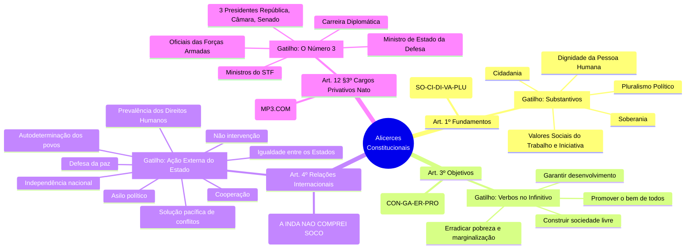
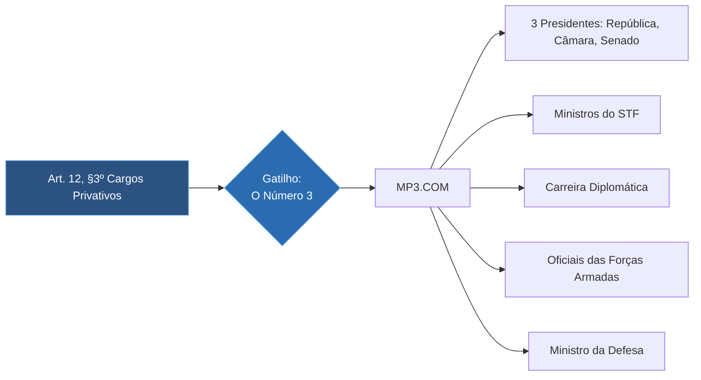
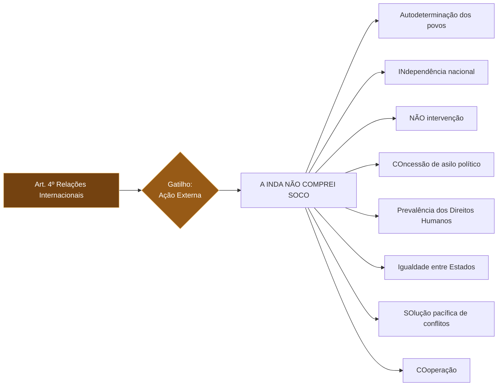
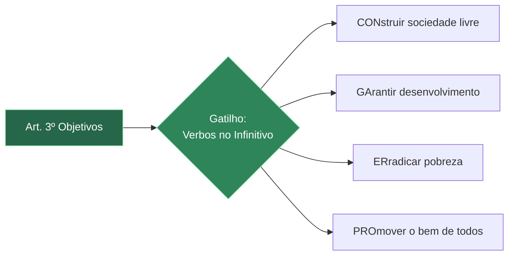
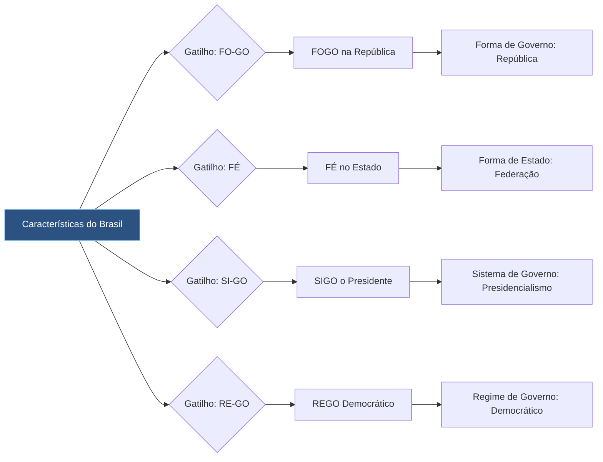
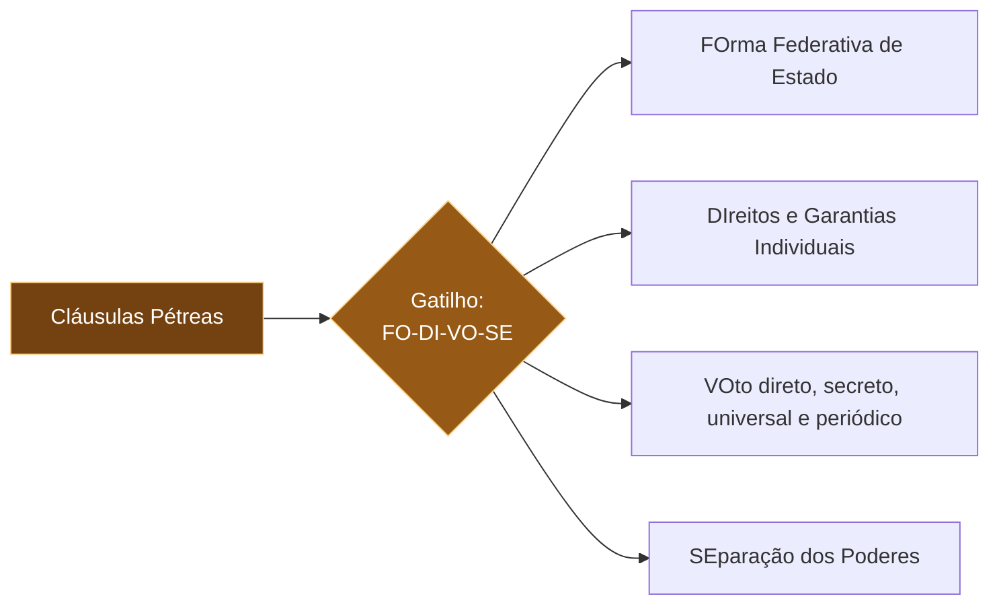
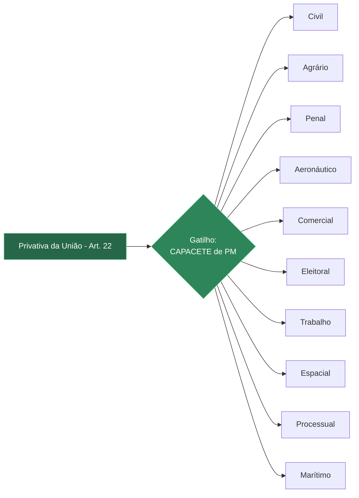

   
 ```mermaid
 graph LR
    A[Art. 1º Fundamentos] --> B{Gatilho:<br>Substantivos}
    B --> C[SOberania]
    B --> D[CIdadania]
    B --> E[DIgnidade da Pessoa Humana]
    B --> F[VAlores Sociais do Trabalho...]
    B --> G[PLUralismo Político]
    
    style A fill:#2d3748,stroke:#cbd5e0,color:#fff
    style B fill:#4a5568,stroke:#cbd5e0,color:#fff
 ```











