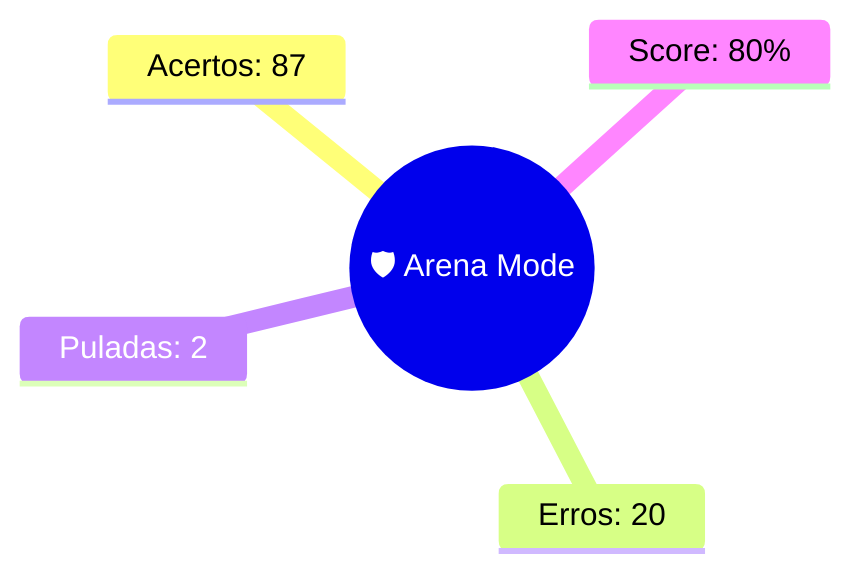

--- 
status: #revisao_arena 
topico: [[Arena Mode]] 
data: 22-07-2026
---

> [!abstract] 🛡️ Relatório de Batalha: [[Arena Mode]]
> Hierarquia de enunciado preservada. #vavilov_engine

> [!success] Questão 1 | DOMINADO
> **ENUNCIADO:**
> No que concerne aos Municípios brasileiros na federação de terceiro grau adotada pela CF/88, a doutrina aponta dificuldades teóricas para considerá-los entes federados plenos, destacando-se entre elas:
> 
> **SUA RESPOSTA:** a ausência de Poder Judiciário próprio, de Ministério Público próprio e de capacidade de auto-organização por Constituição estadual (possuem Lei Orgânica);
> 
> --- 
> **Conceitos:** [[DIREITO CONSTITUCIONAL]] | [[Requisitos de Temer para caracterização e manutenção de uma Federação]] | 🎯 6a6105b2aa8edda503cd85ac

> [!success] Questão 2 | DOMINADO
> **ENUNCIADO:**
> A decisão histórica do STF na ADPF 54, que permitiu a interrupção da gravidez de feto anencefálico, assentou-se na proteção de quais valores constitucionais?
> 
> **SUA RESPOSTA:** dignidade da pessoa humana, autonomia da vontade e saúde da gestante;
> 
> --- 
> **Conceitos:** [[DIREITO CONSTITUCIONAL]] | [[Jurisprudência do STF sobre Dignidade da Pessoa Humana (Súmulas Vinculantes]] | 🎯 6a60f20eaa8edda503cd8593

> [!success] Questão 3 | DOMINADO
> **ENUNCIADO:**
> Em relação às normas de eficácia contida, é correto afirmar que:
> 
> **SUA RESPOSTA:** produzem efeitos plenos desde a promulgação, mas podem ter seu alcance restringido por lei, outras normas constitucionais ou conceitos jurídicos indeterminados;
> 
> --- 
> **Conceitos:** [[DIREITO CONSTITUCIONAL]] | [[Exemplos específicos de normas de eficácia contida (art. 5º, XIII, LVIII, XXV]] | 🎯 6a60f2c1aa8edda503cd859f

> [!success] Questão 4 | DOMINADO
> **ENUNCIADO:**
> O princípio republicano espalha-se por diversos dispositivos da CF/88. Assinale a alternativa que aponta corretamente um artigo que consagra a igualdade perante a lei como exigência republicana:
> 
> **SUA RESPOSTA:** art. 5º, caput;
> 
> --- 
> **Conceitos:** [[DIREITO CONSTITUCIONAL]] | [[Presença do Princípio Republicano no texto constitucional (rol de artigos e manifestações)]] | 🎯 6a60f1d6aa8edda503cd858e

> [!success] Questão 5 | DOMINADO
> **ENUNCIADO:**
> A criação, transformação em Estado ou reintegração de Território Federal depende de:
> 
> **SUA RESPOSTA:** lei complementar;
> 
> --- 
> **Conceitos:** [[DIREITO CONSTITUCIONAL]] | [[Territórios Federais]] | 🎯 6a60e497aa8edda503cd8587

> [!success] Questão 6 | DOMINADO
> **ENUNCIADO:**
> Segundo o material, a consulta popular realizada antes da formação legislativa é chamada de:
> 
> **SUA RESPOSTA:** plebiscito;
> 
> --- 
> **Conceitos:** [[DIREITO CONSTITUCIONAL]] | [[Art. 1º, parágrafo único — Soberania popular (iniciativa popular, plebiscito, referendo, ação popular)]] | 🎯 6a60dcf7aa8edda503cd8553

> [!success] Questão 7 | DOMINADO
> **ENUNCIADO:**
> A auto-constituição dos Estados-membros (capacidade de darem a si própria suas Constituições, respeitados os limites da CF/88) é elemento que diferencia o federalismo de outras formas de Estado e consagra o princípio da:
> 
> **SUA RESPOSTA:** autonomia federativa;
> 
> --- 
> **Conceitos:** [[DIREITO CONSTITUCIONAL]] | [[Requisitos de Temer para caracterização e manutenção de uma Federação]] | 🎯 6a6105b2aa8edda503cd85ad

> [!success] Questão 8 | DOMINADO
> **ENUNCIADO:**
> No Brasil, a Federação é cláusula pétrea, conforme:
> 
> **SUA RESPOSTA:** art. 60, §4º, I, CF/88;
> 
> --- 
> **Conceitos:** [[DIREITO CONSTITUCIONAL]] | [[Forma de Estado]] | 🎯 6a60e2c6aa8edda503cd8572

> [!success] Questão 9 | DOMINADO
> **ENUNCIADO:**
> O mnemônico apresentado para os princípios do art. 4º é:
> 
> **SUA RESPOSTA:** IN PRE AUTO NÃO IGUAL DE SO RE CO CO;
> 
> --- 
> **Conceitos:** [[DIREITO CONSTITUCIONAL]] | [[Art. 4º — Princípios das relações internacionais]] | 🎯 6a60de57aa8edda503cd8565

> [!success] Questão 10 | DOMINADO
> **ENUNCIADO:**
> A Lei Orgânica do Distrito Federal, apesar do nome, tem status de:
> 
> **SUA RESPOSTA:** Constituição Estadual;
> 
> --- 
> **Conceitos:** [[DIREITO CONSTITUCIONAL]] | [[A Federação na CF/88 (soberania x autonomia]] | 🎯 6a60e40daa8edda503cd8580

> [!success] Questão 11 | DOMINADO
> **ENUNCIADO:**
> Sobre a reeleição, a redação atual do art. 14, §5º, CF/88 (dada pela EC 16/1997) prevê que:
> 
> **SUA RESPOSTA:** o Presidente, Governadores e Prefeitos podem ser reeleitos para um único período subsequente;
> 
> --- 
> **Conceitos:** [[DIREITO CONSTITUCIONAL]] | [[Forma de governo]] | 🎯 6a60dc92aa8edda503cd854f

> [!success] Questão 12 | DOMINADO
> **ENUNCIADO:**
> O Governador de Território Federal é:
> 
> **SUA RESPOSTA:** nomeado pelo Presidente da República, após aprovação por maioria absoluta do Senado;
> 
> --- 
> **Conceitos:** [[DIREITO CONSTITUCIONAL]] | [[Territórios Federais]] | 🎯 6a60e497aa8edda503cd8588

> [!success] Questão 13 | DOMINADO
> **ENUNCIADO:**
> O fundamento "pluralismo político" não se confunde com:
> 
> **SUA RESPOSTA:** o pluripartidarismo/multipartidarismo;
> 
> --- 
> **Conceitos:** [[DIREITO CONSTITUCIONAL]] | [[Art. 1º, incisos — Fundamentos (SO CI DI VA PLU)]] | 🎯 6a60dd63aa8edda503cd855b

> [!success] Questão 14 | DOMINADO
> **ENUNCIADO:**
> A Emenda Constitucional nº 111/2021 inseriu os §§12 e 13 no art. 14 da CF/88, disciplinando que as consultas populares sobre temas locais (plebiscitos e referendos municipais) devem ocorrer:
> 
> **SUA RESPOSTA:** concomitantemente às eleições municipais;
> 
> --- 
> **Conceitos:** [[DIREITO CONSTITUCIONAL]] | [[Possibilidades de divisão interna do território (incorporação, fusão, subdivisão, desmembramento-formação, desmembramento-anexação)]] | 🎯 6a6109aeaa8edda503cd85b0

> [!success] Questão 15 | DOMINADO
> **ENUNCIADO:**
> É exemplo de norma de eficácia limitada definidora de princípio institutivo/organizativo:
> 
> **SUA RESPOSTA:** art. 88, CF/88 (lei disporá sobre criação e extinção de Ministérios);
> 
> --- 
> **Conceitos:** [[DIREITO CONSTITUCIONAL]] | [[Art. 3º — Objetivos Fundamentais + Aplicabilidade das normas constitucionais (plena, contida, limitada)]] | 🎯 6a60de06aa8edda503cd8564

> [!success] Questão 16 | DOMINADO
> **ENUNCIADO:**
> A exigência de concurso público para provimento de cargos e empregos públicos (art. 37, II) materializa, no âmbito da Administração Pública, o princípio republicano da:
> 
> **SUA RESPOSTA:** impessoalidade e igualdade de acesso;
> 
> --- 
> **Conceitos:** [[DIREITO CONSTITUCIONAL]] | [[Presença do Princípio Republicano no texto constitucional (rol de artigos e manifestações)]] | 🎯 6a60f1d6aa8edda503cd8590

> [!success] Questão 17 | DOMINADO
> **ENUNCIADO:**
> O valor-fonte do ordenamento jurídico brasileiro, base central de todos os direitos fundamentais, é:
> 
> **SUA RESPOSTA:** a dignidade da pessoa humana;
> 
> --- 
> **Conceitos:** [[DIREITO CONSTITUCIONAL]] | [[Art. 1º, incisos — Fundamentos (SO CI DI VA PLU)]] | 🎯 6a60dd63aa8edda503cd8559

> [!success] Questão 18 | DOMINADO
> **ENUNCIADO:**
> O instituto do "recall", mencionado no material como meio de participação popular direta para aferir satisfação com o mandato de um representante eleito:
> 
> **SUA RESPOSTA:** não foi adotado pela CF/88;
> 
> --- 
> **Conceitos:** [[DIREITO CONSTITUCIONAL]] | [[Art. 1º, parágrafo único — Soberania popular (iniciativa popular, plebiscito, referendo, ação popular)]] | 🎯 6a60dcf7aa8edda503cd8556

> [!success] Questão 19 | DOMINADO
> **ENUNCIADO:**
> Cada Estado-membro elabora sua Constituição Estadual por meio do poder:
> 
> **SUA RESPOSTA:** derivado decorrente;
> 
> --- 
> **Conceitos:** [[DIREITO CONSTITUCIONAL]] | [[A Federação na CF/88 (soberania x autonomia]] | 🎯 6a60e40daa8edda503cd857f

> [!danger] Questão 20 | PONTO DE ATENÇÃO
> **ENUNCIADO:**
> O parecer das Assembleias Legislativas ouvidas no processo de formação de novos Estados é:
> 
> **SUA RESPOSTA:** vinculante e obrigatório;
> **GABARITO:** [[meramente opinativo, não vinculante;]]
> 
> --- 
> **Conceitos:** [[DIREITO CONSTITUCIONAL]] | [[Formação de novos estados]] | 🎯 6a60e4e8aa8edda503cd858c

> [!success] Questão 21 | DOMINADO
> **ENUNCIADO:**
> O mnemônico "1503" refere-se aos requisitos de qual instituto?
> 
> **SUA RESPOSTA:** iniciativa popular de lei;
> 
> --- 
> **Conceitos:** [[DIREITO CONSTITUCIONAL]] | [[Art. 1º, parágrafo único — Soberania popular (iniciativa popular, plebiscito, referendo, ação popular)]] | 🎯 6a60dcf7aa8edda503cd8552

> [!success] Questão 22 | DOMINADO
> **ENUNCIADO:**
> O plebiscito do art. 2º do ADCT, realizado em abril de 1993, decidiu pela manutenção de:
> 
> **SUA RESPOSTA:** república e presidencialismo;
> 
> --- 
> **Conceitos:** [[DIREITO CONSTITUCIONAL]] | [[Sistema de governo]] | 🎯 6a60dec2aa8edda503cd856d

> [!success] Questão 23 | DOMINADO
> **ENUNCIADO:**
> Na perspectiva interna, a soberania significa:
> 
> **SUA RESPOSTA:** supremacia, não havendo norma que se sobreponha à Constituição;
> 
> --- 
> **Conceitos:** [[DIREITO CONSTITUCIONAL]] | [[Art. 1º, incisos — Fundamentos (SO CI DI VA PLU)]] | 🎯 6a60dd63aa8edda503cd8558

> [!success] Questão 24 | DOMINADO
> **ENUNCIADO:**
> São características fundamentais da monarquia, segundo o material:
> 
> **SUA RESPOSTA:** hereditariedade, vitaliciedade e irresponsabilidade política;
> 
> --- 
> **Conceitos:** [[DIREITO CONSTITUCIONAL]] | [[Forma de governo]] | 🎯 6a60dc05aa8edda503cd854a

> [!success] Questão 25 | DOMINADO
> **ENUNCIADO:**
> A Súmula Vinculante nº 11 do STF, que restringe o uso de algemas a casos de resistência, fundada receio de fuga ou perigo à integridade física, fundamenta-se diretamente na garantia da:
> 
> **SUA RESPOSTA:** dignidade da pessoa humana;
> 
> --- 
> **Conceitos:** [[DIREITO CONSTITUCIONAL]] | [[Jurisprudência do STF sobre Dignidade da Pessoa Humana (Súmulas Vinculantes]] | 🎯 6a60f20eaa8edda503cd8592

> [!danger] Questão 26 | PONTO DE ATENÇÃO
> **ENUNCIADO:**
> A tríplice capacidade que compõe a autonomia dos entes federados inclui autogoverno, autoadministração e:
> 
> **SUA RESPOSTA:** autodeterminação;
> **GABARITO:** [[auto-organização;]]
> 
> --- 
> **Conceitos:** [[DIREITO CONSTITUCIONAL]] | [[A Federação na CF/88 (soberania x autonomia]] | 🎯 6a60e40daa8edda503cd857e

> [!success] Questão 27 | DOMINADO
> **ENUNCIADO:**
> As federações simétricas caracterizam-se por:
> 
> **SUA RESPOSTA:** grande homogeneidade cultural, linguística e estrutural entre os Estados-membros (ex: EUA originário);
> 
> --- 
> **Conceitos:** [[DIREITO CONSTITUCIONAL]] | [[Federação simétrica x assimétrica (e as assimetrias no federalismo brasileiro — arts. 43,]] | 🎯 6a60f360aa8edda503cd85a6

> [!danger] Questão 28 | PONTO DE ATENÇÃO
> **ENUNCIADO:**
> Um resultado negativo no plebiscito para formação de novo Estado:
> 
> **SUA RESPOSTA:** não impede o Congresso Nacional de editar a lei complementar;
> **GABARITO:** [[paralisa o processo;]]
> 
> --- 
> **Conceitos:** [[DIREITO CONSTITUCIONAL]] | [[Formação de novos estados]] | 🎯 6a60e4e8aa8edda503cd858d

> [!success] Questão 29 | DOMINADO
> **ENUNCIADO:**
> O mnemônico "SO CI DI VA PLU" refere-se:
> 
> **SUA RESPOSTA:** aos fundamentos da República (art. 1º, incisos);
> 
> --- 
> **Conceitos:** [[DIREITO CONSTITUCIONAL]] | [[Art. 1º, incisos — Fundamentos (SO CI DI VA PLU)]] | 🎯 6a60dd63aa8edda503cd8557

> [!success] Questão 30 | DOMINADO
> **ENUNCIADO:**
> A alteração da divisão territorial interna do Estado brasileiro compreende cinco possibilidades clássicas listadas no esquema de estudos:
> 
> **SUA RESPOSTA:** incorporação, fusão, subdivisão, desmembramento-formação e desmembramento-anexação;
> 
> --- 
> **Conceitos:** [[DIREITO CONSTITUCIONAL]] | [[Possibilidades de divisão interna do território (incorporação, fusão, subdivisão, desmembramento-formação, desmembramento-anexação)]] | 🎯 6a6109aeaa8edda503cd85ae

> [!success] Questão 31 | DOMINADO
> **ENUNCIADO:**
> A Súmula Vinculante nº 56 trata de tema sensível relacionado ao sistema penitenciário. Ela estabelece que:
> 
> **SUA RESPOSTA:** a falta de vaga em estabelecimento penal adequado autoriza a prisão domiciliar em regime aberto ou semiaberto;
> 
> --- 
> **Conceitos:** [[DIREITO CONSTITUCIONAL]] | [[Jurisprudência do STF sobre Dignidade da Pessoa Humana (Súmulas Vinculantes]] | 🎯 6a60f20eaa8edda503cd8595

> [!success] Questão 32 | DOMINADO
> **ENUNCIADO:**
> No Presidencialismo, a chefia é:
> 
> **SUA RESPOSTA:** una/monocrática, exercida pelo Presidente como Chefe de Estado e de Governo;
> 
> --- 
> **Conceitos:** [[DIREITO CONSTITUCIONAL]] | [[Sistema de governo]] | 🎯 6a60dec2aa8edda503cd8569

> [!success] Questão 33 | DOMINADO
> **ENUNCIADO:**
> A regra "DDD" para votação de Lei Orgânica (DF e Municípios) exige:
> 
> **SUA RESPOSTA:** dois turnos, dez dias de interstício e maioria de dois terços;
> 
> --- 
> **Conceitos:** [[DIREITO CONSTITUCIONAL]] | [[A Federação na CF/88 (soberania x autonomia]] | 🎯 6a60e40daa8edda503cd8581

> [!success] Questão 34 | DOMINADO
> **ENUNCIADO:**
> Segundo o STF (RE 1010606), o chamado "direito ao esquecimento":
> 
> **SUA RESPOSTA:** é incompatível com a Constituição, devendo eventuais abusos ser analisados caso a caso;
> 
> --- 
> **Conceitos:** [[DIREITO CONSTITUCIONAL]] | [[Art. 1º, incisos — Fundamentos (SO CI DI VA PLU)]] | 🎯 6a60dd63aa8edda503cd855a

> [!success] Questão 35 | DOMINADO
> **ENUNCIADO:**
> Quando dois ou mais Estados-membros se juntam para formar um único e novo Estado, extinguindo-se os anteriores, configura-se o instituto da:
> 
> **SUA RESPOSTA:** fusão;
> 
> --- 
> **Conceitos:** [[DIREITO CONSTITUCIONAL]] | [[Possibilidades de divisão interna do território (incorporação, fusão, subdivisão, desmembramento-formação, desmembramento-anexação)]] | 🎯 6a6109aeaa8edda503cd85b1

> [!success] Questão 36 | DOMINADO
> **ENUNCIADO:**
> No julgamento da ADI 4.275, o STF firmou entendimento de que os transgêneros possuem o direito à alteração do prenome e do sexo diretamente no registro civil:
> 
> **SUA RESPOSTA:** independentemente de cirurgia ou de comprovação de tratamentos hormonais;
> 
> --- 
> **Conceitos:** [[DIREITO CONSTITUCIONAL]] | [[Jurisprudência do STF sobre Dignidade da Pessoa Humana (Súmulas Vinculantes]] | 🎯 6a60f20eaa8edda503cd8594

> [!danger] Questão 37 | PONTO DE ATENÇÃO
> **ENUNCIADO:**
> Para que um Estado seja caracterizado como uma Federação, o constitucionalista Michel Temer aponta três requisitos estruturais essenciais de criação e dois de manutenção. Entre os requisitos de criação está:
> 
> **SUA RESPOSTA:** a submissão dos Estados a um poder central unitário;
> **GABARITO:** [[a descentralização política fixada na Constituição;]]
> 
> --- 
> **Conceitos:** [[DIREITO CONSTITUCIONAL]] | [[Requisitos de Temer para caracterização e manutenção de uma Federação]] | 🎯 6a6105b2aa8edda503cd85aa

> [!success] Questão 38 | DOMINADO
> **ENUNCIADO:**
> Um dos requisitos de manutenção da Federação apontados na doutrina referenciada é:
> 
> **SUA RESPOSTA:** a participação das ordens jurídicas parciais (Estados) na vontade da ordem central (por meio do Senado);
> 
> --- 
> **Conceitos:** [[DIREITO CONSTITUCIONAL]] | [[Requisitos de Temer para caracterização e manutenção de uma Federação]] | 🎯 6a6105b2aa8edda503cd85ab

> [!success] Questão 39 | DOMINADO
> **ENUNCIADO:**
> São características essenciais da forma republicana de governo:
> 
> **SUA RESPOSTA:** eletividade, temporalidade e responsabilidade política dos governantes;
> 
> --- 
> **Conceitos:** [[DIREITO CONSTITUCIONAL]] | [[Forma de governo]] | 🎯 6a60dc92aa8edda503cd854e

> [!success] Questão 40 | DOMINADO
> **ENUNCIADO:**
> A defesa do consumidor e a defesa do meio ambiente, inclusive mediante tratamento diferenciado conforme o impacto ambiental dos produtos e serviços, constituem:
> 
> **SUA RESPOSTA:** princípios gerais da atividade econômica previstos no art. 170;
> 
> --- 
> **Conceitos:** [[DIREITO CONSTITUCIONAL]] | [[— Valores sociais do trabalho e da livre iniciativa (ordem econômica e limites)]] | 🎯 6a60f244aa8edda503cd8599

> [!success] Questão 41 | DOMINADO
> **ENUNCIADO:**
> A ação popular (art. 5º, LXXIII, CF/88) pode ser proposta por:
> 
> **SUA RESPOSTA:** qualquer cidadão;
> 
> --- 
> **Conceitos:** [[DIREITO CONSTITUCIONAL]] | [[Art. 1º, parágrafo único — Soberania popular (iniciativa popular, plebiscito, referendo, ação popular)]] | 🎯 6a60dcf7aa8edda503cd8555

> [!success] Questão 42 | DOMINADO
> **ENUNCIADO:**
> O Brasil adotou formalmente o parlamentarismo em qual período?
> 
> **SUA RESPOSTA:** setembro de 1961 a janeiro de 1963;
> 
> --- 
> **Conceitos:** [[DIREITO CONSTITUCIONAL]] | [[Sistema de governo]] | 🎯 6a60dec2aa8edda503cd856b

> [!danger] Questão 43 | PONTO DE ATENÇÃO
> **ENUNCIADO:**
> A Câmara Alta que garante o princípio da participação das entidades regionais na formação da vontade nacional, no Brasil, é:
> 
> **SUA RESPOSTA:** a Câmara dos Deputados;
> **GABARITO:** [[o Senado Federal;]]
> 
> --- 
> **Conceitos:** [[DIREITO CONSTITUCIONAL]] | [[Forma de Estado]] | 🎯 6a60e2c6aa8edda503cd8573

> [!success] Questão 44 | DOMINADO
> **ENUNCIADO:**
> O princípio da cooperação entre os povos para o progresso da humanidade (art. 4º, IX):
> 
> **SUA RESPOSTA:** orienta a atuação internacional brasileira para o desenvolvimento mútuo, a solidariedade e o auxílio recíproco entre nações;
> 
> --- 
> **Conceitos:** [[DIREITO CONSTITUCIONAL]] | [[Detalhamento do Art. 4º (Relações Internacionais)]] | 🎯 6a60f32daa8edda503cd85a5

> [!success] Questão 45 | DOMINADO
> **ENUNCIADO:**
> A soberania, no arranjo federativo brasileiro, é atributo:
> 
> **SUA RESPOSTA:** exclusivo da República Federativa do Brasil;
> 
> --- 
> **Conceitos:** [[DIREITO CONSTITUCIONAL]] | [[A Federação na CF/88 (soberania x autonomia]] | 🎯 6a60e40daa8edda503cd857d

> [!success] Questão 46 | DOMINADO
> **ENUNCIADO:**
> As normas de eficácia plena têm aplicabilidade:
> 
> **SUA RESPOSTA:** imediata, direta e integral;
> 
> --- 
> **Conceitos:** [[DIREITO CONSTITUCIONAL]] | [[Art. 3º — Objetivos Fundamentais + Aplicabilidade das normas constitucionais (plena, contida, limitada)]] | 🎯 6a60de06aa8edda503cd8561

> [!success] Questão 47 | DOMINADO
> **ENUNCIADO:**
> A concessão de incentivos regionais para promover o equilíbrio socioeconômico entre as diferentes regiões do país (art. 151, I) constitui exceção ao princípio federativo da:
> 
> **SUA RESPOSTA:** uniformidade da tributação em todo o território nacional;
> 
> --- 
> **Conceitos:** [[DIREITO CONSTITUCIONAL]] | [[Federação simétrica x assimétrica (e as assimetrias no federalismo brasileiro — arts. 43,]] | 🎯 6a60f360aa8edda503cd85a9

> [!success] Questão 48 | DOMINADO
> **ENUNCIADO:**
> O Brasil é classificado, quanto às esferas integrantes da federação, como:
> 
> **SUA RESPOSTA:** federalismo de terceiro grau (tridimensional), por incluir a ordem jurídica local;
> 
> --- 
> **Conceitos:** [[DIREITO CONSTITUCIONAL]] | [[Classificação das Federações (origem, concentração de poder, repartição de competências, equacionamento das desigualdades, esferas)]] | 🎯 6a60e3c8aa8edda503cd857c

> [!danger] Questão 49 | PONTO DE ATENÇÃO
> **ENUNCIADO:**
> O princípio da solução pacífica dos conflitos nas relações internacionais da República Federativa do Brasil guarda profunda sintonia histórica com qual pacto internacional clássico de desarmamento e renúncia à guerra?
> 
> **SUA RESPOSTA:** Pacto de Varsóvia;
> **GABARITO:** [[Pacto Briand-Kellog (1928);]]
> 
> --- 
> **Conceitos:** [[DIREITO CONSTITUCIONAL]] | [[Detalhamento do Art. 4º (Relações Internacionais)]] | 🎯 6a60f32daa8edda503cd85a3

> [!danger] Questão 50 | PONTO DE ATENÇÃO
> **ENUNCIADO:**
> No que tange à fiscalização e prestação de contas, a Constituição de 1988 estabelece o controle externo a cargo do Congresso Nacional, auxiliado pelo Tribunal de Contas da União, com base em quais artigos?
> 
> **SUA RESPOSTA:** arts. 14 e 15;
> **GABARITO:** [[arts. 70 a 75;]]
> 
> --- 
> **Conceitos:** [[DIREITO CONSTITUCIONAL]] | [[Presença do Princípio Republicano no texto constitucional (rol de artigos e manifestações)]] | 🎯 6a60f1d6aa8edda503cd8591

> [!danger] Questão 51 | PONTO DE ATENÇÃO
> **ENUNCIADO:**
> O poder constituinte originário que se manifesta uma única vez, produzindo a primeira Constituição histórica de um Estado, é chamado de:
> 
> **SUA RESPOSTA:** revolucionário;
> **GABARITO:** [[fundacional;]]
> 
> --- 
> **Conceitos:** [[DIREITO CONSTITUCIONAL]] | [[Forma de governo]] | 🎯 6a60dc05aa8edda503cd854c

> [!success] Questão 52 | DOMINADO
> **ENUNCIADO:**
> Quanto à atual concentração de poder, a Federação brasileira é classificada como:
> 
> **SUA RESPOSTA:** centrípeta/centralizadora, concentrando maior volume de atribuições no plano Federal;
> 
> --- 
> **Conceitos:** [[DIREITO CONSTITUCIONAL]] | [[Classificação das Federações (origem, concentração de poder, repartição de competências, equacionamento das desigualdades, esferas)]] | 🎯 6a60e3c8aa8edda503cd857a

> [!danger] Questão 53 | PONTO DE ATENÇÃO
> **ENUNCIADO:**
> Cada Território Federal elege, independentemente do número de habitantes:
> 
> **SUA RESPOSTA:** 8 Deputados Federais e 3 Senadores;
> **GABARITO:** [[4 Deputados Federais, sem representação no Senado;]]
> 
> --- 
> **Conceitos:** [[DIREITO CONSTITUCIONAL]] | [[Territórios Federais]] | 🎯 6a60e497aa8edda503cd8589

> [!success] Questão 54 | DOMINADO
> **ENUNCIADO:**
> A Federação brasileira, formada pelo desfazimento de um Estado unitário (movimento centrífugo em direção à periferia), é classificada quanto à origem como:
> 
> **SUA RESPOSTA:** por segregação/imperfeita;
> 
> --- 
> **Conceitos:** [[DIREITO CONSTITUCIONAL]] | [[Classificação das Federações (origem, concentração de poder, repartição de competências, equacionamento das desigualdades, esferas)]] | 🎯 6a60e3c8aa8edda503cd8579

> [!danger] Questão 55 | PONTO DE ATENÇÃO
> **ENUNCIADO:**
> A autodeterminação dos povos, princípio que veda a dominação estrangeira e assegura a soberania dos Estados, encontra forte respaldo histórico nas resoluções da Assembleia Geral da ONU mencionadas no material, quais sejam:
> 
> **SUA RESPOSTA:** Convenção de Viena de 1969;
> **GABARITO:** [[Resoluções 1514/1960 e 2526/1970;]]
> 
> --- 
> **Conceitos:** [[DIREITO CONSTITUCIONAL]] | [[Detalhamento do Art. 4º (Relações Internacionais)]] | 🎯 6a60f32daa8edda503cd85a2

> [!success] Questão 56 | DOMINADO
> **ENUNCIADO:**
> O Estado unitário sem nenhum tipo de descentralização, nem política nem administrativa, é chamado de:
> 
> **SUA RESPOSTA:** Estado unitário puro;
> 
> --- 
> **Conceitos:** [[DIREITO CONSTITUCIONAL]] | [[Forma de Estado]] | 🎯 6a60e1d8aa8edda503cd856e

> [!success] Questão 57 | DOMINADO
> **ENUNCIADO:**
> O federalismo cooperativo (neoclássico), adotado pelo Brasil a partir de 1934, caracteriza-se por:
> 
> **SUA RESPOSTA:** repartição horizontal e vertical, com competências comuns e concorrentes;
> 
> --- 
> **Conceitos:** [[DIREITO CONSTITUCIONAL]] | [[Classificação das Federações (origem, concentração de poder, repartição de competências, equacionamento das desigualdades, esferas)]] | 🎯 6a60e3c8aa8edda503cd857b

> [!success] Questão 58 | DOMINADO
> **ENUNCIADO:**
> São características da forma federada de Estado, segundo o material:
> 
> **SUA RESPOSTA:** descentralização política, indissolubilidade do vínculo, rigidez constitucional, existência de Tribunal Constitucional e Câmara Alta;
> 
> --- 
> **Conceitos:** [[DIREITO CONSTITUCIONAL]] | [[Forma de Estado]] | 🎯 6a60e2c6aa8edda503cd8570

> [!success] Questão 59 | DOMINADO
> **ENUNCIADO:**
> A competência para autorizar referendo e convocar plebiscito é:
> 
> **SUA RESPOSTA:** exclusiva do Congresso Nacional;
> 
> --- 
> **Conceitos:** [[DIREITO CONSTITUCIONAL]] | [[Art. 1º, parágrafo único — Soberania popular (iniciativa popular, plebiscito, referendo, ação popular)]] | 🎯 6a60dcf7aa8edda503cd8554

> [!success] Questão 60 | DOMINADO
> **ENUNCIADO:**
> No Poder Legislativo brasileiro, a possibilidade de reeleição ocorre:
> 
> **SUA RESPOSTA:** de forma indefinida;
> 
> --- 
> **Conceitos:** [[DIREITO CONSTITUCIONAL]] | [[Forma de governo]] | 🎯 6a60dc92aa8edda503cd8551

> [!success] Questão 61 | DOMINADO
> **ENUNCIADO:**
> Os objetivos fundamentais da República (art. 3º) são classificados, quanto à aplicabilidade, como normas:
> 
> **SUA RESPOSTA:** de eficácia limitada, de princípio programático;
> 
> --- 
> **Conceitos:** [[DIREITO CONSTITUCIONAL]] | [[Art. 3º — Objetivos Fundamentais + Aplicabilidade das normas constitucionais (plena, contida, limitada)]] | 🎯 6a60de06aa8edda503cd8563

> [!success] Questão 62 | DOMINADO
> **ENUNCIADO:**
> São requisitos para a formação de novos Estados, segundo o art. 18, §3º, CF/88:
> 
> **SUA RESPOSTA:** plebiscito, oitiva das Assembleias Legislativas e lei complementar;
> 
> --- 
> **Conceitos:** [[DIREITO CONSTITUCIONAL]] | [[Formação de novos estados]] | 🎯 6a60e4e8aa8edda503cd858a

> [!success] Questão 63 | DOMINADO
> **ENUNCIADO:**
> O federalismo brasileiro é classicamente apontado pela doutrina como:
> 
> **SUA RESPOSTA:** formalmente simétrico no texto constitucional, mas fortemente assimétrico na realidade socioeconômica e regional;
> 
> --- 
> **Conceitos:** [[DIREITO CONSTITUCIONAL]] | [[Federação simétrica x assimétrica (e as assimetrias no federalismo brasileiro — arts. 43,]] | 🎯 6a60f360aa8edda503cd85a7

> [!danger] Questão 64 | PONTO DE ATENÇÃO
> **ENUNCIADO:**
> Segundo o esquema do material, a forma de Estado do Brasil é:
> 
> **SUA RESPOSTA:** Confederação.
> **GABARITO:** [[Federação;]]
> 
> --- 
> **Conceitos:** [[DIREITO CONSTITUCIONAL]] | [[Art. 1º, caput — Forma de governo, sistema de governo, forma de Estado (visão geral + mnemônico)]] | 🎯 6a60daf8aa8edda503cd8547

> [!success] Questão 65 | DOMINADO
> **ENUNCIADO:**
> A ADI 2076, mencionada no material, tratou de qual tema:
> 
> **SUA RESPOSTA:** da natureza jurídica do preâmbulo;
> 
> --- 
> **Conceitos:** [[DIREITO CONSTITUCIONAL]] | [[Estrutura da Constituição (Preâmbulo, Dogmática, ADCT)]] | 🎯 6a60da88aa8edda503cd8545

> [!success] Questão 66 | DOMINADO
> **ENUNCIADO:**
> A derrubada de veto presidencial pelo Congresso Nacional (por voto da maioria absoluta de seus membros) é um mecanismo clássico de:
> 
> **SUA RESPOSTA:** freios e contrapesos que garante o equilíbrio entre os Poderes;
> 
> --- 
> **Conceitos:** [[DIREITO CONSTITUCIONAL]] | [[Mecanismos de freios e contrapesos]] | 🎯 6a60f275aa8edda503cd859b

> [!success] Questão 67 | DOMINADO
> **ENUNCIADO:**
> Quantas são as escolhas centrais para a estruturação do Estado e organização dos poderes, segundo o material?
> 
> **SUA RESPOSTA:** quatro;
> 
> --- 
> **Conceitos:** [[DIREITO CONSTITUCIONAL]] | [[Art. 1º, caput — Forma de governo, sistema de governo, forma de Estado (visão geral + mnemônico)]] | 🎯 6a60daf8aa8edda503cd8549

> [!danger] Questão 68 | PONTO DE ATENÇÃO
> **ENUNCIADO:**
> O modelo típico da Itália, em que a descentralização legislativa ocorre "de cima para baixo" por concessão do poder central, é o: a) Estado unitário puro; b) Estado regional; c) Estado autonômico; d) Estado federado; e) Confederação. O modelo típico da Espanha, em que a descentralização legislativa ocorre "de baixo para cima", é o: a) Estado regional; b) Estado unitário puro; c) Estado autonômico; d) Estado federado; e) Confederação. O Brasil já foi um Estado unitário:
> 
> **SUA RESPOSTA:** undefined
> **GABARITO:** [[no período Brasil-Colônia/Brasil-Império;]]
> 
> --- 
> **Conceitos:** [[DIREITO CONSTITUCIONAL]] | [[Forma de Estado]] | 🎯 6a60e1d8aa8edda503cd856f

> [!success] Questão 69 | DOMINADO
> **ENUNCIADO:**
> A inovação da CF/88 em relação à Capital Federal foi:
> 
> **SUA RESPOSTA:** estabelecer expressamente que Brasília é a Capital Federal;
> 
> --- 
> **Conceitos:** [[DIREITO CONSTITUCIONAL]] | [[Autogoverno/autoadministração/auto-organização) Capital Federal]] | 🎯 6a60e452aa8edda503cd8583

> [!neutral] Questão 70 | EM BRANCO
> **ENUNCIADO:**
> O mnemônico "CONS GA ERRA RE PRO" refere-se:
> 
> **SUA RESPOSTA:** Pulei
> 
> --- 
> **Conceitos:** [[DIREITO CONSTITUCIONAL]] | [[Art. 3º — Objetivos Fundamentais + Aplicabilidade das normas constitucionais (plena, contida, limitada)]] | 🎯 6a60de06aa8edda503cd8560

> [!danger] Questão 71 | PONTO DE ATENÇÃO
> **ENUNCIADO:**
> O princípio pelo qual um grupo pode se separar do Estado e se organizar como Estado Nacional novo é o de:
> 
> **SUA RESPOSTA:** igualdade entre os Estados;
> **GABARITO:** [[autodeterminação dos povos;]]
> 
> --- 
> **Conceitos:** [[DIREITO CONSTITUCIONAL]] | [[Art. 4º — Princípios das relações internacionais]] | 🎯 6a60de57aa8edda503cd8567

> [!success] Questão 72 | DOMINADO
> **ENUNCIADO:**
> Segundo o art. 4º da CF/88, a República Federativa do Brasil rege-se nas suas relações internacionais por diversos princípios, entre os quais figura expressamente:
> 
> **SUA RESPOSTA:** a prevalência dos direitos humanos;
> 
> --- 
> **Conceitos:** [[DIREITO CONSTITUCIONAL]] | [[Detalhamento do Art. 4º (Relações Internacionais)]] | 🎯 6a60f32daa8edda503cd85a4

> [!success] Questão 73 | DOMINADO
> **ENUNCIADO:**
> Nos Municípios brasileiros, segundo o material, existem apenas os Poderes:
> 
> **SUA RESPOSTA:** Legislativo e Executivo;
> 
> --- 
> **Conceitos:** [[DIREITO CONSTITUCIONAL]] | [[Art. 2º — Separação de Poderes / freios e contrapesos]] | 🎯 6a60dda3aa8edda503cd855f

> [!success] Questão 74 | DOMINADO
> **ENUNCIADO:**
> A "população diretamente interessada" no plebiscito de formação de novos Estados, segundo a ADI 2.650-DF, compreende:
> 
> **SUA RESPOSTA:** tanto a população da área desmembranda quanto a da área remanescente;
> 
> --- 
> **Conceitos:** [[DIREITO CONSTITUCIONAL]] | [[Formação de novos estados]] | 🎯 6a60e4e8aa8edda503cd858b

> [!success] Questão 75 | DOMINADO
> **ENUNCIADO:**
> No semipresidencialismo, a chefia de Estado:
> 
> **SUA RESPOSTA:** possui atribuições políticas relevantes, como comandar as Forças Armadas e conduzir a política externa;
> 
> --- 
> **Conceitos:** [[DIREITO CONSTITUCIONAL]] | [[Sistema de governo]] | 🎯 6a60dec2aa8edda503cd856c

> [!danger] Questão 76 | PONTO DE ATENÇÃO
> **ENUNCIADO:**
> Segundo o material, qual dispositivo trata da forma republicana como princípio sensível cuja inobservância pode ensejar intervenção federal?
> 
> **SUA RESPOSTA:** art. 60, §4º;
> **GABARITO:** [[art. 34, VII, "a";]]
> 
> --- 
> **Conceitos:** [[DIREITO CONSTITUCIONAL]] | [[Forma de governo]] | 🎯 6a60dc92aa8edda503cd8550

> [!success] Questão 77 | DOMINADO
> **ENUNCIADO:**
> As normas de eficácia contida podem sofrer restrições impostas:
> 
> **SUA RESPOSTA:** por lei, por outras normas constitucionais ou por conceitos ético-jurídicos pacificados;
> 
> --- 
> **Conceitos:** [[DIREITO CONSTITUCIONAL]] | [[Art. 3º — Objetivos Fundamentais + Aplicabilidade das normas constitucionais (plena, contida, limitada)]] | 🎯 6a60de06aa8edda503cd8562

> [!success] Questão 78 | DOMINADO
> **ENUNCIADO:**
> A rejeição de Medida Provisória editada pelo Presidente da República pelo Congresso Nacional é exemplo de:
> 
> **SUA RESPOSTA:** consagração do sistema de freios e contrapesos;
> 
> --- 
> **Conceitos:** [[DIREITO CONSTITUCIONAL]] | [[Art. 2º — Separação de Poderes / freios e contrapesos]] | 🎯 6a60dda3aa8edda503cd855e

> [!success] Questão 79 | DOMINADO
> **ENUNCIADO:**
> A vedação de distinções entre brasileiros ou preferências entre Estados (art. 19, I) reflete diretamente qual postulado da República?
> 
> **SUA RESPOSTA:** a isonomia federativa e republicana;
> 
> --- 
> **Conceitos:** [[DIREITO CONSTITUCIONAL]] | [[Presença do Princípio Republicano no texto constitucional (rol de artigos e manifestações)]] | 🎯 6a60f1d6aa8edda503cd858f

> [!success] Questão 80 | DOMINADO
> **ENUNCIADO:**
> O sistema de origem norte-americana pelo qual um Poder impede o exercício arbitrário de outro é chamado de:
> 
> **SUA RESPOSTA:** freios e contrapesos (checks and balances);
> 
> --- 
> **Conceitos:** [[DIREITO CONSTITUCIONAL]] | [[Art. 2º — Separação de Poderes / freios e contrapesos]] | 🎯 6a60dda3aa8edda503cd855d

> [!success] Questão 81 | DOMINADO
> **ENUNCIADO:**
> A expressão "the king can do no wrong" ilustra qual característica da monarquia?
> 
> **SUA RESPOSTA:** irresponsabilidade política do monarca;
> 
> --- 
> **Conceitos:** [[DIREITO CONSTITUCIONAL]] | [[Forma de governo]] | 🎯 6a60dc05aa8edda503cd854d

> [!neutral] Questão 82 | EM BRANCO
> **ENUNCIADO:**
> O asilo político (inciso X do art. 4º) baseia-se na ideia de:
> 
> **SUA RESPOSTA:** Pulei
> 
> --- 
> **Conceitos:** [[DIREITO CONSTITUCIONAL]] | [[Art. 4º — Princípios das relações internacionais]] | 🎯 6a60de57aa8edda503cd8568

> [!success] Questão 83 | DOMINADO
> **ENUNCIADO:**
> Segundo o material, quais dispositivos do ADCT já têm eficácia exaurida?
> 
> **SUA RESPOSTA:** arts. 2º, 3º, 14 e 15;
> 
> --- 
> **Conceitos:** [[DIREITO CONSTITUCIONAL]] | [[Estrutura da Constituição (Preâmbulo, Dogmática, ADCT)]] | 🎯 6a60da88aa8edda503cd8544

> [!success] Questão 84 | DOMINADO
> **ENUNCIADO:**
> A autonomia dos entes federados compreende a capacidade de:
> 
> **SUA RESPOSTA:** auto-organização, autogoverno e autoadministração;
> 
> --- 
> **Conceitos:** [[DIREITO CONSTITUCIONAL]] | [[Forma de Estado]] | 🎯 6a60e2c6aa8edda503cd8571

> [!success] Questão 85 | DOMINADO
> **ENUNCIADO:**
> A primeira Constituição histórica do Brasil (1824) apresentava, entre outras características:
> 
> **SUA RESPOSTA:** forma de Estado unitária, semirrígida e existência de poder moderador;
> 
> --- 
> **Conceitos:** [[DIREITO CONSTITUCIONAL]] | [[Forma de governo]] | 🎯 6a60dc05aa8edda503cd854b

> [!success] Questão 86 | DOMINADO
> **ENUNCIADO:**
> O princípio da livre concorrência (art. 170, IV) na ordem econômica brasileira:
> 
> **SUA RESPOSTA:** é relativo, admitindo controle estatal para coibir o abuso do poder econômico que vise à dominação de mercados;
> 
> --- 
> **Conceitos:** [[DIREITO CONSTITUCIONAL]] | [[— Valores sociais do trabalho e da livre iniciativa (ordem econômica e limites)]] | 🎯 6a60f244aa8edda503cd8597

> [!danger] Questão 87 | PONTO DE ATENÇÃO
> **ENUNCIADO:**
> Segundo o material, a atribuição típica do Poder Executivo é:
> 
> **SUA RESPOSTA:** legislar e fiscalizar;
> **GABARITO:** [[administrar/governar;]]
> 
> --- 
> **Conceitos:** [[DIREITO CONSTITUCIONAL]] | [[Art. 2º — Separação de Poderes / freios e contrapesos]] | 🎯 6a60dda3aa8edda503cd855c

> [!success] Questão 88 | DOMINADO
> **ENUNCIADO:**
> O controle de constitucionalidade exercido pelo Poder Judiciário sobre as leis e atos normativos do Legislativo e Executivo representa:
> 
> **SUA RESPOSTA:** o funcionamento do sistema de freios e contrapesos para salvaguardar a supremacia da Constituição;
> 
> --- 
> **Conceitos:** [[DIREITO CONSTITUCIONAL]] | [[Mecanismos de freios e contrapesos]] | 🎯 6a60f275aa8edda503cd859d

> [!success] Questão 89 | DOMINADO
> **ENUNCIADO:**
> A parte da Constituição composta por 9 títulos, o que evidencia a prolixidade do texto (classificação quanto à extensão), é:
> 
> **SUA RESPOSTA:** a Dogmática;
> 
> --- 
> **Conceitos:** [[DIREITO CONSTITUCIONAL]] | [[Estrutura da Constituição (Preâmbulo, Dogmática, ADCT)]] | 🎯 6a60da88aa8edda503cd8543

> [!success] Questão 90 | DOMINADO
> **ENUNCIADO:**
> A Federação formada pela reunião de Estados até então soberanos que cedem sua soberania ao todo (ex.: EUA em 1787) é chamada de:
> 
> **SUA RESPOSTA:** por agregação/perfeita;
> 
> --- 
> **Conceitos:** [[DIREITO CONSTITUCIONAL]] | [[Classificação das Federações (origem, concentração de poder, repartição de competências, equacionamento das desigualdades, esferas)]] | 🎯 6a60e3c8aa8edda503cd8578

> [!danger] Questão 91 | PONTO DE ATENÇÃO
> **ENUNCIADO:**
> A República Federativa do Brasil buscará a integração de povos, formando uma comunidade:
> 
> **SUA RESPOSTA:** sul-americana de nações;
> **GABARITO:** [[latino-americana de nações;]]
> 
> --- 
> **Conceitos:** [[DIREITO CONSTITUCIONAL]] | [[Art. 4º — Princípios das relações internacionais]] | 🎯 6a60de57aa8edda503cd8566

> [!success] Questão 92 | DOMINADO
> **ENUNCIADO:**
> O mnemônico apresentado no material para as escolhas centrais do Estado brasileiro é:
> 
> **SUA RESPOSTA:** "O Estado FED; a República é Fogo; o presidente é SIStemático";
> 
> --- 
> **Conceitos:** [[DIREITO CONSTITUCIONAL]] | [[Art. 1º, caput — Forma de governo, sistema de governo, forma de Estado (visão geral + mnemônico)]] | 🎯 6a60daf8aa8edda503cd8546

> [!success] Questão 93 | DOMINADO
> **ENUNCIADO:**
> As restrições e suspensões de garantias constitucionais durante o estado de sítio (art. 139) exemplificam a atuação de normas de eficácia:
> 
> **SUA RESPOSTA:** contida;
> 
> --- 
> **Conceitos:** [[DIREITO CONSTITUCIONAL]] | [[Exemplos específicos de normas de eficácia contida (art. 5º, XIII, LVIII, XXV]] | 🎯 6a60f2c1aa8edda503cd85a1

> [!success] Questão 94 | DOMINADO
> **ENUNCIADO:**
> Antes da mudança para Brasília, qual Constituição já determinava a transferência da capital para um ponto central do Brasil?
> 
> **SUA RESPOSTA:** Constituição de 1934 (ADCT, art. 4º);
> 
> --- 
> **Conceitos:** [[DIREITO CONSTITUCIONAL]] | [[Autogoverno/autoadministração/auto-organização) Capital Federal]] | 🎯 6a60e452aa8edda503cd8584

> [!success] Questão 95 | DOMINADO
> **ENUNCIADO:**
> O julgamento do Presidente da República por crime de responsabilidade perante o Senado Federal (após autorização da Câmara dos Deputados) consagra o controle exercido pelo:
> 
> **SUA RESPOSTA:** Poder Legislativo sobre o Executivo;
> 
> --- 
> **Conceitos:** [[DIREITO CONSTITUCIONAL]] | [[Mecanismos de freios e contrapesos]] | 🎯 6a60f275aa8edda503cd859c

> [!danger] Questão 96 | PONTO DE ATENÇÃO
> **ENUNCIADO:**
> Os últimos Territórios Federais do Brasil, extintos ou transformados, foram:
> 
> **SUA RESPOSTA:** Amapá, Rondônia e Fernando de Noronha;
> **GABARITO:** [[Roraima, Amapá e Fernando de Noronha;]]
> 
> --- 
> **Conceitos:** [[DIREITO CONSTITUCIONAL]] | [[Territórios Federais]] | 🎯 6a60e497aa8edda503cd8586

> [!success] Questão 97 | DOMINADO
> **ENUNCIADO:**
> O sistema de freios e contrapesos caracteriza-se pelo controle recíproco entre os Poderes. Assinale a alternativa que apresenta corretamente um instrumento típico de controle do Legislativo sobre o Executivo:
> 
> **SUA RESPOSTA:** a aprovação prévia, pelo Senado Federal, de autoridades indicadas pelo Presidente da República (art. 52, III);
> 
> --- 
> **Conceitos:** [[DIREITO CONSTITUCIONAL]] | [[Mecanismos de freios e contrapesos]] | 🎯 6a60f275aa8edda503cd859a

> [!danger] Questão 98 | PONTO DE ATENÇÃO
> **ENUNCIADO:**
> Ainda conforme o esquema, o regime de governo brasileiro é classificado como:
> 
> **SUA RESPOSTA:** República;
> **GABARITO:** [[Democrático;]]
> 
> --- 
> **Conceitos:** [[DIREITO CONSTITUCIONAL]] | [[Art. 1º, caput — Forma de governo, sistema de governo, forma de Estado (visão geral + mnemônico)]] | 🎯 6a60daf8aa8edda503cd8548

> [!success] Questão 99 | DOMINADO
> **ENUNCIADO:**
> Sobre o preâmbulo da CF/88, é correto afirmar que:
> 
> **SUA RESPOSTA:** não é norma jurídica, tendo apenas importância histórica;
> 
> --- 
> **Conceitos:** [[DIREITO CONSTITUCIONAL]] | [[Estrutura da Constituição (Preâmbulo, Dogmática, ADCT)]] | 🎯 6a60da88aa8edda503cd8542

> [!success] Questão 100 | DOMINADO
> **ENUNCIADO:**
> Segundo o art. 18, §1º, CF/88, a Capital Federal é:
> 
> **SUA RESPOSTA:** Brasília;
> 
> --- 
> **Conceitos:** [[DIREITO CONSTITUCIONAL]] | [[Autogoverno/autoadministração/auto-organização) Capital Federal]] | 🎯 6a60e452aa8edda503cd8582

> [!danger] Questão 101 | PONTO DE ATENÇÃO
> **ENUNCIADO:**
> O art. 5º, inciso XXV, que trata da requisição administrativa em caso de iminente perigo público (assegurada indenização ulterior, se houver dano), é apontado na doutrina como exemplo de norma de eficácia:
> 
> **SUA RESPOSTA:** de eficácia absoluta.
> **GABARITO:** [[contida;]]
> 
> --- 
> **Conceitos:** [[DIREITO CONSTITUCIONAL]] | [[Exemplos específicos de normas de eficácia contida (art. 5º, XIII, LVIII, XXV]] | 🎯 6a60f2c1aa8edda503cd85a0

> [!success] Questão 102 | DOMINADO
> **ENUNCIADO:**
> Atualmente, quantos Territórios Federais existem no Brasil?
> 
> **SUA RESPOSTA:** nenhum, foram extintos pela CF/88;
> 
> --- 
> **Conceitos:** [[DIREITO CONSTITUCIONAL]] | [[Territórios Federais]] | 🎯 6a60e497aa8edda503cd8585

> [!danger] Questão 103 | PONTO DE ATENÇÃO
> **ENUNCIADO:**
> Ocorre desmembramento por formação quando um Estado-membro ou Território:
> 
> **SUA RESPOSTA:** divide-se inteiramente em dois ou mais novos Estados, desaparecendo o originário;
> **GABARITO:** [[perde parte de seu território para dar origem a um novo Estado;]]
> 
> --- 
> **Conceitos:** [[DIREITO CONSTITUCIONAL]] | [[Possibilidades de divisão interna do território (incorporação, fusão, subdivisão, desmembramento-formação, desmembramento-anexação)]] | 🎯 6a6109aeaa8edda503cd85af

> [!success] Questão 104 | DOMINADO
> **ENUNCIADO:**
> O art. 5º, inciso XIII da CF/88 ("é livre o exercício de qualquer trabalho, ofício ou profissão, atendidas as qualificações profissionais que a lei estabelecer") é o exemplo clássico de norma constitucional de eficácia:
> 
> **SUA RESPOSTA:** contida (ou prospectiva/retentiva);
> 
> --- 
> **Conceitos:** [[DIREITO CONSTITUCIONAL]] | [[Exemplos específicos de normas de eficácia contida (art. 5º, XIII, LVIII, XXV]] | 🎯 6a60f2c1aa8edda503cd859e

> [!success] Questão 105 | DOMINADO
> **ENUNCIADO:**
> Nos termos do art. 170 da CF/88, a ordem econômica nacional é fundada na valorização do trabalho humano e na livre iniciativa, tendo por fim assegurar a todos existência digna, observados alguns princípios, exceto:
> 
> **SUA RESPOSTA:** estatização integral dos meios de produção.
> 
> --- 
> **Conceitos:** [[DIREITO CONSTITUCIONAL]] | [[— Valores sociais do trabalho e da livre iniciativa (ordem econômica e limites)]] | 🎯 6a60f244aa8edda503cd8596

> [!success] Questão 106 | DOMINADO
> **ENUNCIADO:**
> É vedado à Federação, por ser característica essencial:
> 
> **SUA RESPOSTA:** o direito de secessão;
> 
> --- 
> **Conceitos:** [[DIREITO CONSTITUCIONAL]] | [[Forma de Estado]] | 🎯 6a60e2c6aa8edda503cd8574

> [!success] Questão 107 | DOMINADO
> **ENUNCIADO:**
> A exigência de que a propriedade atenda à sua função social (art. 170, III):
> 
> **SUA RESPOSTA:** restringe o direito de propriedade em prol dos interesses coletivos e da justiça social;
> 
> --- 
> **Conceitos:** [[DIREITO CONSTITUCIONAL]] | [[— Valores sociais do trabalho e da livre iniciativa (ordem econômica e limites)]] | 🎯 6a60f244aa8edda503cd8598

> [!success] Questão 108 | DOMINADO
> **ENUNCIADO:**
> O parlamentarismo surgiu, segundo o material:
> 
> **SUA RESPOSTA:** na Inglaterra, no século XI, com contornos contemporâneos no século XIX;
> 
> --- 
> **Conceitos:** [[DIREITO CONSTITUCIONAL]] | [[Sistema de governo]] | 🎯 6a60dec2aa8edda503cd856a

> [!success] Questão 109 | DOMINADO
> **ENUNCIADO:**
> Para atenuar as desigualdades regionais e materializar a cooperação federativa no Brasil, a Constituição de 1988 prevê instrumentos específicos, tais como:
> 
> **SUA RESPOSTA:** as regiões integradas de desenvolvimento e fundos constitucionais de financiamento (ex: arts. 43, 151 e 159);
> 
> --- 
> **Conceitos:** [[DIREITO CONSTITUCIONAL]] | [[Federação simétrica x assimétrica (e as assimetrias no federalismo brasileiro — arts. 43,]] | 🎯 6a60f360aa8edda503cd85a8

---
### 🧠 Mapa Mental
