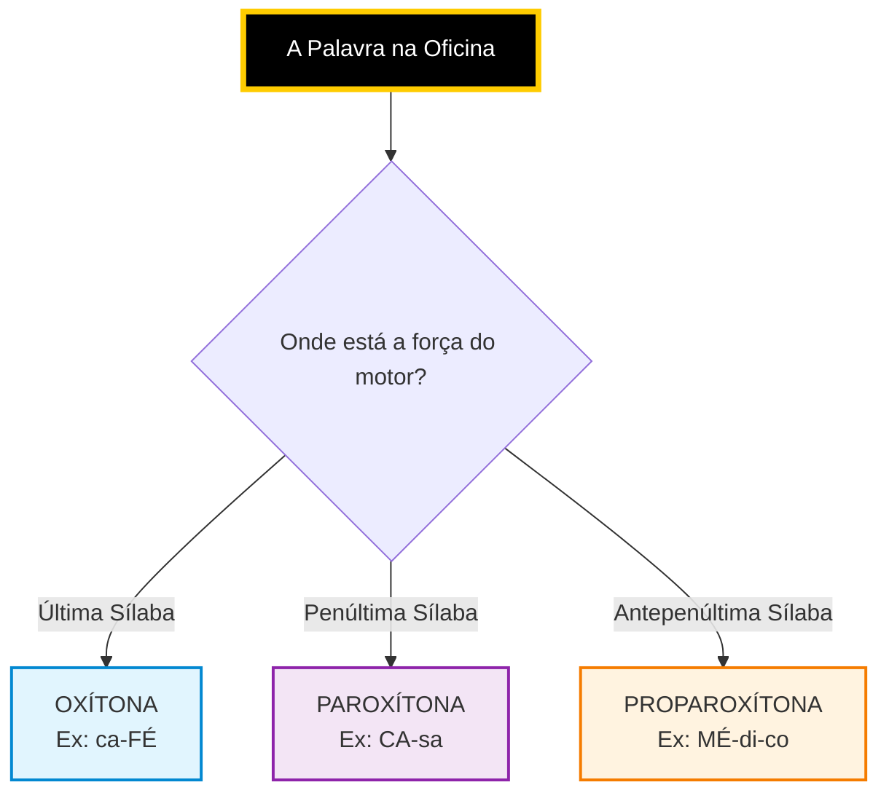
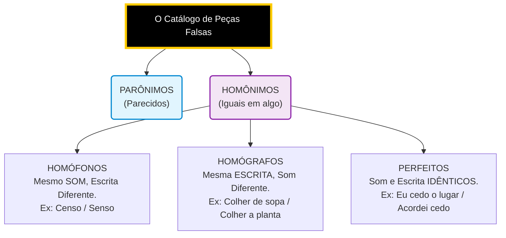

---
tags:
  - Vavilov
  - LÍNGUA_PORTUGUESA
  - A_Acentuação
  - _Termo_associado_ao_Verbo
data: 2026-03-31
---
# #português #ortografia #acentuação #semântica

> [!abstract] Resumo da Oficina: Acentuação e Ortografia A acentuação gráfica não é um enfeite; é o **balanceamento das rodas** da palavra. Ela serve para mostrar onde o motor faz mais força (sílaba tônica) ou para diferenciar peças idênticas (acento diferencial). O segredo para não decorar infinitas regras é entender a **Regra da Gangorra** (a oposição perfeita entre Oxítonas e Paroxítonas).

---

### 1. O Eixo de Rotação (A Sílaba Tônica)

Antes de colocar o peso (acento), você precisa achar onde o pneu está mais pesado (a sílaba tônica). A posição dessa sílaba define o chassi da palavra:

Snippet de código

---

### 2. A Regra da Gangorra (Oxítonas vs. Paroxítonas)

Aqui está a grande engenharia da língua: **As Paroxítonas odeiam as Oxítonas.** A regra de uma é o exato oposto da outra. Memorize apenas o grupo VIP (A, E, O, EM, ENS).

> [!info] O Grupo VIP: **A(s), E(s), O(s), EM, ENS**
> 
> - **OXÍTONAS:** Se terminarem com essas letras, **GANHAM** acento. _(Ex: sofá, café, cipó, armazéns)._
>     
> - **PAROXÍTONAS:** Se terminarem com essas letras, **NÃO GANHAM** acento. _(Ex: casa, dente, prato, jovem)._
>     

Como as Paroxítonas são a maioria esmagadora da língua, elas só ganham o balanceamento (acento) se terminarem em **peças "estranhas"** (L, N, R, X, PS, I, U, UM, ÃO, Ditongo).

- _Exemplos:_ fácil, pólen, revólver, tórax, bíceps, táxi, vírus, fórum, órgão, água.
    

> [!check] Proparoxítonas (O Carro de Luxo) **TODAS** são acentuadas, sem exceção. _Exemplos:_ médico, lâmpada, árvore, trânsito.
> 
> 🚨 **Atenção (A Falsa Proparoxítona):** Palavras terminadas em ditongo crescente (ex: _his-tó-ria, sé-rie, á-gua_) são tratadas pelas bancas como paroxítonas terminadas em ditongo, mas algumas consideram proparoxítonas aparentes. Na dúvida: **têm acento sempre**.

---

### 3. Casos Especiais de Oficina (Motor Turbinado)

**O Motor de Hiatos (A regra do I e U solitários)** Duas vogais que andavam juntas separam-se em sílabas diferentes.

- **Regra:** Acentuam-se o **I** e o **U** tônicos se ficarem **sozinhos** na sílaba (ou com 's').
    
- _Exemplos:_ sa-ú-de, fa-ís-ca, Lu-ís.
    
- _As Travas (Exceções que perdem o acento):_ Se vier 'NH' depois (_ra-i-nha_), se dobrar a letra (_xi-i-ta_), ou se formar ditongo antes em paroxítonas (_fei-u-ra_).
    

**O Acordo Ortográfico (O que mudou nas peças)**

- **Ditongos Abertos (ÉI, ÉU, ÓI):** Só ganham acento se estiverem na **última sílaba** (Oxítonas e Monossílabos). Ex: _herói, céu, papéis_.
    
    - _Perderam o acento (Paroxítonas):_ _ideia, jiboia, heroico._
        

> [!warning] O Acento Diferencial (Manual vs. Automático) Serve para mostrar qual marcha está engatada em palavras iguais:
> 
> - **Pôde** (Passado / Freou) vs. **Pode** (Presente / Acelerando).
>     
> - **Pôr** (Verbo / Ação) vs. **Por** (Preposição / Parafuso).
>     
> - **Têm / Vêm** (Plural / Carro cheio) vs. **Tem / Vem** (Singular / Carro vazio).
>     

---

### 4. O Scanner Semântico (Peças Gêmeas e Ortografia)

> [!example] ISAR vs. IZAR (A Regra do DNA) A palavra nova herda o DNA da palavra de origem.
> 
> - **Tem 'S' na raiz?** Usa **-AR**. (Ex: Pesqui**s**a -> Pesqui**sar** / Avi**s**o -> Avi**sar**).
>     
> - **Não tem 'S' na raiz?** Instala o **-IZAR**. (Ex: Útil -> Util**izar** / Canal -> Canal**izar**).
>     

### O Teste do DNA do Chassi (-ISAR vs -IZAR)

Quando você for transformar um Substantivo/Adjetivo (O Carro) num Verbo (O Motor), olhe para a última sílaba da palavra original.

#### 1. O Chassi de Fábrica já tem a peça "S"

Se a palavra original já possui a letra **S** no seu radical (na última sílaba), você não precisa comprar uma peça nova com Z. Você apenas **solda a terminação do motor "-AR"** no final dela. O "S" é mantido por pura herança genética.

- **Pesquis-**a + AR = Pesqui**s**ar
    
- **Avis-**o + AR = Avi**s**ar
    
- **Anális-**e + AR = Anali**s**ar
    
- **Lis-**o + AR = Ali**s**ar
    
- **Pis-**o + AR = Pi**s**ar
    

#### 2. O Chassi de Fábrica NÃO tem a peça "S"

Se a palavra original não tem "S" na sua estrutura (termina em L, R, M, etc., ou apenas em vogal sem o som de S), o verbo precisa de um adaptador completo para funcionar. Você vai à prateleira e instala a peça inteira **-IZAR** (com a letra Z).

- **Útil** + IZAR = Util**izar**
    
- **Canal** + IZAR = Canal**izar**
    
- **Padrão** + IZAR = Padron**izar**
    
- **Economia** + IZAR = Econom**izar**
    
- **Atual** + IZAR = Atual**izar**
    

> _Nota rápida:_ Se a palavra já vier com "Z" de fábrica (ex: _Cicatriz_ ou _Cruz_), a lógica é a mesma do "S". Você mantém a peça original e só cola o "-AR" (Cicatri**z**ar, Cru**z**ar).

---

### 🚨 As Exceções (Os Carros Importados)

É aqui que o examinador tenta reprovar você. Existem algumas palavras que, mesmo tendo o "S" na estrutura original, sofrem uma mutação e ganham o **-IZAR** (com Z).

As bancas cobram _exatamente_ estas três palavras abaixo. Coloque um adesivo de atenção nelas:

1. **Catequese** ➡️ Catequi**z**ar _(A mais cobrada de todas as provas!)_
    
2. **Síntese** ➡️ Sinteti**z**ar
    
3. **Hipnose** ➡️ Hipnoti**z**ar

**Os Gêmeos do Dia a Dia:**

- **MAL vs. MAU (O Teste do Antônimo)**
    
    - **MAL** é o contrário de **BEM**. (Ex: Ele canta muito _mal_).
        
    - **MAU** é o contrário de **BOM**. (Ex: O lobo é _mau_ / Mau aluno).
        
- **SENÃO vs. SE NÃO (A Condição)**
-
>[!success] Posso tirar o ==não== e ver se a frase terá sentido. Se fizer, então é Se não separado.

    
#### Senão: Caso contrário, a não ser. (Ex: Estude, _senão_ reprovará).

#### Se não: Pede uma condição do destino. (Ex: _Se não_ chover, iremos à praia).
        
- **A FIM vs. AFIM (O Propósito)**
    
    - **A fim de:** Finalidade, objetivo. A viagem exige esforço (é separado). (Ex: Estudo _a fim de_ passar).
        
    - **Afim:** Afinidade, semelhança. Ficam juntos. (Ex: Temos ideias _afins_).
        
- **DEMAIS vs. DE MAIS (O Excesso)**
    
    - **Demais:** Advérbio (Intensidade/Muito) ou "os outros". (Ex: Ele fala _demais_ / Chame os _demais_).
        
    - **De mais:** Oposto de "De menos" (Liga-se a substantivo). (Ex: Não há nada _de mais_ nisso / Dinheiro _de mais_).
        
- **MAS vs. MAIS (O Freio e o Acelerador)**
    
    - **Mas:** O Freio (Oposição = porém). (Ex: Estudou, _mas_ reprovou).
        
    - **Mais:** O Acelerador (Soma/Intensidade). (Ex: Quero _mais_ café).
        
- **AONDE vs. ONDE (O Movimento)**
    
    - **Onde:** Lugar fixo. O carro está estacionado. (Ex: _Onde_ você mora?).
        
    - **Aonde:** O "A" é o pedágio de movimento (A + Onde). O carro está rodando. (Ex: _Aonde_ você vai?).
        
- **AO ENCONTRO DE vs. DE ENCONTRO A (A Colisão)**
    
    - **Ao encontro de:** Concordância, o abraço, a mesma direção. (Ex: Suas ideias vêm _ao encontro das_ minhas = concordamos).
        
    - **De encontro a:** Choque frontal, oposição, bater de frente. (Ex: O carro foi _de encontro ao_ muro = colidiu).

# Semântica

A) Homógrafos --> Colher (verbo) x colher (substantivo)
B) Homófonas --> Sessão (intervalo de tempo) X Seção (Repartição ==colocar o todo em partes==) X Cessão (Ceder)
C) Parônimos --> Soar X Suar

# #português #ortografia #semântica #parônimos

> [!abstract] Resumo da Oficina: Semântica e Ortografia Na língua portuguesa, existem peças que saem de fábrica parecidas ou até idênticas, mas que exercem funções completamente diferentes no motor. Colocar a peça errada não só gera um erro de ortografia, como capota o sentido da frase.

### 1. A Classificação das Peças (Homônimos e Parônimos)

Antes de memorizar as palavras, entenda como a fábrica as classifica.

- **Parônimos (As Peças Parecidas):** São palavras que se _parecem_ na escrita e na pronúncia, mas não são iguais. É como confundir o pedal do freio com a embreagem.
    
    - _Exemplo:_ Comprimento (tamanho) e Cumprimento (saudação).
        
- **Homônimos (As Peças Gêmeas):** São palavras que compartilham _alguma coisa idêntica_ (ou o som, ou a escrita, ou ambos). Elas se dividem em três prateleiras:
    

Snippet de código

---

### 2. O Scanner Semântico (As Locuções)

Aqui estão as expressões que funcionam como os conectores da frase.

> [!info] O Eixo de Ligação (Conectores e Advérbios)
> 
> - **MAL vs. MAU (O Teste do Antônimo):**
>     
>     - **MAL** (com L) é o contrário de **BEM**. (Ex: Ele canta muito _mal_).
>         
>     - **MAU** (com U) é o contrário de **BOM**. (Ex: O lobo é _mau_).
>         
> - **SENÃO vs. SE NÃO (A Condição):**
>     
>     - **Senão:** Caso contrário, a não ser, defeito. (Ex: Estude, _senão_ reprovará. / Não tem um _senão_).
>         
>     - **Se não:** É o "se" condicional. Se acontecer o contrário... (Ex: _Se não_ chover, iremos).
>         
> - **ACERCA DE vs. CERCA DE (Assunto vs. Medida):**
>     
>     - **Acerca de:** Sobre, a respeito de. (Ex: Falamos _acerca de_ política).
>         
>     - **Cerca de:** Aproximadamente. (Ex: Havia _cerca de_ mil pessoas).
>         
>     - _Bônus:_ **Há cerca de:** Faz aproximadamente (tempo). (Ex: _Há cerca de_ dez anos).
>         
> - **A FIM vs. AFIM (O Propósito):**
>     
>     - **A fim de:** Finalidade, objetivo. (Separado = Esforço). (Ex: Estudo _a fim de_ passar).
>         
>     - **Afim:** Semelhança, parentesco. (Ex: Temos ideias _afins_).
>         
> - **DEMAIS vs. DE MAIS (O Excesso):**
>     
>     - **Demais:** Muito (advérbio) ou os outros (pronome). (Ex: Ele fala _demais_ / Os _demais_ saíram).
>         
>     - **De mais:** Oposto de "de menos" (liga-se a nome). (Ex: Não vejo nada _de mais_).
>         
> - **ONDE vs. AONDE (O Movimento):**
>     
>     - **Onde:** Lugar estático, parado. (Ex: _Onde_ o carro está?).
>         
>     - **Aonde:** O "A" indica destino/movimento (A + Onde). (Ex: _Aonde_ o carro vai?).
>         
> - **AO ENCONTRO DE vs. DE ENCONTRO A (A Colisão):**
>     
>     - **Ao encontro de:** Aproximação pacífica, concordância. (Ex: Suas ideias vêm _ao encontro das_ minhas = concordamos).
>         
>     - **De encontro a:** Batida de frente, oposição, choque. (Ex: O carro foi _de encontro ao_ muro = colidiu).

| **Peça A (Significado)**                  | **Peça B (Significado)**                | **Macete da Oficina**                                                              |
| ----------------------------------------- | --------------------------------------- | ---------------------------------------------------------------------------------- |
| **Absorver** (Sugar, aspirar)             | **Absolver** (Perdoar, inocentar)       | A esponja abs**O**rve. O juiz abs**L**ve (Livra).                                  |
| **Comprimento** (Medida/Tamanho)          | **Cumprimento** (Saudação/Cumprir)      | **C**o**mpr**ar a trena para medir. / **Cump**rir a lei.                           |
| **Deferir** (Aprovar, conceder)           | **Diferir** (Ser diferente, adiar)      | Juiz d**E**fere (diz É). / Coisa d**I**ferente.                                    |
| **Descrição** (Ato de descrever/detalhar) | **Discrição** (Ser discreto/reservado)  | D**E**screver o ladrão. / Agir com d**I**scrição.                                  |
| **Dispensa** (Ato de liberar/desobrigar)  | **Despensa** (Lugar de guardar comida)  | Fui d**I**spensado do tiro de guerra. / Limpou a d**E**spensa.                     |
| **Mandato** (Cargo político, procuração)  | **Mandado** (Ordem judicial)            | O político tem um manda**T**o (Tempo). / O juiz expediu o manda**D**o (Documento). |
| **Ratificar** (Confirmar)                 | **Retificar** (Corrigir, consertar)     | **Ra**tificar a verdade. / **Re**tificar a **re**ta.                               |
| **Acender** (Pôr fogo, ligar)             | **Ascender** (Subir, elevar-se)         | A**c**ender o **c**igarro. / A**sc**ender na e**sc**ada.                           |
| **Censo** (Recenseamento demográfico)     | **Senso** (Juízo, razão, percepção)     | O IBGE faz o **C**enso. / Falta de **S**enso de humor.                             |
| **Conserto** (Reparo, ajuste da oficina)  | **Concerto** (Show de música, harmonia) | O mecânico tem **S**ujeira (Conserto). / O músico toca **C**elofane (Concerto).    |
### 4. A Tríplice Coroa (Cessão, Sessão, Seção)

Esta trinca de palavras homófonas (mesmo som) é a rainha das pegadinhas de bancas como FGV e CESPE.

> [!warning] O Triângulo da Confusão
> 
> - **CESSÃO (com C e SS):** É o ato de **Ceder** (doar, transferir).
>     
>     - _Macete:_ Começa com C de Ceder. (Ex: A _cessão_ dos direitos autorais).
>         
> - **SESSÃO (com S e SS):** É o **Tempo** de uma reunião ou espetáculo (cinema, plenário).
>     
>     - _Macete:_ S de Sentar (as pessoas sentam para assistir à sessão). (Ex: A _sessão_ da tarde).
>         
> - **SEÇÃO (com S e Ç):** É o **Departamento**, a divisão, o pedaço de algo (também aceita a forma _Secção_).
>     
>     - _Macete:_ Lembra "Separar" e a cedilha 'Ç' parece um gancho cortando algo. (Ex: A _seção_ de perfumaria, a _seção_ eleitoral).
>