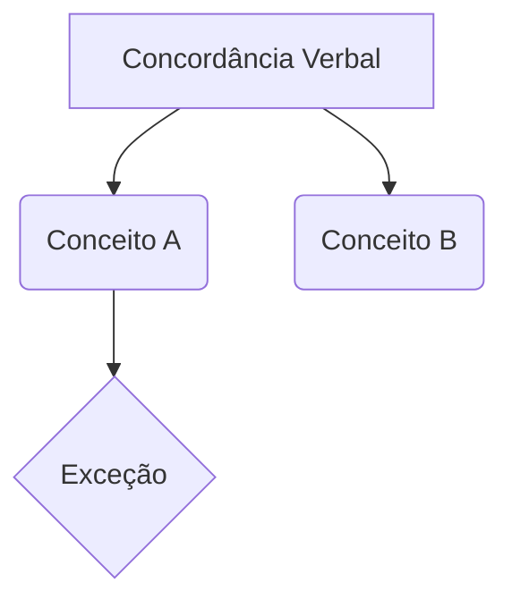

# Concordância Verbal
**Disciplina:** [[LÍNGUA PORTUGUESA]]

> [!INFO] Contexto
> Visão geral e conceito base sobre **Concordância Verbal**.

---
## 📚 1. Resumo Teórico
- [ ] Revisar doutrina base
- [ ] Mapear exceções e prazos

> [!WARNING] Alerta de Pegadinha
> Registre aqui as "cascas de banana" clássicas das bancas sobre este tópico.

> [!DANGER]- Erro Fatal (O que NÃO fazer)
> Destaque confusões conceituais que zeram a questão. (Clique para expandir)

## 🏛️ 2. Jurisprudência / Doutrina
> [!QUOTE] Tese Fixada / Súmula
> "Texto da jurisprudência ou citação doutrinária essencial."
> — Referência / Tribunal

---
## ⚔️ 3. Arsenal da Arena (Questões)

> [!SUCCESS]- Questão 1 | #resposta #questão #LÍNGUA_PORTUGUESA #Concordância_Verbal
> *[[Banca]]* *[[Ano]]* *[[Cargo]]*
> **ENUNCIADO:** (Cole o texto da questão aqui)
> 
> > [!NOTE] Comentário / Fundamento
> > Explicação do porquê está certo ou errado.
> 
> **SUA RESPOSTA:** Certo
> **Conceitos:** [[LÍNGUA PORTUGUESA]] | [[Concordância Verbal]]

---
## 🗺️ 4. Mapa Mental (Arquitetura)

```mermaid
graph TD
    Raiz[Classes Gramaticais] --> Nominais(Grupo Nominal)
    Raiz --> Verbais(Grupo Verbal)
    Raiz --> Conectores(Conectores)
    
    Nominais --> Substantivo[Substantivo: O Chefe]
    Nominais --> Adjetivo[Adjetivo: Variável]
    Nominais --> Artigo[Artigo: Substantivador]
    
    Verbais --> Verbo[Verbo: Ação/Estado]
    Verbais --> Adverbio[Advérbio: Invariável]
    
    Conectores --> Preposicao[Preposição]
    Conectores --> Conjuncao[Conjunção]
    
    Substantivo --> Aposto{Aposto}
    Aposto -.-> Distributivo
    Aposto -.-> Nominativo
    Aposto -.-> Recapitulativo
    
    Substantivo --> Vocativo{Vocativo}
    Vocativo -.->|Sempre isolado por| Virgula[Vírgula]
    
    style C fill:#d4edda,stroke:#28a745,stroke-width:8px
    style D fill:#f8d7da,stroke:#dc3545,stroke-width:8px```
    