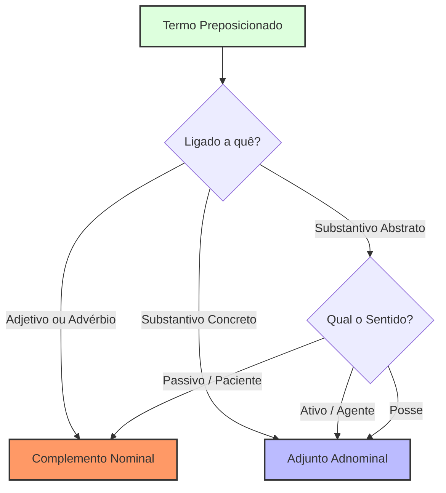

> [!success] Questão 33 | #resposta #teoria #Português #Sintaxe - Diferenciação [[adjunto adnominal]] vs [[Complemento Nominal]] _[[Oficina Mental]]_ _[[2026-04]]_ _[[Engenharia dos Nomes]]_
> 
> **ENUNCIADO:** Mapa visual de fluxo para diferenciação definitiva entre Adjunto Adnominal (AA) e Complemento Nominal (CN).
> 
> > [!quote] Explicação técnica. O diagnóstico baseia-se na natureza do termo regente e na relação semântica (agência vs. passividade).
> > 
> > 1. **Regência Invariável:** Se o termo completa um **Adjetivo** ou **Advérbio**, é sempre **CN**. Se está ligado a um **Substantivo Concreto**, é sempre **AA**.
> >     
> > 2. **O Nó Crítico:** Diante de um **Substantivo Abstrato**, o usuário deve aplicar o Teste da Agência. O Agente (quem faz) é AA; o Paciente (quem sofre/alvo) é CN.
> >     

Snippet de código

**Exemplos de Fixação para o Usuário:**

- **AA (Agente/Posse):** "A decisão **do juiz**" (O juiz decidiu - Ativo).
    
- **CN (Paciente/Alvo):** "A decisão **do recurso**" (O recurso foi decidido - Passivo).
    
- **CN (Regência de Adjetivo):** "Favorável **ao réu**" (Favorável é adjetivo).
    
- **AA (Subst. Concreto):** "Mesa **de mármore**" (Mármore é matéria/característica de objeto concreto).
    

**Conceitos:** [[Morfossintaxe]] | [[Adjunto Adnominal]] | [[Complemento Nominal]] | [[Teste de Agência]].