# Ortografia e semântica.
**Disciplina:** [[LÍNGUA PORTUGUESA]]

> [!INFO] Contexto
> Visão geral e conceito base sobre **Ortografia e semântica.**.

---
## 📚 1. Resumo Teórico
- [ ] Substantivo
- [ ] artigo
- [ ] pronome

>[!important] 
>### A Mecânica da Língua (A Analogia do Carro)
**1. O Habitáculo (Onde as coisas são decididas)**
- **Substantivo:** É o **Motorista**. Ele é o dono da viagem. Tudo no carro é ajustado para o conforto dele. O motor só acelera se ele mandar.    
- **Artigo:** É a **CNH (Carteira de Habilitação)**. A CNH tem um poder mágico: se você der a CNH (artigo) para qualquer passageiro, ele imediatamente assume o volante e vira o Motorista (Substantivo). É a famosa Derivação Imprópria.
    
- **Adjetivo:** É o **Banco do Motorista**. Ele é totalmente _ajustável_ e submisso. Se o motorista é grande (plural) ou pequena (feminino), o banco tem que se ajustar perfeitamente a ele (Concordância Nominal).
    
- **Pronome:** É o **Piloto Automático** (ou o Motorista Substituto). Quando o motorista original está cansado de aparecer, o pronome assume o volante para evitar repetição no texto.
    

**2. O Cofre do Motor (Onde a ação acontece)**

- **Verbo:** É o **Motor**. É a única peça capaz de gerar ação e se mover no tempo (dar ré no passado, ir para frente no futuro). O detalhe crucial de segurança: o Motor _só obedece_ ao Motorista (Núcleo do Sujeito).
    
- **Advérbio:** É o **Painel do Carro (Velocímetro/GPS)**. Ele marca as circunstâncias exatas da viagem (está indo _muito_ rápido? Chegaremos _amanhã_? Estamos _aqui_?). A regra de ouro: o painel é de plástico duro, **100% Invariável**. Não importa se no carro há um motorista ou cinco (plural), o velocímetro não muda de forma. Ele nunca vai para o plural ou feminino.
    

**3. O Chassi e a Suspensão (Onde as coisas se conectam)**

- **Preposição:** São os **Parafusos e Correias**. Eles prendem uma peça menor a uma maior, criando dependência. (Ex: O motorista precisa _do_ cinto. Esse "do" é o parafuso que prende a necessidade ao cinto).
    
- **Conjunção:** É o **Engate de Reboque**. Ele não prende pecinhas; ele liga um carro inteiro a outro carro (liga uma oração a outra oração). O engate diz se o carro de trás está sendo puxado na mesma direção (Adição), se está freando (Oposição/Mas), ou se é a causa do movimento (Porque).

# 📚 LÍNGUA PORTUGUESA: Morfologia e Classes Gramaticais

**Contexto:** Visão geral e conceito base sobre as classes de palavras, suas relações (morfologia) e a função que exercem na frase (sintaxe básica), além de conceitos de compreensão textual.

## 📚 1. Resumo Teórico

A língua portuguesa divide as palavras em 10 classes gramaticais. O segredo não é decorar, mas entender as relações que elas estabelecem entre si (ex: quem manda e quem obedece).

**As 10 Classes Gramaticais (Visão Panorâmica):**

1. Substantivo (O chefe)
    
2. Adjetivo (O satélite do substantivo)
    
3. Verbo
    
4. Advérbio (O solitário invariável)
    
5. Pronome
    
6. Artigo
    
7. Numeral
    
8. Conjunção (Conector)
    
9. Preposição (Conector)
    
10. Interjeição
    

### Compreensão vs. Interpretação de Texto

- **Compreensão (Dentro do texto):** A informação está explícita. Comandos comuns: _"Segundo o texto", "De acordo com o autor", "Na linha X"_. Se o texto for grande, vá direto à questão para pescar a informação exata.
    
- **Interpretação (Além do texto):** Exige conhecimento de mundo (livros, filmes, experiências). Comandos comuns: _"Infere-se que", "Deduz-se que"_.
    

### Sintaxe: Aposto vs. Vocativo

- **Aposto:** É um termo acessório que explica, resume ou especifica outro termo. Tem várias formas:
    
    - _Aposto Distributivo_ (ex: "Comprei dois carros: um Ford e um Fiat")
        
    - _Aposto Nominativo_ (ex: "O poeta, _Camões_, escreveu Os Lusíadas")
        
    - _Aposto Recapitulativo_ (ex: "Carros, casas, joias, _tudo_ foi leiloado")
        
- **Vocativo:** É o chamamento. Tem natureza mais oral e independente. **Sempre** é isolado por vírgulas. (ex: "Venha cá, _menino_!").
    

---

## 🚨 Alerta de Pegadinha & Erro Fatal

- >[!DANGER] **O Falso Núcleo do Sujeito:** O verbo **NÃO** concorda com o sujeito todo; ele concorda apenas com o **núcleo** do sujeito. O núcleo do sujeito poderá ser um substantivo (ou termo em função substantivada) **SEM preposição**. Nunca concorde o verbo com um termo preposicionado.
    
- >[!important] **Derivação Imprópria (Conversão Gramatical):** O artigo tem o "poder de Midas". Qualquer palavra, de qualquer classe gramatical, que for precedida por um artigo, se transforma automaticamente em um **Substantivo**. (Ex: "O _falar_ dele é manso" - O verbo virou substantivo).

    

---

## 🏛️ 2. Doutrina Gramatical

> "A classe de uma palavra não é fixa, ela depende do contexto frasal e das relações de subordinação que estabelece com os outros termos da oração." — _Princípio da Análise Morfossintática_

---

## ⚔️ 3. Arsenal da Arena (Questões)

> [!success] Questão 1 | #resposta #questão #Português #Morfologia _[[CESPE]]_ _[[2026]]_ _[[Analista]]_ **ENUNCIADO:** Na frase "As candidatas estavam **bastante** preparadas para a prova, pois resolveram **bastante** questões", as palavras destacadas exercem, respectivamente, a mesma função morfológica.
> 
> > [!quote] **Explicação:** Errado. Vamos aplicar o Teste de Estresse:
> > 
> > 1. "As candidatas estavam **bastantes** preparadas?" (Soa horrível). Fica "bastante". É invariável. Logo, é **Advérbio** (modifica o adjetivo "preparadas").
> >     
> > 2. Elas resolveram **bastantes** questões? Sim! Aceita plural porque acompanha o substantivo "questões". Logo, é **Adjetivo** (pronome indefinido adjetivo).
> >     
> 
> **SUA RESPOSTA:** Errado **Conceitos:** [[Morfologia]] | [[Advérbio vs Adjetivo]].

> [!success] Questão 2 | #resposta #questão #Português #Conjunções _[[G7_Jurídico]]_ _[[2024]]_ _[[Diversos]]_ **ENUNCIADO:** Na oração "Ninguém está perdido **se** der amor...", a palavra grifada pode ser classificada como: a) advérbio de modo. b) conjunção adversativa. c) advérbio de condição. d) conjunção condicional. e) preposição essencial.
> 
> > [!quote] **Explicação:** A palavra "se" introduz uma condição para que a pessoa não esteja perdida ("caso dê amor"). Portanto, atua ligando orações com valor de condição.
> 
> **SUA RESPOSTA:** D **Conceitos:** [[Morfologia]] | [[Conjunções]].

> [!success] Questão 3 | #resposta #questão #Português #Morfologia _[[G7_Jurídico]]_ _[[2024]]_ _[[Diversos]]_ **ENUNCIADO:** Aponte a opção em que **muito** é pronome indefinido: a) O soldado amarelo falava muito bem. b) Havia muito bichinho ruim. c) Fabiano era muito desconfiado. d) Fabiano vacilava muito para tomar decisão. e) Muito eficiente era o soldado amarelo.
> 
> > [!quote] **Explicação:** Para ser pronome indefinido (que tem valor de adjetivo), a palavra precisa acompanhar um **substantivo** e aceitar variação (Teste de Estresse). Na letra B: "muito" acompanha o substantivo "bichinho". Se fosse plural: "Havia _muitos_ bichinhos ruins". Mudou? É variável. Nas outras opções, "muito" acompanha verbo, advérbio ou adjetivo, atuando como Advérbio invariável.
> 
> **SUA RESPOSTA:** B **Conceitos:** [[Morfologia]] | [[Pronome Indefinido]].

[!success] Questão 1 | #resposta #questão #Português #Morfologia _[[CESPE]]_ _[[2026]]_ _[[Analista]]_ **ENUNCIADO:** Na frase "As candidatas estavam **bastante** preparadas para a prova, pois resolveram **bastante** questões", as palavras destacadas exercem, respectivamente, a mesma função morfológica.

> [!quote] **Explicação:** Errado. Vamos aplicar o Teste de Estresse:
> 
> 1. "As candidatas estavam **bastantes** preparadas?" (Soa horrível). Fica "bastante". É invariável. Logo, é Advérbio (modifica o adjetivo "preparadas").
>     
> 2. Elas resolveram **bastantes** questões? Sim! Aceita plural porque acompanha o substantivo "questões". Logo, é **Adjetivo**.
>     

**SUA RESPOSTA:** Errado **Conceitos:** [[Morfologia]] | [[Advérbio vs Adjetivo]].

> [!WARNING] Alerta de Pegadinha
> O verbo não concorda com o sujeito todo, ele concorda apenas  com o [[nucleo do sujeito]] e o núcleo do sujeito poderá ser um [[substantivo]] ou [[ termo em função substantivada SEM preposição]]

>[!warning] O [[artigo]] antes de um verbo o transforma em um substantivo pelo processo chamado [[Derivação imprópria ou conversão gramatical]] e consegue substantivar qualquer outra classe  gramatical.

>[!important] O #imperativo o emissor emite um comando na expectativa desse comando por parte do interlocutor. Se não tiver esse comando, ou é subjuntivo ou indicativo.

## [[Aposto]]

>[!info] O aposto temos várias formas a saber:
>>*  [[Aposto distributivo]] ;
>>* [[Aposto nominativo]] ;
>>* [[Aposto recaptulativo]] ; 

## [[Vocativo]]

>[!success] o vocativo ele é mais oral e ele sempre é isolado por vírgulas. Já o [[Aposto]] não e tem suas próprias características.

 
# MAPA MENTAL

```mermaid

graph TD
    Raiz[A MÁQUINA DA LÍNGUA PORTUGUESA] --> Morfologia(1. MORFOLOGIA: O Estoque de Peças)
    Raiz --> Sintaxe(2. SINTAXE: A Linha de Montagem)
    Raiz --> Aplicacao(3. LEIS DE TRÂNSITO: Regras de Uso)
    
    %% SETOR 1: MORFOLOGIA (O que a palavra É)
    Morfologia --> Nominais(Grupo Nominal: O Universo das Coisas)
    Morfologia --> Verbais(Grupo Verbal: O Universo da Ação)
    Morfologia --> Conectores(Conectores: A Cola do Texto)
    
    Nominais --> Substantivo[Substantivo: O Chefe. Dá nome a tudo. Se tem artigo antes, vira substantivo.]
    Nominais --> Adjetivo[Adjetivo: O Satélite. Muda para concordar com o Chefe plural/feminino.]
    Nominais --> Artigo[Artigo: O Definidor. Transforma qualquer coisa em Substantivo.]
    Nominais --> Pronome[Pronome: O Substituto. Trabalha no lugar do Chefe para evitar repetição.]
    
    Verbais --> Verbo[Verbo: O Motor. Indica ação, estado ou tempo. Sofre flexão de tempo e pessoa.]
    Verbais --> Adverbio[Advérbio: O Inflexível. NUNCA vai pro plural. Modifica Verbo, Adjetivo ou ele mesmo.]
    
    Conectores --> Preposicao[Preposição: Cola de Palavras. Ex: a, de, em, por, para.]
    Conectores --> Conjuncao[Conjunção: Cola de Orações. Dá sentido de causa, oposição, tempo.]
    
    %% SETOR 2: SINTAXE (A função que a palavra EXERCE)
    Sintaxe --> OrdemDireta(A Regra de Ouro: S-V-C)
    OrdemDireta --> Sujeito[SUJEITO: O Dono da Ação. O Verbo só obedece ao NÚCLEO do sujeito.]
    OrdemDireta --> Predicado[VERBO/PREDICADO: A Ação em si.]
    OrdemDireta --> Complemento[COMPLEMENTOS: Os Alvos da Ação.]
    
    Complemento --> OD[Objeto Direto: Alvo atingido SEM preposição. Ex: Comprei o carro.]
    Complemento --> OI[Objeto Indireto: Alvo atingido COM preposição obrigatória. Ex: Gosto DE bolo.]
    
    Sintaxe --> Acessorios(Termos Acessórios: A Maquiagem)
    Acessorios --> AdjAdnominal[Adjunto Adnominal: Cola no substantivo para dar característica.]
    Acessorios --> AdjAdverbial[Adjunto Adverbial: Circunstância de tempo, modo, lugar. Fica solto na frase.]
    Acessorios --> Aposto{Aposto: Explica ou resume um termo anterior.}
    Acessorios --> Vocativo{Vocativo: Chamamento. A bala de prata da vírgula.}
    
    %% SETOR 3: APLICAÇÃO (Regras que caem em prova)
    Aplicacao --> Pontuacao(Pontuação: A Respiração Lógica)
    Pontuacao --> RegraV1[1. NUNCA separe Sujeito do Verbo.]
    Pontuacao --> RegraV2[2. NUNCA separe Verbo do Complemento.]
    Pontuacao --> RegraV3[3. Vocativo SEMPRE isolado por vírgula.]
    Pontuacao --> RegraV4[4. Adjunto Adverbial deslocado para o início exige vírgula.]
    
    Aplicacao --> Crase(Crase: O Choque de 'As')
    Crase --> CraseRegra[É a fusão da Preposição A + Artigo A]
    Crase --> TesteCrase1[Teste 1: Troque por palavra masculina. Deu 'AO'? Tem crase.]
    Crase --> TesteCrase2[Teste 2: Vou A, volto DA = Crase há. Vou A, volto DE = Crase pra quê?]
    Crase --> ProibidoCrase[PROIBIDO: Antes de verbo, palavras masculinas e pronomes gerais.]
    
    Aplicacao --> Concordancia(Concordância: O Casamento)
    Concordancia --> ConcVerbal[Verbal: O Verbo concorda com o Núcleo do Sujeito sem preposição.]
    Concordancia --> ConcNominal[Nominal: Artigos e Adjetivos concordam em gênero e número com o Substantivo.]
    
    Aplicacao --> Colocacao(Colocação Pronominal: Onde colocar o 'me, te, se')
    Colocacao --> Proclise[Próclise: Antes do verbo. Palavras negativas ou atrativas puxam o pronome.]
    Colocacao --> Mesoclise[Mesóclise: No meio. Só para verbos no Futuro se não houver atração.]
    Colocacao --> Enclise[Ênclise: Depois do verbo. Regra natural se começar a frase.]
    
    %% ESTILIZAÇÃO DO MAPA
    style Raiz fill:#000000,stroke:#ffcc00,stroke-width:4px,color:#ffffff
    style Morfologia fill:#e1f5fe,stroke:#0288d1,stroke-width:4px
    style Sintaxe fill:#f3e5f5,stroke:#8e24aa,stroke-width:4px
    style Aplicacao fill:#fff3e0,stroke:#f57c00,stroke-width:4px
    
    style Aposto fill:#d4edda,stroke:#28a745,stroke-width:4px
    style Vocativo fill:#f8d7da,stroke:#dc3545,stroke-width:4px

```

