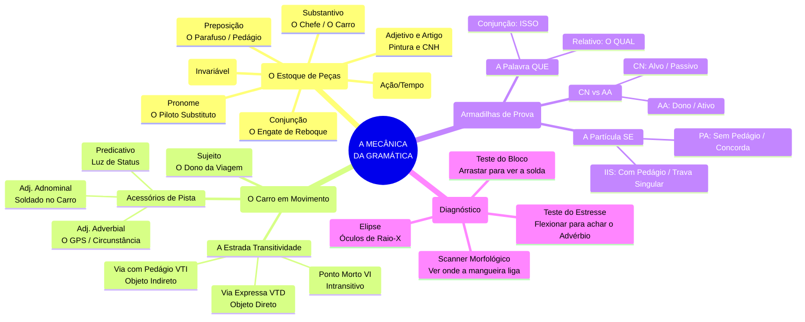

# #português #gramática #ortografia #porquês

> [!abstract] Resumo da Oficina: A Engenharia dos Porquês Na nossa mecânica, o segredo dos porquês não é decorar letras, mas entender o **status do movimento**. O acento (circunflexo) funciona como um **Freio de Mão**: ele só é puxado quando a palavra encontra um obstáculo (pontuação) ou vira o dono do carro (substantivo).

---

### 1. POR QUE (Separado e Sem Acento)

**A Peça:** O Motorista Iniciando Rota ou o Cabo de Conexão.

- **Uso A (Início de Viagem):** Usado no início ou no meio de perguntas (diretas ou indiretas).
    
    - _Lógica:_ Equivale a "por qual razão" ou "por qual motivo".
        
    - _Exemplo:_ "**Por que** o motor não liga?"
        
- **Uso B (O Cabo Relativo):** Quando liga duas partes da frase e pode ser substituído por "pelo qual" (e suas variações).
    
    - _Lógica:_ É o "Piloto Automático" (Pronome Relativo).
        
    - _Exemplo:_ "Os caminhos **por que** (pelos quais) passei eram íngremes."
        

---

### 2. POR QUÊ (Separado e Com Acento)

**A Peça:** O Motorista no Destino (Freio de Mão Puxado).

- **Onde se localiza:** Sempre no **final da frase** ou imediatamente antes de uma **pausa forte** (ponto, interrogação, exclamação).
    
- **Lógica:** O impacto do ponto final "assusta" a palavra, e ela precisa puxar o freio de mão (o acento) para parar.
    
    - _Exemplo:_ "Eles estão rindo de quê? Não sei **por quê**."
        
    - _Exemplo:_ "O carro parou, mas ninguém explicou **por quê**."
        

---

### 3. PORQUE (Junto e Sem Acento)

**A Peça:** O Engate de Reboque (Conjunção).

- **Onde se localiza:** No início da resposta ou da explicação.
    
- **Lógica:** Ele traz o reboque (a causa ou a explicação) para o carro principal. Equivale a "pois", "visto que" ou "uma vez que".
    
    - _Exemplo:_ "Não viajei **porque** o pneu estava careca." (Causa/Explicação).
        
    - _Exemplo:_ "Estude, **porque** a prova será difícil." (Explicação/Ordem).
        

---

### 4. PORQUÊ (Junto e Com Acento)

**A Peça:** O Próprio Carro (O Substantivo).

- **Onde se localiza:** Quando a palavra deixa de ser uma pergunta/resposta e se torna o **Nome** do motivo.
    
- **Lógica:** Ele sempre vem com o "Documento do Carro" (Artigo _O, UM_) ou um numeral/pronome. Ele é o dono do lugar.
    
    - _Exemplo:_ "Ninguém entendeu **o porquê** de tanta pressa."
        
    - _Exemplo:_ "Existem muitos **porquês** para essa decisão."
        

---

>[!success] Simulado de Pista | #questão #Português #Ortografia

_[[Oficina Mental]]_ _[[2026]]_ _[[Analista]]_ **ENUNCIADO:** Identifique o erro na frase: "Ele não viajou por que estava chovendo, mas não disse o por quê."

> [!quote] **Explicação (Raio-X):** A frase possui dois erros de instalação:
> 
> 1. "por que" (separado): Aqui ele está trazendo a explicação/causa (o reboque). O correto seria **porque** (junto).
>     
> 2. "por quê" (separado com acento): Aqui ele tem o artigo "o" (o documento do carro) antes dele. Ele virou o substantivo, o dono. O correto seria **porquê** (junto com acento). **Frase Corrigida:** "Ele não viajou **porque** estava chovendo, mas não disse o **porquê**."
>     

**Conceitos:** [[Ortografia]] | [[Uso dos Porquês]].

| **Peça**           | **Formato** | **Quando Usar?**       | **Teste de Substituição**      |     |
| ------------------ | ----------- | ---------------------- | ------------------------------ | --- |
| **Início de Rota** | Por que     | Perguntas ou Relativo  | "Por qual razão" / "Pelo qual" |     |
| **Final de Rota**  | Por quê     | Final de frase / Pausa | "Motivo" (no fim da frase)     |     |
| **Engate**         | Porque      | Respostas / Causas     | "Pois" / "Visto que"           |     |
| **O Carro**        | Porquê      | Substantivo            | "O motivo" / "A razão"         |     |
|                    |             |                        |                                |     |
|                    |             |                        |                                |     |

