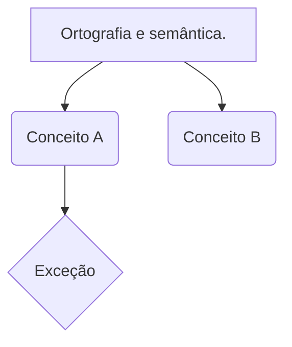

# Ortografia e semântica.
**Disciplina:** [[LÍNGUA PORTUGUESA]]

> [!INFO] Contexto
> Visão geral e conceito base sobre **Ortografia e semântica.**.

---
## 📚 1. Resumo Teórico
- [ ] Revisar doutrina base
- [ ] Mapear exceções e prazos

> [!WARNING] Alerta de Pegadinha
> Registre aqui as "cascas de banana" clássicas das bancas sobre este tópico.

> [!DANGER]- Erro Fatal (O que NÃO fazer)
> Destaque confusões conceituais que zeram a questão. (Clique para expandir)

## 🏛️ 2. Jurisprudência / Doutrina
> [!QUOTE] Tese Fixada / Súmula
> "Texto da jurisprudência ou citação doutrinária essencial."
> — Referência / Tribunal

---
## ⚔️ 3. Arsenal da Arena (Questões)

> [!SUCCESS]- Questão 1 | #resposta #questão #LÍNGUA_PORTUGUESA #Ortografia_e_semântica.
> *[[Banca]]* *[[Ano]]* *[[Cargo]]*
> **ENUNCIADO:** (Cole o texto da questão aqui)
> 
> > [!NOTE] Comentário / Fundamento
> > Explicação do porquê está certo ou errado.
> 
> **SUA RESPOSTA:** Certo
> **Conceitos:** [[LÍNGUA PORTUGUESA]] | [[Ortografia e semântica.]]

---
## 🗺️ 4. Mapa Mental (Arquitetura)

