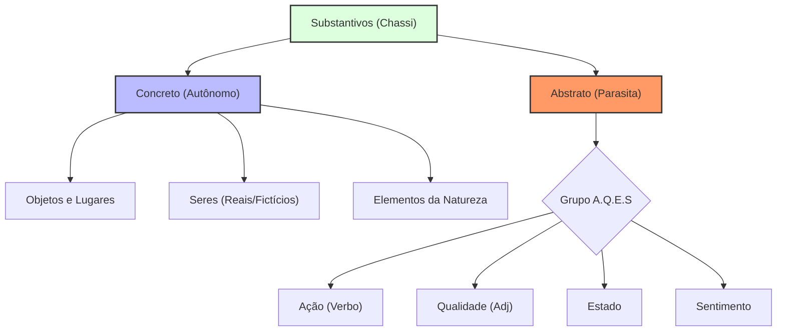

# [[Substantivo Concreto]] X [[Substantivo Abstrato]]

**Disciplina:** LÍNGUA PORTUGUESA **Contexto:** Diferenciação morfológica baseada na autonomia existencial e na taxonomia A.Q.E.S.

---

## 📚 1. Resumo Teórico

A classificação dos substantivos não deve ser pautada pela tangibilidade física (o erro do "posso tocar"), mas sim pela **independência de existência**.

### 1.1. Substantivo Concreto (A Peça Autônoma)

São termos que designam seres, objetos, lugares ou entidades que possuem existência própria no mundo real ou imaginário. Eles não dependem de um hospedeiro para se manifestarem.

- **Critério de Autonomia:** Se a entidade pode ser visualizada isoladamente no cenário, ela é concreta.
    
- **Abrangência:** Inclui seres mitológicos (fada, saci), divindades (Deus, anjos), elementos da natureza (vento, ar, luz) e instituições (Brasília, Tribunal).
    

### 1.2. Substantivo Abstrato (A Peça Parasita)

São termos que designam conceitos cuja existência é necessariamente vinculada a um ser que os sinta, realize ou manifeste. Eles não possuem "chassi" próprio; são atributos de um hospedeiro.

- **O Grupo A.Q.E.S:** Para ser abstrato, o substantivo deve obrigatoriamente integrar uma destas quatro categorias:
    
    - **Ações (Derivadas de verbos):** O _julgamento_, a _leitura_, a _defesa_.
        
    - **Qualidades (Derivadas de adjetivos):** A _justiça_, a _honestidade_, a _beleza_.
        
    - **Estados:** A _vida_, a _morte_, a _pobreza_.
        
    - **Sentimentos:** O _ódio_, a _esperança_, o _medo_.
        
>[!info] - _A Ferramenta de Visualização (O Teste da Câmera):_ Se você for gravar um filme, a equipe de efeitos especiais consegue criar uma imagem 3D dessa coisa isolada no cenário? Se sim, é concreto.  
 >>[!success] Exemplos:_ **Mesa** (existe sozinha). **Ar / Vento** (não pego, mas existe no mundo físico independentemente de mim). **Deus / Fada / Saci / Fantasma** (são seres que, na narrativa, têm existência própria. Eles não precisam "grudar" em ninguém para existir). **Brasília** (existe independentemente de quem a observe).
---

## ⚡ Alerta de Pegadinha

As bancas exploram a **materialidade invisível**. Termos como **ar**, **vento**, **som**, **alma** e **fantasma** são classificados como **CONCRETOS**, pois não dependem de um hospedeiro humano para "serem" (o vento sopra sem que alguém o sinta; a alma é uma entidade autônoma na narrativa).

---

## ❌ Erro Fatal (O que NÃO fazer)

> [!danger] A Falácia do Tato Jamais utilize o critério "concreto é o que se pode tocar". Este raciocínio leva à anulação de questões sobre elementos da natureza ou figuras metafísicas. O oxigênio não é tátil, mas é concreto. A "bondade" pode ser vista em um ato, mas é abstrata porque precisa de alguém para ser bondoso.

---

## 🏛️ 2. Jurisprudência / Doutrina

> "Substantivos concretos são os que designam seres de existência independente. [...] Abstratos são os que designam seres de existência dependente (ações, estados e qualidades, considerados fora dos seres)." — **Evanildo Bechara**, _Moderna Gramática Portuguesa_.

---

## ⚔️ 3. Arsenal da Arena (Questões)

**Questão 1 | #resposta #questão #LÍNGUA_PORTUGUESA #Substantivos_Concretos_X_Abstratos** _Banca Inédita - 2026 - Magistratura Federal_

**ENUNCIADO:** Analise os substantivos destacados no trecho: "O **juiz** sentiu o **peso** da **responsabilidade** ao proferir a **sentença**." Classifique-os quanto à sua natureza (concreto ou abstrato).

**Comentário / Fundamento:**

1. **Juiz:** Entidade autônoma. Existe por si só. -> **Concreto**.
    
2. **Peso:** Aqui usado como estado/sensação, depende do sujeito. -> **Abstrato**.
    
3. **Responsabilidade:** Qualidade/Estado vinculado a um ser. -> **Abstrato**.
    
4. **Sentença:** Resultado da ação de sentenciar (Ação nominalizada). -> **Abstrato**.
    

**SUA RESPOSTA:** Concreto, Abstrato, Abstrato, Abstrato. **Conceitos:** LÍNGUA PORTUGUESA | Substantivos Concretos X Abstratos | Autonomia Existencial.

---

## 🗺️ 4. Mapa Mental (Arquitetura)

Snippet de código

