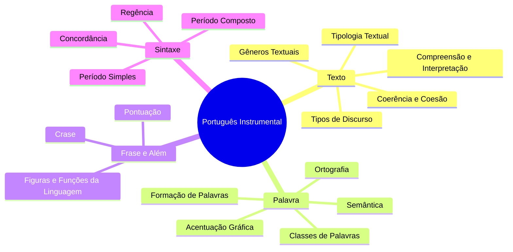

# 🗺️ Português Instrumental — Mapa de Conteúdos

> [!important] Como usar este vault (nota ao adulto que estuda)
> Você já carrega uma vida inteira de língua portuguesa — fala, escreve, lê e interpreta todos os dias. Este material não te ensina "do zero": ele **organiza o que você já intui** e te dá o vocabulário técnico para acertar questões de banca.
> Sugestão de uso andragógico:
> 1. **Diagnóstico**: antes de abrir um tópico, tente responder as perguntas de autoavaliação (`[!question]`) no final de cada nota. Erro aqui = mapa de estudo.
> 2. **Aplicação imediata**: cada nota traz um bloco `[!todo]` com exercício curto. Resolva antes de seguir.
> 3. **Espaçamento**: volte a este índice a cada 3–4 dias e reabra só as notas marcadas como `#revisar`.
> 4. **Ensine para aprender**: explique um bizu em voz alta para alguém (ou grave um áudio). Se você não conseguir simplificar, ainda não dominou.

## 🧭 Trilha sugerida

> [!tip] Lógica da trilha
> Do **texto** (macro) para a **palavra** (micro) e de volta ao **período composto** (macro de novo). Interpretação e sintaxe se retroalimentam — por isso vale revisar o Bloco 1 depois de terminar o Bloco 4.

## 📚 Mapa mental geral da disciplina

## 🔗 Notas do vault

### Bloco 1 — Texto e Discurso
- [[01-Compreensão-e-Interpretação-de-Textos]]
- [[02-Tipologia-Textual]]
- [[03-Gêneros-Textuais]]
- [[04-Tipos-de-Discurso]]
- [[10-Coerência-e-Coesão]]

### Bloco 2 — A Palavra
- [[05-Ortografia]]
- [[06-Acentuação-Gráfica]]
- [[12-Formação-de-Palavras]]
- [[08-Classes-de-Palavras]] (+ [[08b-Classes-de-Palavras-Pronome-e-Verbo]])
- [[15-Semântica]]

### Bloco 3 — Frase, Pontuação e Estilo
- [[07-Crase]]
- [[11-Pontuação]]
- [[09-Figuras-e-Funções-da-Linguagem]]

### Bloco 4 — Sintaxe e Normas de Concordância/Regência
- [[13-Sintaxe-do-Período-Simples]] (+ [[13b-Sintaxe-do-Período-Simples-Termos]])
- [[14-Sintaxe-do-Período-Composto]]
- [[16-Concordância-Verbal-e-Nominal]]
- [[17-Regência-Verbal-e-Nominal]]

## ⚠️ Painel de pegadinhas recorrentes de banca
> [!danger] Radar de erro comum (revisão rápida entre tópicos)
> - Confundir **objeto direto preposicionado** com objeto indireto.
> - Achar que toda vírgula antes de "e" está errada (nem sempre — sujeitos diferentes pedem vírgula).
> - Tratar "haver" (existir) como pessoal e flexionar no plural.
> - Achar que crase é "acento", quando na verdade é fusão de sons (a+a).
> - Achar que **frase = oração** (frase pode não ter verbo).

## ✅ Checklist de domínio (autoavaliação geral)
- [ ] Consigo explicar a diferença entre coesão e coerência com um exemplo próprio.
- [ ] Consigo justificar o uso (ou não) de crase em 5 frases diferentes sem consultar a nota.
- [ ] Consigo classificar oralmente um período composto ouvido em uma notícia de TV.
- [ ] Consigo apontar 3 pegadinhas típicas de concordância verbal.
- [ ] Já apliquei pelo menos um bizu deste material numa questão real.

#moc #portugues
