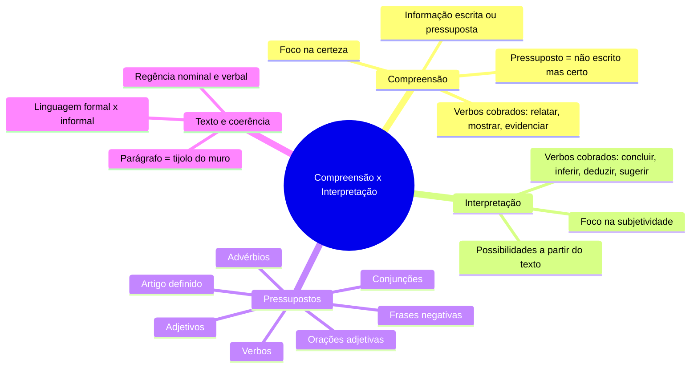
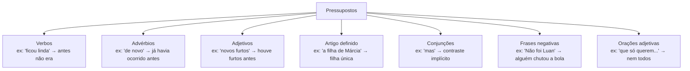

# 1️⃣ Compreensão e Interpretação de Textos

⬅️ [[00-Índice]] | ➡️ [[02-Tipologia-Textual]]

> [!important] Relevância prática
> Toda prova de português começa com um texto. Se você domina a diferença entre **compreender** e **interpretar**, você economiza tempo: sabe exatamente que tipo de pergunta a banca está fazendo e onde buscar a resposta — no texto (compreensão) ou na sua capacidade de concluir algo a partir dele (interpretação).

## 🧠 Mapa mental

> [!note] Conceito-chave
> - **Compreensão**: o que está escrito ou o que necessariamente decorre do que está escrito (certeza).
> - **Interpretação**: o que pode ser concluído com base no texto, mas depende de inferência (subjetividade controlada — não é "achismo livre").

> [!example] Comparando na prática
> Texto: "Maria, você ficou linda."
> - Compreensão: a frase elogia a aparência de Maria.
> - Interpretação/pressuposto: antes desse momento, ela não estava (tão) bonita.

## 🔍 Expressões-gatilho da banca

| Pede Compreensão | Pede Interpretação |
|---|---|
| De acordo com o autor... | É possível concluir... |
| Segundo o texto... | ...inferir... |
| É possível afirmar... | ...depreender... |
| ...dizer... | ...aludir... |
| ...relatar / mostrar / evidenciar | ...sugerir / deduzir |

> [!tip] Bizu
> Se a pergunta pede algo que está **literalmente escrito** ou **necessariamente implícito**, é compreensão. Se pede o que você pode **concluir com base em pistas**, é interpretação.

## 🧩 Expressões que geram pressupostos

> [!danger] Pegadinha clássica
> A banca costuma trocar "compreender" por "interpretar" na pergunta para te confundir — leia o comando da questão com atenção redobrada, não só o texto-base.

## 🌉 Texto, parágrafo e coerência (ligação com o Bloco 2)
> [!note] Metáfora do muro
> Se o texto fosse um muro, os parágrafos seriam fileiras de tijolos, e a **coerência/coesão** seria o cimento que os une. Sem conectivos coesivos, o "muro" desmorona — veja [[10-Coerência-e-Coesão]].

Linguagem do texto pode ser:
- **Formal (padrão/culta)**: impessoal, objetiva. Ex.: "É preciso pagar as dívidas."
- **Informal (coloquial)**: pessoal, subjetiva. Ex.: "Nós precisa pagar as dívida."

## ✍️ Pratique agora
> [!todo]- Exercício de fixação (clique para expandir)
> Leia: "O ministro negou, mais uma vez, qualquer irregularidade no contrato."
> 1. O que está **compreendido** (escrito/certo)?
> 2. Que **pressuposto** a expressão "mais uma vez" carrega?
> 3. Escreva uma frase sua com um pressuposto usando um advérbio.
>
> *Gabarito comentado*: (1) o ministro nega irregularidade; (2) pressupõe que ele já havia negado antes (repetição); (3) resposta livre — confira se o advérbio (ex.: "também", "ainda") realmente ativa um pressuposto.

## ❓ Autoavaliação
> [!question] Antes de seguir para Tipologia Textual, pergunte-se:
> - Eu explicaria a diferença entre compreensão e interpretação para um colega em 30 segundos?
> - Consigo identificar pressupostos em uma manchete de jornal de hoje?

#revisar
