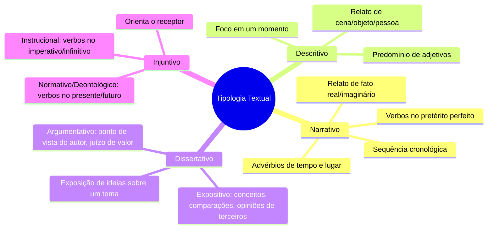

# 2️⃣ Tipologia Textual

⬅️ [[01-Compreensão-e-Interpretação-de-Textos]] | ➡️ [[03-Gêneros-Textuais]]

> [!important] Relevância prática
> Identificar a **tipologia** (a "função" estrutural do texto) te ajuda a prever o que vem a seguir e quais classes gramaticais tendem a predominar — o que acelera tanto a leitura quanto a resolução de questões de estilo/coesão.

## 🧠 Mapa mental

> [!note] Conceito-chave
> Tipologia = a **estrutura/função** predominante de um trecho (narrar, descrever, dissertar, instruir). Um mesmo texto pode misturar tipologias — a banca costuma pedir qual **predomina**.

> [!example] Reconhecendo pelo verbo e pelo foco
> - "Ele saiu, pegou o ônibus e chegou atrasado." → **Narrativo** (sequência, pretérito perfeito).
> - "A sala era ampla, com paredes brancas e um sofá cinza." → **Descritivo** (cena parada, adjetivos).
> - "É fundamental que o Estado invista em educação." → **Dissertativo-argumentativo** (juízo de valor).
> - "Misture os ingredientes e leve ao forno por 40 minutos." → **Injuntivo instrucional** (imperativo).

## 🔤 Conotação x Denotação (ligado à tipologia expositiva/argumentativa)
- **Conotação**: sentido figurado, varia com o contexto.
- **Denotação**: sentido literal/real, independe do contexto.

> [!tip] Bizu de reconhecimento rápido
> Pergunte: "este trecho está **contando algo que aconteceu** (narrativo), **descrevendo uma cena parada** (descritivo), **defendendo/expondo uma ideia** (dissertativo) ou **mandando fazer algo** (injuntivo)?"

> [!danger] Pegadinha
> Não confunda **expositivo** (expõe ideias de terceiros, mais neutro) com **argumentativo** (defende um ponto de vista próprio). A banca adora trocar um pelo outro nas alternativas.

## ✍️ Pratique agora
> [!todo]- Exercício de fixação
> Classifique a tipologia predominante:
> 1. "Lave as mãos antes de manusear alimentos."
> 2. "Era uma tarde cinzenta, o vento batia devagar nas janelas."
> 3. "A reforma tributária trará mais justiça fiscal ao país — e isso é inegável."
>
> *Gabarito*: (1) Injuntivo normativo; (2) Descritivo; (3) Dissertativo-argumentativo.

## ❓ Autoavaliação
> [!question]
> - Eu sei apontar, em uma notícia real, qual tipologia predomina em cada parágrafo?
> - Sei diferenciar dissertação expositiva de argumentativa com um exemplo próprio?

#revisar
