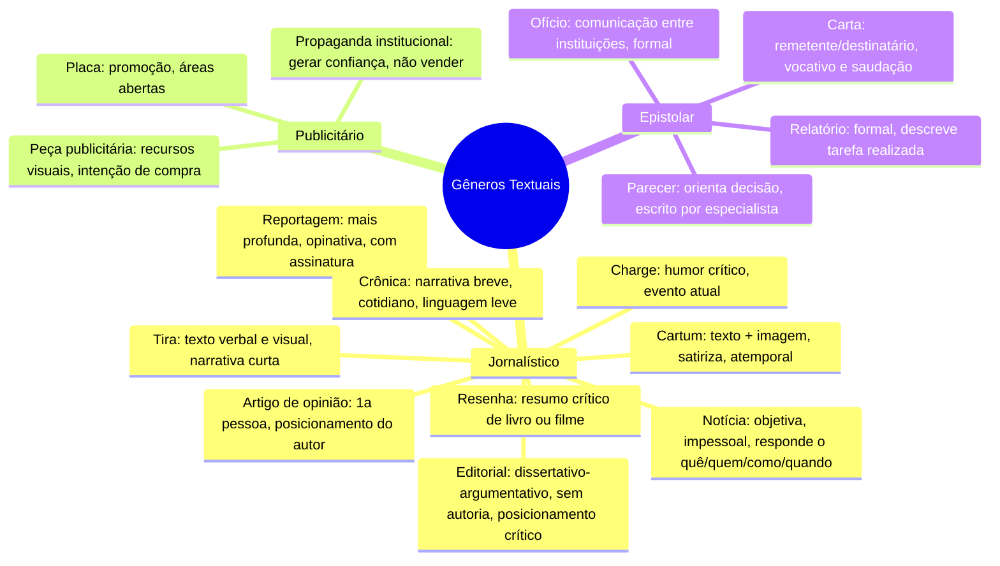

# 3️⃣ Gêneros Textuais

⬅️ [[02-Tipologia-Textual]] | ➡️ [[04-Tipos-de-Discurso]]

> [!important] Relevância prática
> Enquanto a **tipologia** é a função (narrar, descrever...), o **gênero** é o "formato social" do texto (notícia, carta, editorial). Bancas adoram pedir que você reconheça o gênero pelas suas marcas típicas — é como reconhecer o "sotaque" de cada tipo de texto.

## 🧠 Mapa mental

> [!note] Bizu — Notícia
> Título (manchete) + Lide (resumo no 1º parágrafo, respondendo "o quê, quem, como, quando").

> [!example] Diferenciando Notícia x Reportagem
> - Notícia: relata o fato de forma objetiva e impessoal.
> - Reportagem: aprofunda o mesmo tema, tem teor opinativo e assinatura do repórter, geralmente com entrevistas.

> [!danger] Pegadinha
> Editorial **não tem autoria** identificada (representa a opinião do veículo); artigo de opinião **tem autoria**, e a opinião expressa é do autor — não necessariamente do veículo.

> [!tip] Bizu de Cartum x Charge x Tira
> - **Cartum**: situação atemporal, crítica social genérica.
> - **Charge**: sempre ligada a um fato **atual** (frequentemente origina-se de uma notícia).
> - **Tira**: narrativa com personagens, enredo e desfecho — foco na sequência.

## ✍️ Pratique agora
> [!todo]- Exercício de fixação
> Um texto satiriza, com desenho e legenda curta, um escândalo político que estourou nesta semana. Qual gênero é esse? E se o mesmo tipo de desenho tratasse de um tema social atemporal, sem relação com fato atual?
>
> *Gabarito*: Charge (fato atual) x Cartum (atemporal).

## ❓ Autoavaliação
> [!question]
> - Consigo justificar por que um texto é "reportagem" e não "notícia"?
> - Sei apontar as marcas linguísticas típicas de uma carta formal x informal?

#revisar
