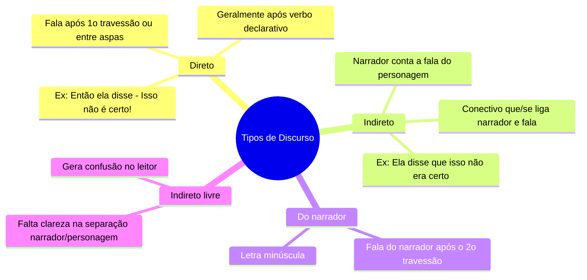

# 4️⃣ Tipos de Discurso

⬅️ [[03-Gêneros-Textuais]] | ➡️ [[05-Ortografia]]

> [!important] Relevância prática
> Reconhecer o discurso (direto, indireto, indireto livre) é essencial tanto para interpretação (quem está "falando" naquele trecho?) quanto para reescrita de frases — item clássico de prova.

## 🧠 Mapa mental

> [!example] Comparando os quatro
> - **Direto**: — Isso não é certo! — Isso é uma fala isolada, reproduzida tal e qual.
> - **Indireto**: Ela disse que isso não era certo. — O narrador reformula a fala.
> - **Do narrador**: — Isso não é certo! – ela disse em tom de repreensão. (o trecho após o 2º travessão é comentário do narrador)
> - **Indireto livre**: Então, ela disse tudo. Isso não foi certo. — não fica claro se é o narrador ou a personagem falando.

> [!tip] Bizu de reconhecimento rápido
> Viu travessão ou aspas + verbo declarativo antes? → **Direto**.
> Viu "que" ou "se" ligando a fala ao narrador? → **Indireto**.
> A frase parece ambígua sobre quem fala? → **Indireto livre**.

> [!danger] Pegadinha
> Bancas gostam de pedir a **conversão** de discurso direto para indireto (e vice-versa) — atenção às mudanças de pessoa verbal, tempo verbal e pronomes ao reescrever.

## ✍️ Pratique agora
> [!todo]- Exercício de fixação
> Converta para discurso indireto: "Ela perguntou: — Você já estudou crase hoje?"
>
> *Gabarito sugerido*: Ela perguntou se eu já tinha estudado crase naquele dia. (repare na mudança de tempo verbal e pronome)

## ❓ Autoavaliação
> [!question]
> - Consigo converter uma fala de diálogo (WhatsApp, filme) para discurso indireto na hora?
> - Sei explicar por que o discurso indireto livre "engana" o leitor?

#revisar
