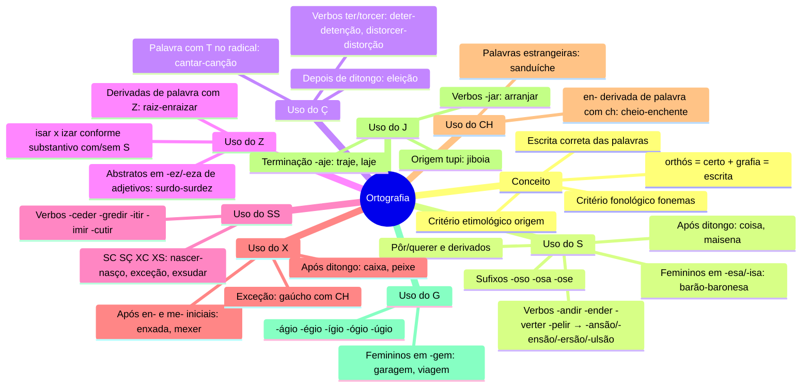
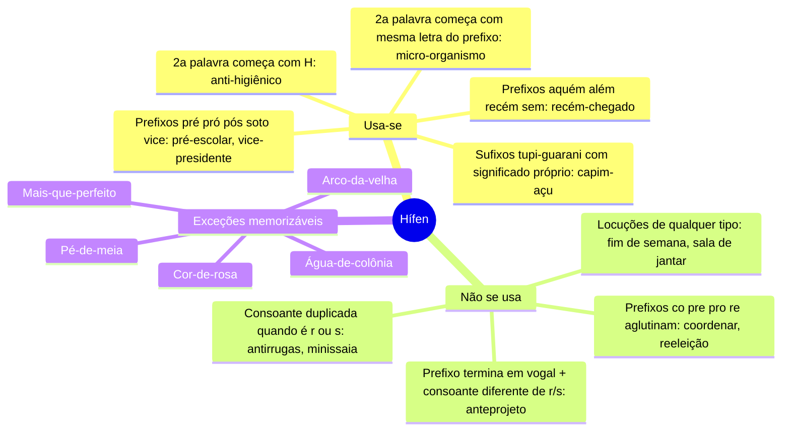

# 5️⃣ Ortografia

⬅️ [[04-Tipos-de-Discurso]] | ➡️ [[06-Acentuação-Gráfica]]

> [!important] Relevância prática
> Ortografia é o item mais "decoreba" da língua — mas decoreba com **padrão** é regra, não sorte. A estratégia andragógica aqui é: não memorize listas soltas, memorize **famílias de verbos e sufixos**. Isso reduz uma lista de centenas de palavras a ~10 padrões.

## 🧠 Mapa mental geral

> [!tip] Bizu mestre
> A maioria das confusões S/Ç/SS/Z é resolvida perguntando: **"de que verbo essa palavra deriva?"** Ex.: discussão vem de discutir (-cutir → -cussão); conversão vem de converter (-verter → -versão).

> [!example] Aplicando o padrão
> - expandir → expans**ão** / suspender → suspens**ão** / repelir → repuls**ão**
> - conceder → conces**são** / permitir → permis**são** / imprimir → impres**são**
> - deter → deten**ção** / distorcer → distor**ção**

> [!danger] Pegadinha
> "Ascender" (subir) x "Acender" (colocar fogo) — parecem o mesmo verbo, mas são palavras **diferentes**, não uma questão de regra ortográfica de sufixo. Cuidado com a lista de vocábulos.

## 📖 Vocábulos que a banca ama confundir

```mermaid
flowchart TD
    S1["Seção = parte, divisão"] 
    S2["Cessão = ato de ceder"]
    S3["Sessão = período, duração"]
    M1["Mais = oposto de menos"]
    M2["Mas = porém"]
    M3["Más = oposto de boas"]
    T1["Mau = oposto de bom"]
    T2["Mal = oposto de bem"]
    A1["Acerca de = a respeito de"]
    A2["A cerca de = aproximadamente"]
    A3["Há cerca de = tempo decorrido aprox."]
```

> [!note] Uso dos porquês (o clássico da prova)
> - **Por que** (separado, sem acento): início de frase interrogativa direta/indireta. Ex.: *Por que estava sorrindo?* / *Queria saber por que você faltou.*
> - **Porque** (junto, sem acento): resposta, sinônimo de "pois". Ex.: *Estuda, porque a prova será difícil.*
> - **Por quê** (separado, com acento): final de frase. Ex.: *Estava sorrindo por quê?*
> - **Porquê** (junto, com acento): tem valor de substantivo, aparece após artigo/pronome/numeral/adjetivo. Ex.: *Não sei o porquê de tanto barulho.*

> [!tip] Bizu do Revisura
> "Por que tem acento? Porque sim! Mas por quê? O porquê eu não sei." — decore essa frase-mnemônica, ela contém os 4 casos na ordem certa.

## ➖ Uso do hífen

> [!danger] Pegadinha do hífen
> Prefixos **des-** e **in-** perdem o H da palavra seguinte: *desumano* (não "des-humano").

## ✍️ Pratique agora
> [!todo]- Exercício de fixação
> Complete com S, Ç, SS, Z ou X, justificando pela família de palavras:
> 1. permi__ão (de permitir)
> 2. reden__ão (de redimir? cheque o radical)
> 3. cate__izar
> 4. en__ada
>
> *Gabarito*: 1. permissão; 2. redenção (de redimir); 3. catequizar; 4. enxada.

> [!todo]- Exercício de porquês
> Preencha: "Não entendo ___ você chorou. Foi ___ perdeu o emprego? Ela sabe o ___ , mas não conta ___."
>
> *Gabarito*: por que / por quê / porquê / porque.

## ❓ Autoavaliação
> [!question]
> - Consigo justificar 5 palavras com Ç usando a regra do radical em T?
> - Recito de cor o mnemônico dos 4 porquês?

#revisar
