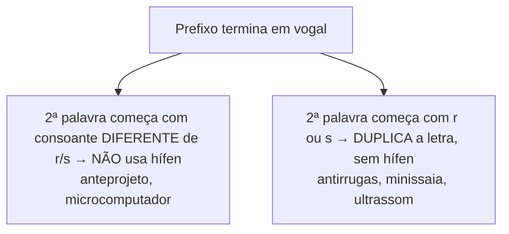

# 5️⃣➕ Complemento — Ortografia

> Anexar após [[05-Ortografia]]. Conteúdo do PDF original que não entrou na primeira versão da nota.

## Uso do S — casos adicionais
> [!note] Regras que faltavam
> - Após ditongo: *coisa, maisena*.
> - Palavras derivadas de outras que já têm "s": *análise → analisar*.
> - Formas de **pôr** e **querer**: *Nós pusemos. Nós quisemos.*

## Uso do Z — casos adicionais
> [!note] Regras que faltavam
> - Palavras derivadas de outras que já têm "z": *raiz → enraizar*, *cruz → cruzeiro*.
> - Vocábulos importantes com Z: *azar, cuscuz, verniz, vizinho*.
> - **Exceções** de verbos em -izar que "deveriam" ser com S: *hipnose → hipnotizar*, *síntese → sintetizar*, *batismo → batizar*, *catequese → catequizar*.

> [!tip] Bizu isar x izar
> - **-isar**: substantivo já tem **S** → *atraso → atrasar*, *cicatriz → cicatrizar*.
> - **-izar**: substantivo **sem S** → *útil → utilizar*.

## Uso do SS — vocábulos importantes
> [!danger] Grafias que confundem
> - **SC**: acréscimo, descender, fascínio.
> - **SÇ**: nascer → nasço, crescer → cresço.
> - **XC**: exceção.
> - **XS**: exsudar.

## Uso do X e CH — casos adicionais
> [!example]
> - Após as sílabas iniciais "en" e "me": *enxaqueca, enxada, enxurrada, mexer, mexerica, mexicano*.
> - CH em palavra com "en" derivada de palavra com CH: *cheio → enchente*; *chiqueiro → enchiqueirar*.
> - CH em palavras de origem estrangeira: *salsicha, sanduíche, capricho*.

## Uso do J e G — casos adicionais
> [!example]
> - J em palavras de origem tupi: *jiboia, pajé, jenipapo*.
> - G em palavras terminadas em -ógio, -égio, -ígio, -úgio: *relógio, colégio, litígio, refúgio*.
> - G em femininos terminados em -gem: *garagem, viagem, vagem*.

## Vocábulo que faltava
> [!note] Tampouco x Tão pouco
> - **Tampouco** = também não.
> - **Tão pouco** = muito pouco (quantidade).

## Uso do hífen — quando NÃO usar (detalhe que faltava)

> [!note] Exceção dos prefixos co-, pre-, pro-, re-
> Aglutinam-se com a segunda palavra mesmo terminando em "e" ou "o": *coordenar, coopera, preeleito, preenchido, proativo, reeleição, reedição*.

> [!tip] Palavras que perderam a noção de composição (sem hífen, grafia única)
> *girassol, mandachuva, paraquedas, pontapé* — não levam mais hífen porque a ideia de "palavra composta" se perdeu com o uso.

#revisar #complemento
