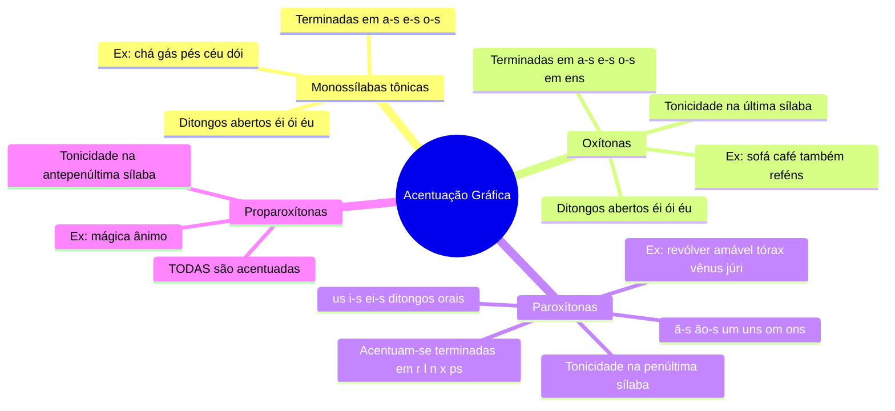
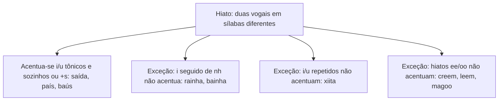

# 6️⃣ Acentuação Gráfica

⬅️ [[05-Ortografia]] | ➡️ [[07-Crase]]

> [!important] Relevância prática
> Acentuação parece "decoreba de escola", mas na verdade segue **4 regras de posição da sílaba tônica** + exceções pontuais. Dominar as 4 regras resolve 90% das questões — é mais eficiente que tentar "decorar palavra por palavra".

## 🧠 Mapa mental

> [!tip] Bizu mestre — a lógica inversa
> - **Oxítona** acentua o que é "raro" nela (a,e,o / em,ens / éi,ói,éu).
> - **Paroxítona** acentua o que é "raro" nela (r,l,n,x,ps / ã,ão / um,om / us,i,ei / ditongo oral).
> - **Proparoxítona**: não pensa, **acentua sempre**.

## 🔎 Casos especiais

> [!note] Ditongos abertos éi, ói, éu em paroxítonas
> Desde o Novo Acordo Ortográfico, **não são mais acentuados** em paroxítonas: *ideia, jiboia, geleia, estreia* (sem acento).

> [!danger] Pegadinha
> Prefixos paroxítonos terminados em "i" e "r" **não são acentuados**: *anti, multi, hiper* — mesmo "parecendo" precisar de acento.

## 🎯 Acento diferencial e trema

| Item | Regra |
|---|---|
| Trema (¨) | **Não é mais usado** no português atual |
| Contêm | 3ª pessoa do plural (com acento) |
| Contém | 3ª pessoa do singular (sem acento circunflexo duplo) |
| Pôr (verbo) x Por (preposição) | acento diferencia a classe gramatical |
| têm / vêm | 3ª pessoa do plural de ter/vir (circunflexo) |
| tem / vem | 3ª pessoa do singular (sem acento) |
| mantém / retém | agudo, singular |
| mantêm / retêm | circunflexo, plural |

> [!example] Aplicando
> - *Ele mantém a calma.* (singular, agudo)
> - *Eles mantêm a calma.* (plural, circunflexo)

## ✍️ Pratique agora
> [!todo]- Exercício de fixação
> Classifique e acentue se necessário: "saida", "vencedor", "canhoto", "medico", "heroi".
>
> *Gabarito*: saída (paroxítona/hiato), vencedor (oxítona, termina em -r → acentua), canhoto (paroxítona comum, sem acento), médico (proparoxítona → sempre acentua), herói (monossílaba/oxítona com ditongo aberto → acentua).

## ❓ Autoavaliação
> [!question]
> - Consigo classificar qualquer palavra em oxítona/paroxítona/proparoxítona só ouvindo?
> - Sei explicar por que "ideia" não tem mais acento?

#revisar
