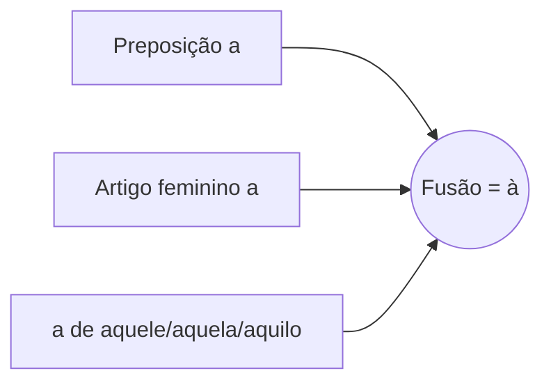
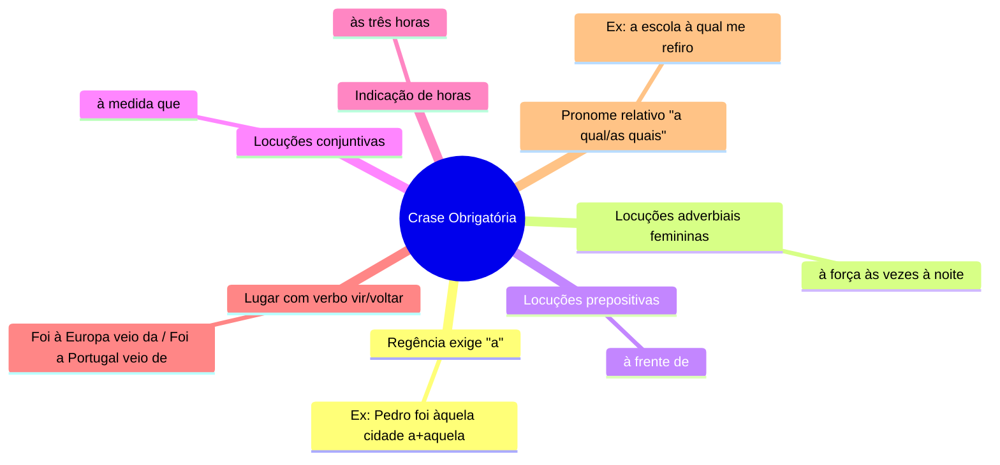
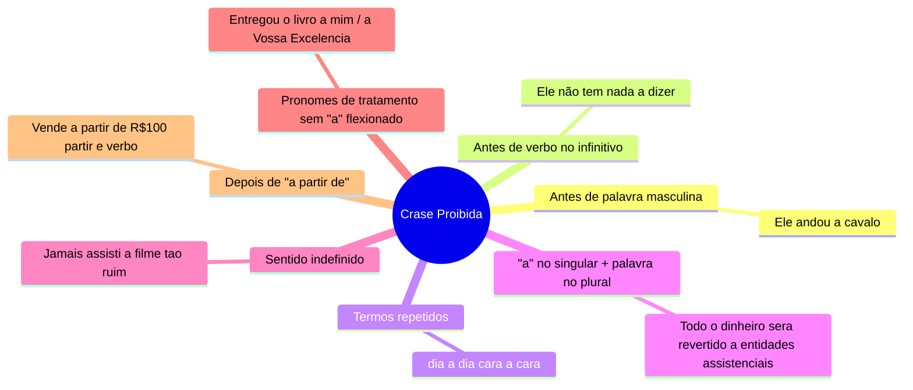
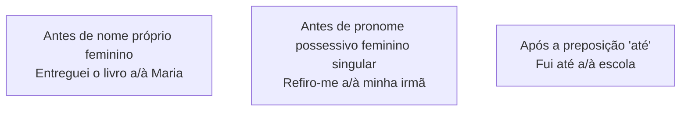

# 7️⃣ Emprego do Sinal Indicativo de Crase

⬅️ [[06-Acentuação-Gráfica]] | ➡️ [[08-Classes-de-Palavras]]

> [!important] Relevância prática
> Crase é o item que mais gera insegurança em quem escreve — inclusive em profissionais experientes. A boa notícia: existe **um teste infalível** (a troca por "vir/voltar" ou masculino/feminino) que resolve a maioria dos casos sem decoreba.

## 🧠 Conceito

> [!note] O que é crase
> Fusão de dois sons **"a"**: a preposição **a** + o artigo feminino **a** (ou o "a" inicial de pronomes demonstrativos: aquele/aquela/aquilo). Representada pelo acento grave (`).

> [!tip] O teste de ouro (use sempre que tiver dúvida)
> Troque a palavra feminina por uma **masculina equivalente**:
> - Virou **"ao"**? → há crase.
> - Virou apenas **"o"**? → não há crase.
> Ex.: *Ela pediu permissão à senhora.* → "Ela pediu permissão **ao** senhor." → há crase. ✅

## 🧠 Mapa mental — Crase Obrigatória

> [!example] Regra do lugar (vir de / voltar de)
> Troque o verbo por "vir" ou "voltar":
> - *Ele foi a Portugal.* → "veio **de** Portugal" → sem crase.
> - *Ele foi à Europa.* → "veio **da** Europa" → com crase.

## 🚫 Mapa mental — Crase Proibida

> [!danger] Pegadinha "a partir"
> Nunca há crase antes de "a partir de": aqui "a" é apenas preposição ligada ao verbo "partir", não ao substantivo.

## 🤷 Crase Facultativa

> [!danger] Atenção ao plural
> No **plural**, a crase com possessivo é **obrigatória**: *Refiro-me às minhas irmãs* (nunca "a minhas irmãs").

## 🌍 Palavras-armadilha

| Palavra | Regra | Exemplo |
|---|---|---|
| Casa | Sentido de lar → **sem** crase | Fui a casa almoçar. |
| Casa | Com adjetivo → **com** crase | Fui à casa verde. |
| Terra | "Terra firme" → **sem** crase | Os pilotos chegaram a terra. |
| Terra | Com determinante → **com** crase | Voltou à terra natal. |
| Distância | Não especificada → **sem** crase | Os policiais ficaram a distância. |
| Distância | Especificada → **com** crase | Fica à distância de 10 km. |
| Continentes/países femininos (África, Ásia, Europa, França, Holanda, Espanha, Escócia) | facultativa quando "até" | Fui até à/a França |

## ✍️ Pratique agora
> [!todo]- Exercício de fixação (use o teste de ouro)
> Marque se há crase:
> 1. Cheguei ___ uma hora atrás.
> 2. Refiro-me ___ Vossa Excelência.
> 3. Ele foi ___ pé até o trabalho.
> 4. Estou disposto ___ ajudar.
>
> *Gabarito*: 1. às (hora — sempre com crase); 2. a (pronome de tratamento sem "a" na forma — não há crase); 3. a (masculino: "a pé", sem crase); 4. a (infinitivo, não há crase).

## ❓ Autoavaliação
> [!question]
> - Consigo aplicar o teste "masculino/vir de-da" em qualquer frase nova, sem consultar a tabela?
> - Sei explicar por que "a partir de" nunca tem crase?

#revisar
