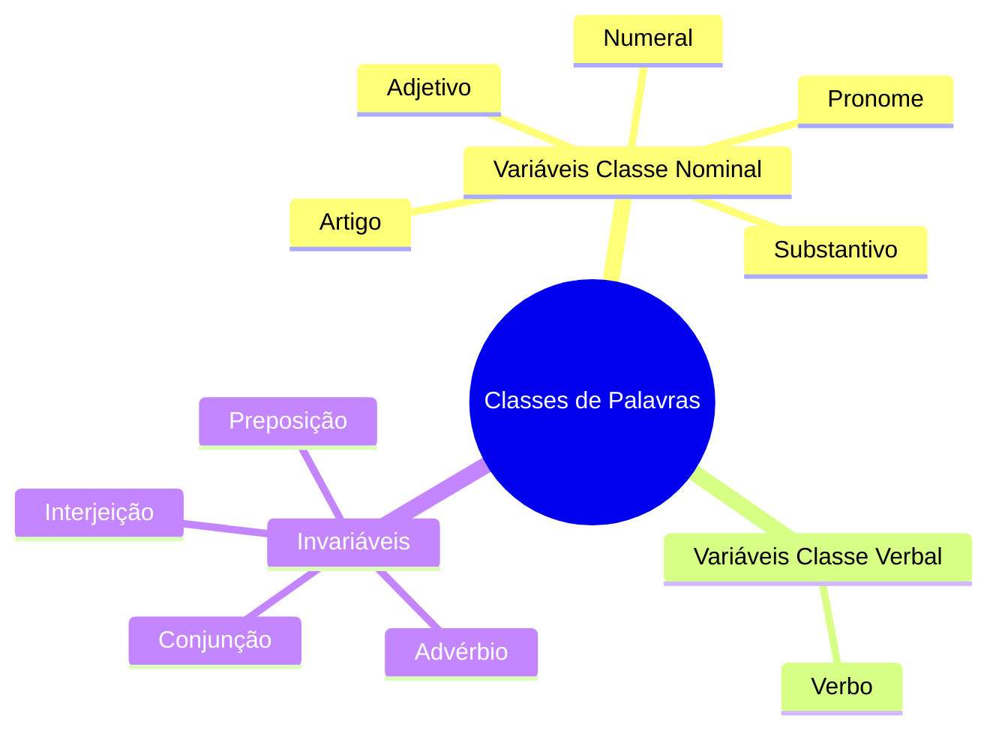
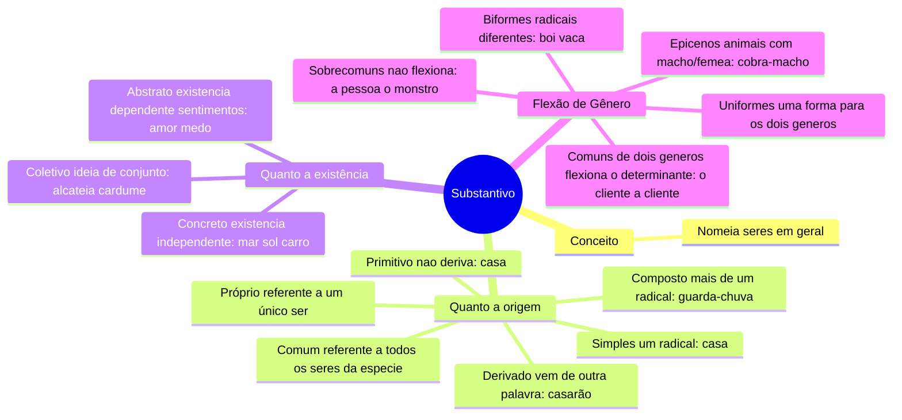
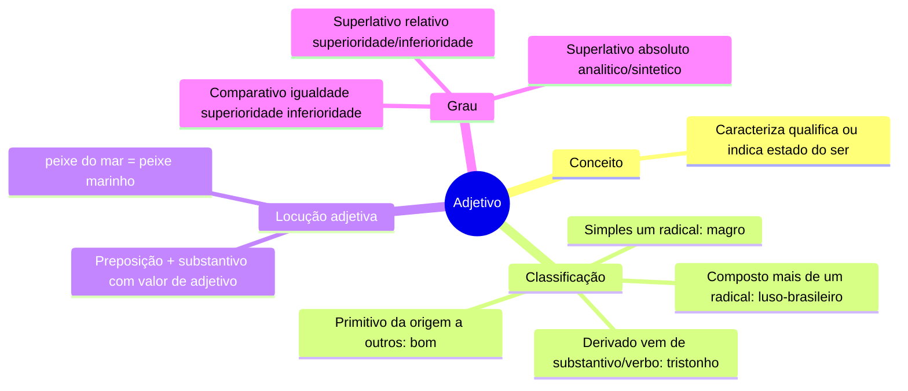
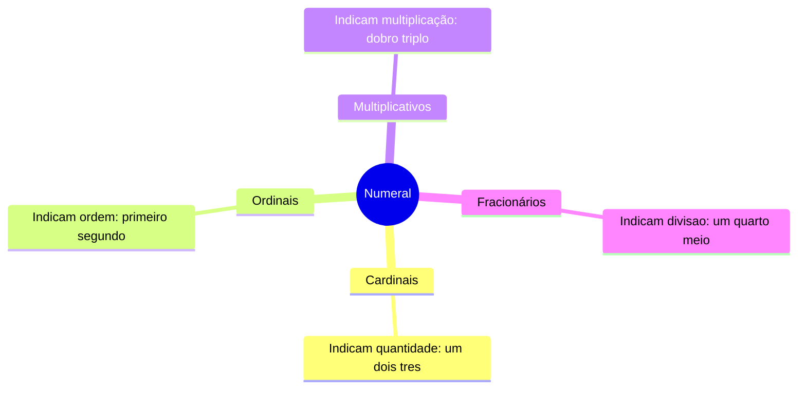

# 8️⃣ Emprego das Classes de Palavras

⬅️ [[07-Crase]] | ➡️ [[09-Figuras-e-Funções-da-Linguagem]]

> [!important] Relevância prática
> As 10 classes de palavras são a "tabela periódica" do português: tudo o que vem depois (sintaxe, concordância, regência) usa esse vocabulário. Vale a pena voltar aqui sempre que uma nota mais à frente citar uma classe que você não lembra bem.

## 🧠 Visão geral

> [!tip] Bizu de memorização
> **VARIÁVEIS** flexionam em gênero/número/pessoa (SAAN P + Verbo). **INVARIÁVEIS** nunca mudam de forma (ACPI).

---

## 📦 Substantivo

> [!note] Plural — regras que mais caem
> - **-ão tônico**: três formas possíveis (-ãos, -ões, -ães). Ex.: cidadãos, corações, capitães.
> - **-al/-el/-ol/-ul** → troca -l por -is: varais, aluguéis, anzóis. Exceções: mal**es**, cônsul**es**, gol**s**.
> - **-il oxítona** → troca -il por -is: canis, fuzis. **-il paroxítona** → troca -il por -eis: fósseis, répteis.
> - **-r/-z** → acrescenta -es: altares, cruzes.
> - **-m** → troca -m por -ns: álbuns, jovens.
> - **-x** → invariável: os tórax, os ônix.

> [!example] Plural dos compostos
> - Flexionam **os dois**: substantivo+substantivo, substantivo+adjetivo, adjetivo+substantivo, numeral+substantivo → couves-flores, cabeças-chatas, altos-relevos, quintas-feiras.
> - Flexiona **só o primeiro**: substantivo+preposição+substantivo → pés-de-moleque.
> - Flexiona **só o segundo**: origem/onomatopeia/verbos iguais → afro-brasileiros, tique-taques.
> - **Invariável**: quando o elemento é verbo, advérbio, substantivo/pronome invariável → guarda-roupas, abaixo-assinados, porta-lápis.

> [!danger] Pegadinha do grau
> Nem todo aumentativo/diminutivo é "sintético" (um sufixo): analítico usa um **adjetivo separado** (casa grande = aumentativo analítico).

---

## 🎨 Adjetivo

> [!example] Grau do adjetivo
> - Comparativo de igualdade: *tão bom quanto*
> - Superlativo absoluto sintético: *habilíssimo* (uma palavra)
> - Superlativo absoluto analítico: *extremamente habilidoso* (duas palavras)
> - Superlativo relativo: *o mais/menos habilidoso do time*

---

## 🔖 Artigo

> [!note] Conceito
> Vem antes do substantivo, particularizando (**definido**: o, a, os, as) ou indefinindo (**indefinido**: um, uma, uns, umas) o nome.

> [!tip] Bizu — ligação direta com Crase
> A presença do **artigo feminino** é o que determina a ocorrência de crase (ver [[07-Crase]]). Nem toda palavra feminina aceita artigo — atenção a essa exceção ao aplicar o teste de crase.

---

## 🔢 Numeral

## ✍️ Pratique agora
> [!todo]- Exercício de fixação
> Classifique o substantivo destacado quanto à origem e existência: "A **alcateia** cercou a presa ao anoitecer."
>
> *Gabarito*: coletivo (conjunto de lobos) e concreto (existência independente).

## ❓ Autoavaliação
> [!question]
> - Consigo formar o plural de "cidadão", "fóssil" e "álbum" sem hesitar?
> - Sei explicar a diferença entre adjunto adnominal (adjetivo) e locução adjetiva?

➡️ Continue em [[08b-Classes-de-Palavras-Pronome-e-Verbo]]

#revisar
