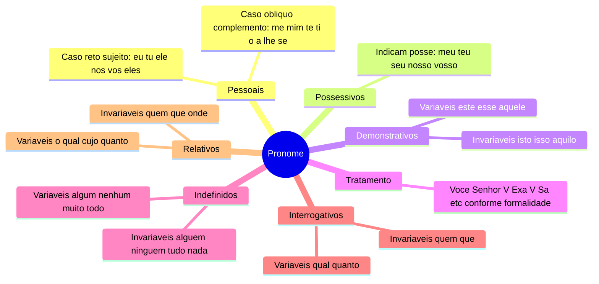
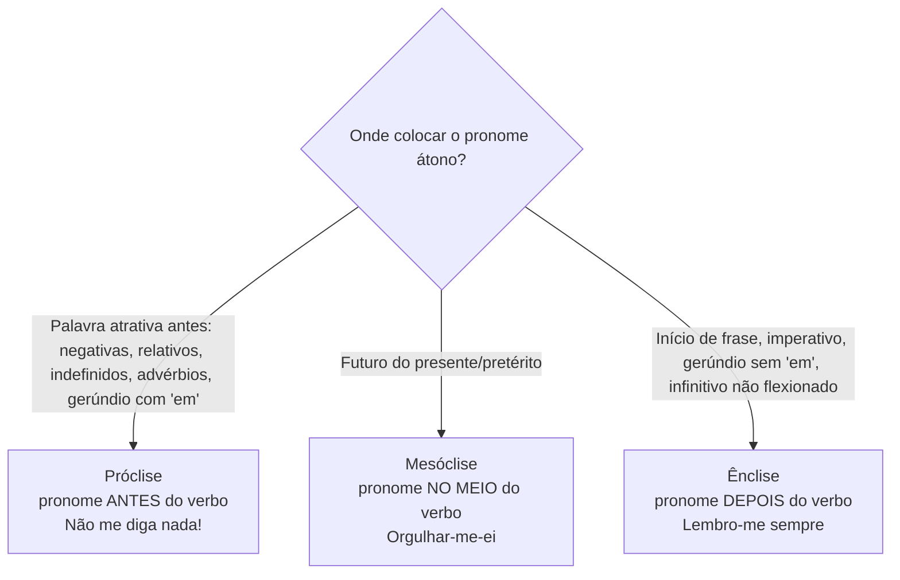
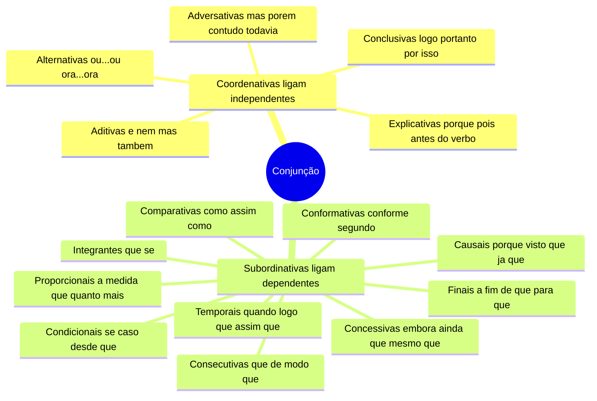
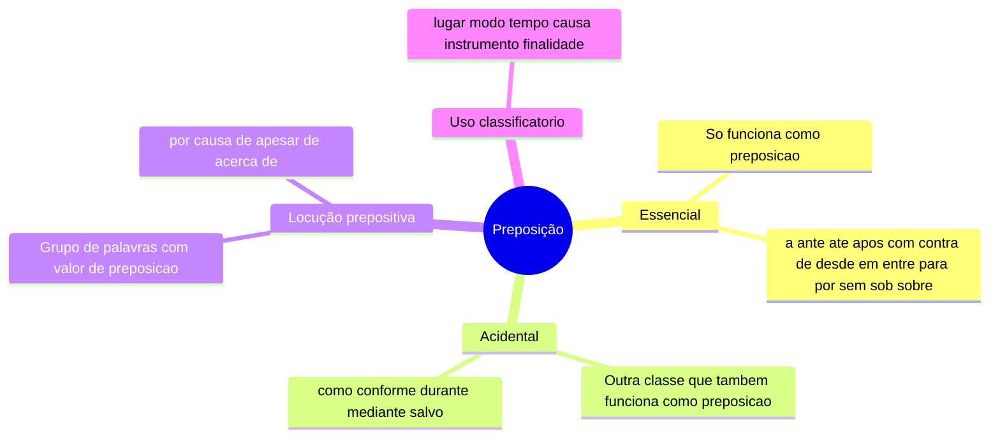
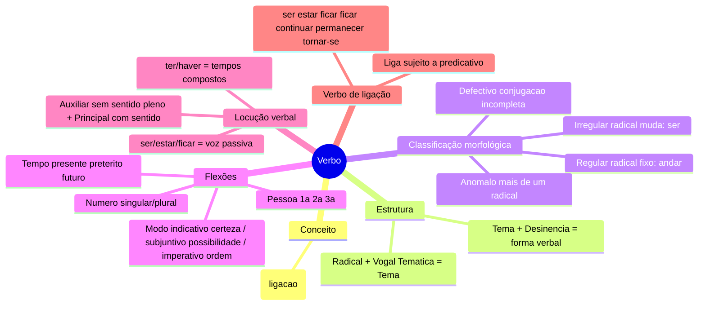

# 8️⃣.2 Classes de Palavras — Pronome, Conjunção, Preposição, Advérbio, Interjeição, Verbo

⬅️ [[08-Classes-de-Palavras]] | ➡️ [[09-Figuras-e-Funções-da-Linguagem]]

> [!important] Relevância prática
> Pronome (colocação pronominal) e Verbo (regência, vozes) são os campeões de questões de concurso e de erro no dia a dia — inclusive entre falantes nativos. Dedique tempo extra a esses dois blocos.

## 🙋 Pronome

> [!note] Caso oblíquo — quem faz o quê
> - **o, os, a, as** e **lo/la/no/na** (variantes): só **objeto direto**.
> - **lhe, lhes**: só **objeto indireto**.
> - **me, te, se, nos, vos**: podem ser objeto direto **ou** indireto, dependendo do verbo.

> [!example] Demonstrativos — bizu de pessoa
> - 1ª pessoa (quem fala): este, esta, isto.
> - 2ª pessoa (com quem se fala): esse, essa, isso.
> - 3ª pessoa (nem quem fala nem quem ouve): aquele, aquela, aquilo.

> [!tip] Bizu — que x o qual / cujo
> - **que**: usar apenas após preposição **monossilábica** (em que, de que).
> - **o qual**: usar com preposições **dissílabas/trissílabas** ou locuções (para o qual, através do qual).
> - **cujo**: nunca vem seguido de artigo (❌ "cujas as folhas"); pode vir precedido de preposição (por cujos portões).

### 🎯 Colocação Pronominal (próclise, mesóclise, ênclise)

> [!danger] Pegadinha da vírgula
> Depois de vírgula, usa-se **ênclise**: *Professora, ajude-me aqui.* — **exceto** se o verbo estiver no futuro, caso em que prevalece a **mesóclise**.

---

## 🔗 Conjunção

> [!tip] Bizu do "pois"
> - **Antes** do verbo = explicativa (*Ele não veio, pois estava doente*).
> - **Depois** do verbo = conclusiva (*Ele estudou muito, foi aprovado, pois*).

---

## 🎈 Interjeição

> [!note] Conceito
> Expressa emoção (surpresa, dor, alegria, alerta...), é autônoma e independe de outros elementos da frase. Ex.: Ah! (admiração), Ui! (dor), Oxente! (espanto), Tchau! (despedida).

---

## 🧭 Preposição

---

## 🌬️ Advérbio

> [!note] Conceito
> Modifica verbo, adjetivo ou outro advérbio; é **invariável**. Função sintática: **adjunto adverbial**.

> [!tip] Bizu do "bastante"
> "Bastante" não flexiona quando é advérbio (modifica adjetivo): *Meus pais chegaram bastante animados* (bastante = advérbio, invariável; animados = adjetivo, flexiona).

---

## 🏃 Verbo

> [!example] Tempos verbais mais cobrados
> - Pretérito imperfeito: passado não concluído — *Bruna era romântica.*
> - Pretérito perfeito: passado concluído — *Eu fui ao médico.*
> - Pretérito mais-que-perfeito: passado anterior a outro passado — *O edital saiu, Marcela ouvira de seus pais.*
> - Futuro do pretérito: fato posterior a um passado — *Se não viajasse, ela resolveria esse impasse.*

> [!danger] Pegadinha
> Verbo de ligação pode "deixar de ser" ligação: *O menino está no quarto.* Aqui "está" é intransitivo — "no quarto" é adjunto adverbial, não predicativo.

## ✍️ Pratique agora
> [!todo]- Exercício de fixação
> Complete com o pronome correto: "___ direi a verdade" (indireto, 1ª sing.) / "Eu ___ encontrei na escola" (direto, 3ª fem.).
>
> *Gabarito*: "Lhe direi a verdade." / "Eu a encontrei na escola."

## ❓ Autoavaliação
> [!question]
> - Consigo aplicar próclise/ênclise/mesóclise sem pensar demais, só reconhecendo o "gatilho" da regra?
> - Sei diferenciar conjunção causal de conclusiva usando a posição do "pois"?

#revisar
