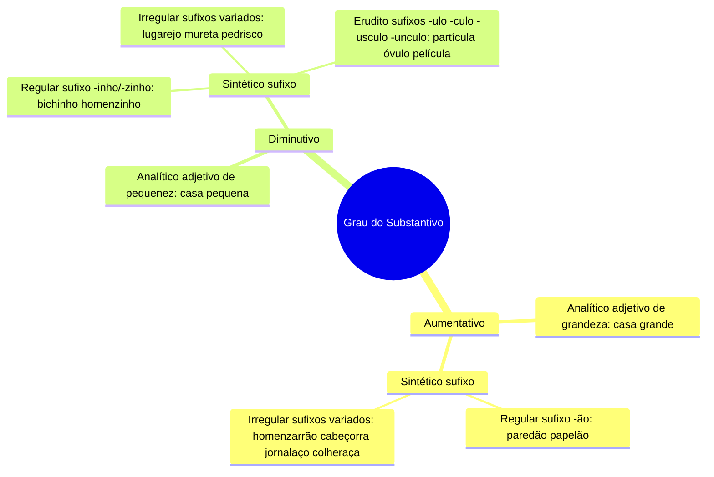

# 8️⃣➕ Complemento — Substantivo: Aumentativo e Diminutivo

> Anexar após [[08-Classes-de-Palavras]].

## Grau do substantivo — detalhamento completo

> [!example] Aplicando
> - Aumentativo sintético regular: *parede → paredão*
> - Aumentativo sintético irregular: *homem → homenzarrão*, *jornal → jornalaço*
> - Diminutivo sintético irregular: *lugar → lugarejo*, *muro → mureta*, *pedra → pedrisco*
> - Diminutivo erudito: *parte → partícula*, *ovo → óvulo*, *pele → película*

> [!tip] Bizu
> "Erudito" é sempre diminutivo, formado com sufixos de origem greco-latina (-ulo, -culo, -úsculo, -únculo) — costuma ser cobrado em prova por parecer "estranho" à primeira vista.

#revisar #complemento
