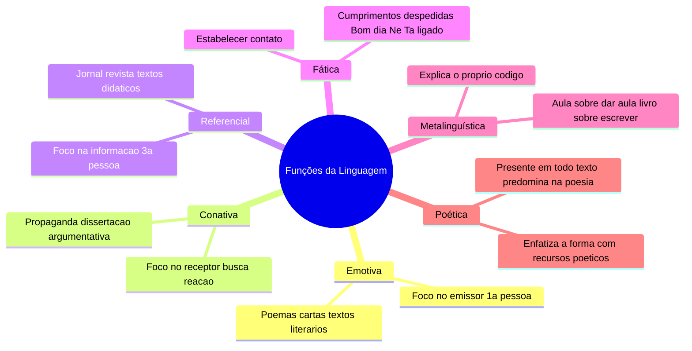
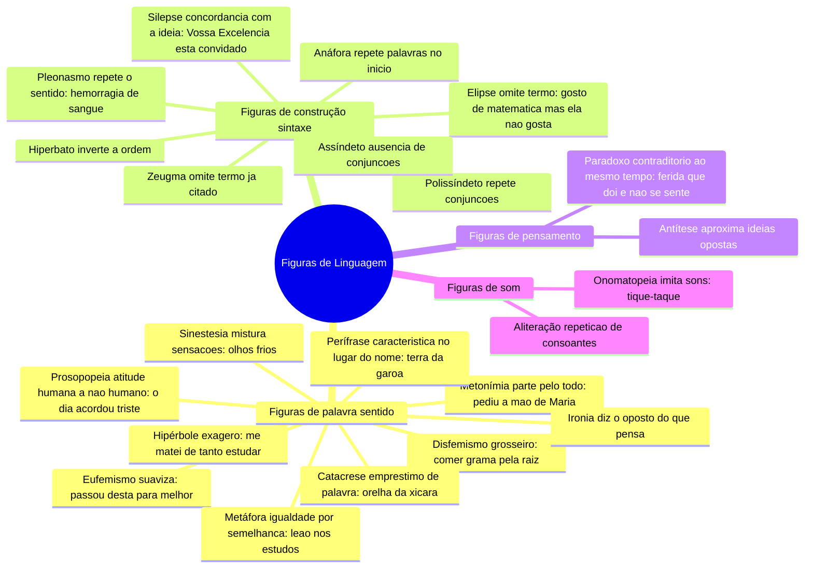

# 9️⃣ Figuras de Linguagem e Funções da Linguagem

⬅️ [[08b-Classes-de-Palavras-Pronome-e-Verbo]] | ➡️ [[10-Coerência-e-Coesão]]

> [!important] Relevância prática
> As funções da linguagem explicam **por que** um texto foi escrito daquele jeito (a intenção). As figuras de linguagem explicam **como** o efeito estético/persuasivo é construído. Juntas, resolvem quase toda questão de "qual o efeito de sentido desse trecho?".

## 🧠 Funções da Linguagem

> [!tip] Bizu de reconhecimento
> Pergunte "quem está em foco?" — Eu (emotiva), Você (conativa), Isso (referencial), o Contato em si (fática), a própria Língua (metalinguística) ou a Forma/Estética (poética)?

## 🎭 Figuras de Linguagem

> [!example] Distinguindo Eufemismo x Disfemismo
> - Eufemismo (suaviza): *Passou desta para melhor* = morreu.
> - Disfemismo (agrava/vulgariza): *Comer grama pela raiz* = morrer, de forma grosseira.

> [!danger] Pegadinha Metáfora x Metonímia
> Metáfora compara por **semelhança** (é como se fosse). Metonímia substitui por **relação lógica** (contiguidade: parte/todo, autor/obra, causa/efeito) — não há comparação, há substituição direta.

> [!danger] Pegadinha Pleonasmo
> - **Estilístico** (aceito, dá ênfase): *Vi com meus próprios olhos.*
> - **Vicioso** (erro, redundância sem função estética): *Subir para cima.*

## ✍️ Pratique agora
> [!todo]- Exercício de fixação
> Identifique a figura: "Ele é um poço de sabedoria." / "Bebi dois copos de água." (copo pelo conteúdo) / "Não sou nem um pouco preguiçoso... quando durmo até meio-dia" (ironia).
>
> *Gabarito*: metáfora / metonímia / ironia.

## ❓ Autoavaliação
> [!question]
> - Consigo apontar a função da linguagem predominante em uma propaganda que acabei de ver?
> - Sei diferenciar metáfora de metonímia com meus próprios exemplos?

#revisar
