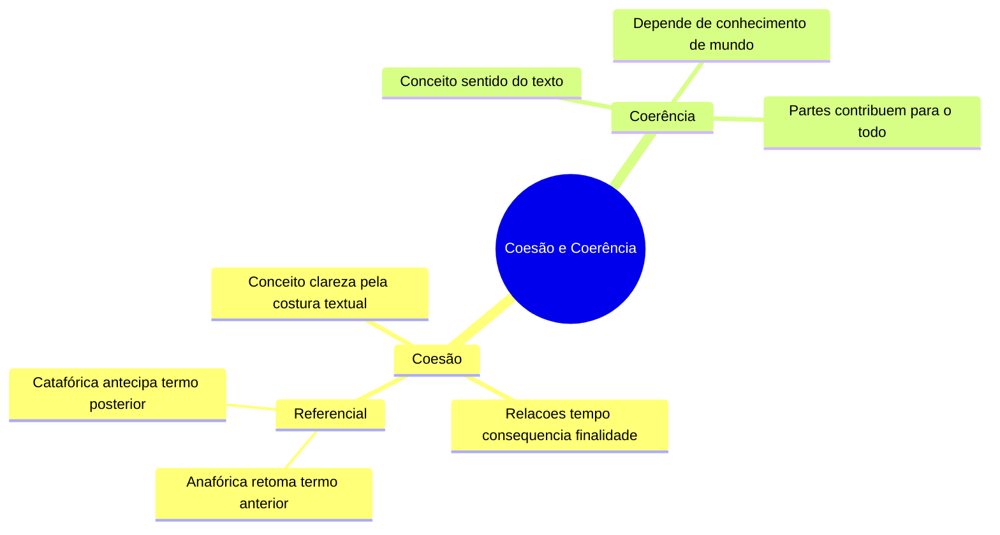
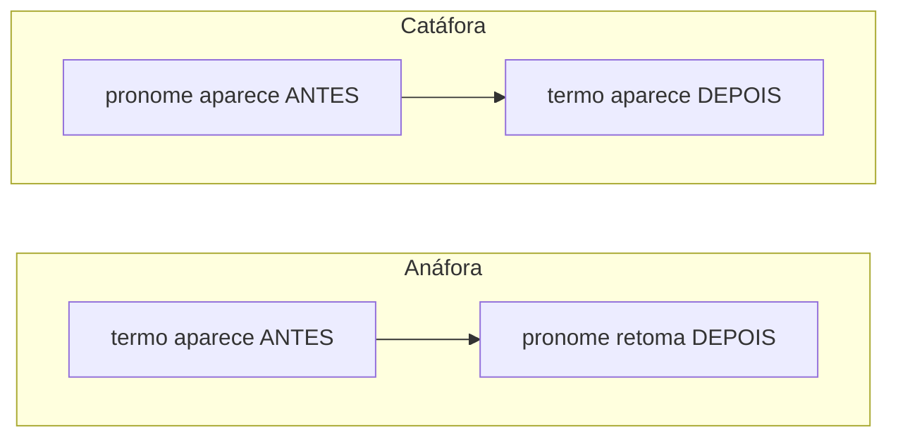

# 🔟 Coerência e Coesão

⬅️ [[09-Figuras-e-Funções-da-Linguagem]] | ➡️ [[11-Pontuação]]

> [!important] Relevância prática
> Esse é o tópico que mais conecta **gramática** e **interpretação de texto**. Entender coesão referencial (anáfora/catáfora) resolve boa parte das questões "a que esse pronome se refere?" — item recorrente em qualquer prova de leitura.

## 🧠 Mapa mental

> [!note] A diferença essencial
> - **Coesão**: conexão **gramatical** entre as partes do texto (a "costura").
> - **Coerência**: conexão de **sentido** — um texto pode ter zero erro gramatical e ainda ser incoerente.

> [!example] Coesão em ação
> *Mário estudou a aula de matemática, mas Helena preferiu revisar a de português.*
> — "mas" (conjunção de oposição) liga as orações; a elipse de "aula" na segunda oração evita repetição.

## 🔁 Anáfora x Catáfora

> [!tip] Bizu de pronomes
> - **Catáfora** usa: *este, esta, isto* (e variantes: nisto, disto).
> - **Anáfora** usa: *esse, essa, isso* (e variantes: nisso, disso).

> [!example] Aplicando
> - Catáfora: *Maria me mandou esta mensagem: "Adriana fez bolo, vem comer."* — "esta" antecipa a mensagem.
> - Anáfora: *João comprou um livro de inglês. Fiquei sabendo que esse é o melhor do mercado.* — "esse" retoma "livro".

> [!danger] Pegadinha de banca
> A banca pode usar "isto" (marca de catáfora) retomando algo já dito (função de anáfora), propositalmente, para testar se você entende o **sentido referencial real**, não só a regrinha. Leia sempre o contexto, não decore cegamente.

## 🌐 Coerência e conhecimento de mundo

> [!example] Texto coerente
> *"Jane é uma aluna esforçada. Estuda, revisa, responde muitas questões, tudo no seu tempo, sem procrastinar. Por isso, estamos certos de sua aprovação."* — as partes convergem para uma conclusão lógica.

> [!example] Texto incoerente
> *"Arroz, ovos, leite e carne. Tudo pronto para o meu jantar vegano!"* — contradiz o conhecimento de mundo (vegano não consome produtos de origem animal).

## ✍️ Pratique agora
> [!todo]- Exercício de fixação
> Aponte se o pronome grifado é anafórico ou catafórico: "Ela me disse **isto**: precisamos conversar." / "Comprei um carro novo. **Ele** é econômico."
>
> *Gabarito*: catafórico (isto antecipa a fala) / anafórico (ele retoma "carro").

## ❓ Autoavaliação
> [!question]
> - Consigo explicar coesão e coerência para alguém usando exemplos diferentes dos daqui?
> - Sei identificar, num texto real, se um pronome está sendo anafórico ou catafórico?

#revisar
