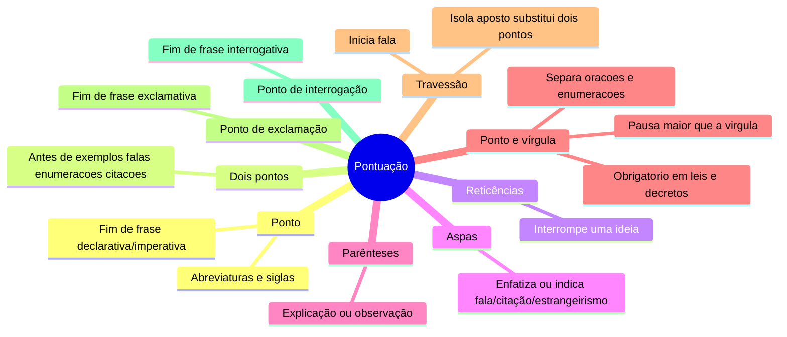
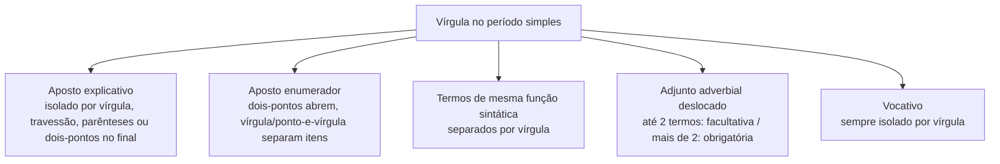
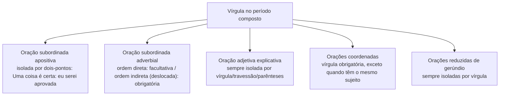

# 1️⃣1️⃣ Pontuação

⬅️ [[10-Coerência-e-Coesão]] | ➡️ [[12-Formação-de-Palavras]]

> [!important] Relevância prática
> Pontuação não é "estética" — ela muda o sentido da frase (lembra da clássica "vamos comer, vovó" x "vamos comer vovó"?). Dominar a regra da vírgula, em especial, evita perder pontos por ambiguidade em redações e questões objetivas.

## 🧠 Mapa mental — sinais e função

## ✒️ A vírgula no período simples

> [!example] Aposto explicativo em três formatos
> - *Ana, a filha de Maria, faltou.* (vírgula)
> - *A notícia – Ovni – assustou todos.* (travessão)
> - *Eles descobriram a culpada: a procrastinação.* (dois-pontos, quando está no final)

## ✒️ A vírgula no período composto

> [!tip] Bizu da ordem
> *Quando eu cheguei na sala, a professora já estava.* (ordem indireta → vírgula **obrigatória**)
> *A professora já estava quando eu cheguei na sala.* (ordem direta → vírgula **facultativa**)

> [!danger] Pegadinha
> Orações coordenadas com o **mesmo sujeito** dispensam a vírgula antes de "e": *Ele é esforçado e sempre fica em ótimas colocações.*

## 🔤 Aspas e travessão no discurso

> [!example]
> *Ela disse: — Eu vou priorizar os meus estudos!* — o travessão inicia a fala; os dois-pontos anunciam a citação.

## ✍️ Pratique agora
> [!todo]- Exercício de fixação
> Pontue: "Rebeca professora de história aplicará a prova amanhã" (aposto explicativo) e "Ana você fez a prova" (vocativo).
>
> *Gabarito*: "Rebeca, professora de história, aplicará a prova amanhã." / "Ana, você fez a prova?"

## ❓ Autoavaliação
> [!question]
> - Consigo justificar quando a vírgula antes de "e" é obrigatória?
> - Sei diferenciar aposto explicativo de aposto enumerador na prática?

#revisar
