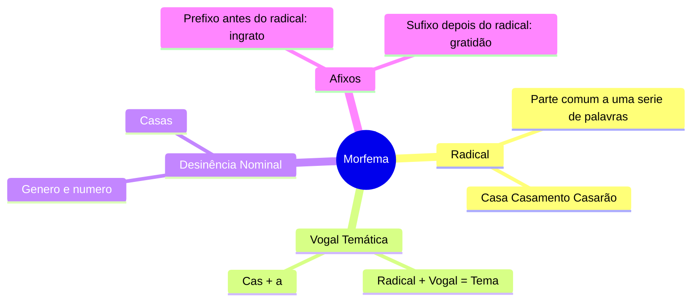
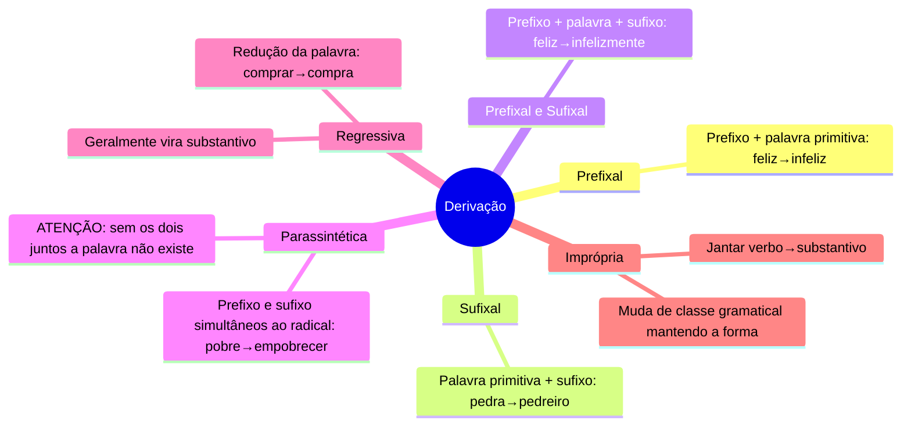
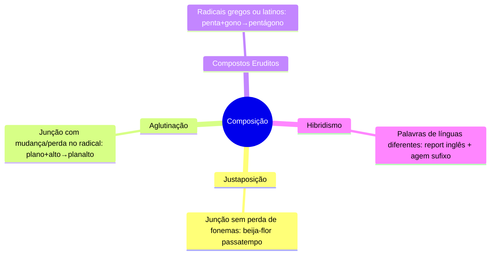
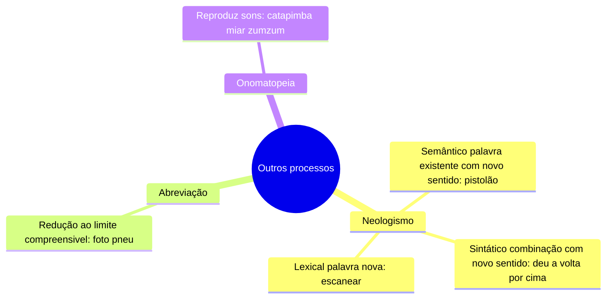

# 1️⃣2️⃣ Estrutura e Processos de Formação de Palavras

⬅️ [[11-Pontuação]] | ➡️ [[13-Sintaxe-do-Período-Simples]]

> [!important] Relevância prática
> Entender **como** as palavras se formam ajuda a decifrar o significado de palavras desconhecidas em uma prova — e a antecipar pegadinhas de derivação x composição.

## 🧠 Estrutura das palavras (morfema)

## 🌱 Processos de Formação — Derivação

> [!danger] Pegadinha: Parassintética
> Só é parassintética quando o prefixo **e** o sufixo são indispensáveis **ao mesmo tempo** — se você remover só um deles e a palavra intermediária não existir (\*pobrecer, \*empobre), é parassintética.

## 🌳 Processos de Formação — Composição

## 🆕 Outros processos

> [!example] Justaposição x Aglutinação
> - Justaposição (nada se perde): *guarda + chuva → guarda-chuva*
> - Aglutinação (o radical muda/funde): *plano + alto → planalto*

## ✍️ Pratique agora
> [!todo]- Exercício de fixação
> Classifique o processo de formação: "empobrecer", "beija-flor", "pentágono", "escanear".
>
> *Gabarito*: derivação parassintética / composição por justaposição / composto erudito / neologismo lexical.

## ❓ Autoavaliação
> [!question]
> - Consigo diferenciar justaposição de aglutinação com meus próprios exemplos?
> - Sei explicar por que "empobrecer" é parassintética e não apenas prefixal?

#revisar
