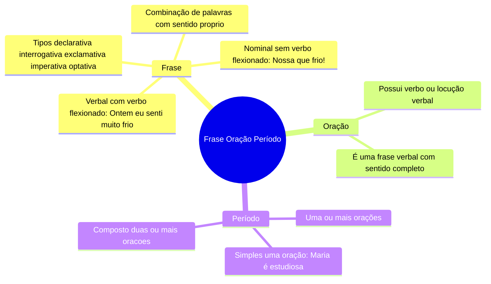
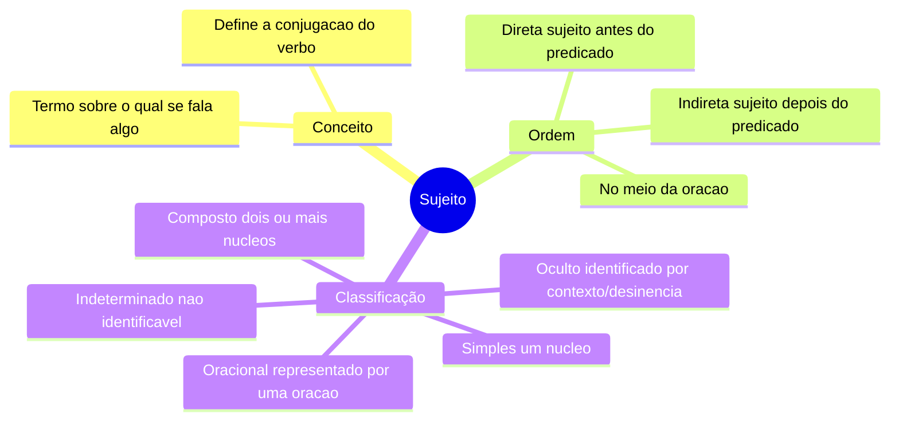
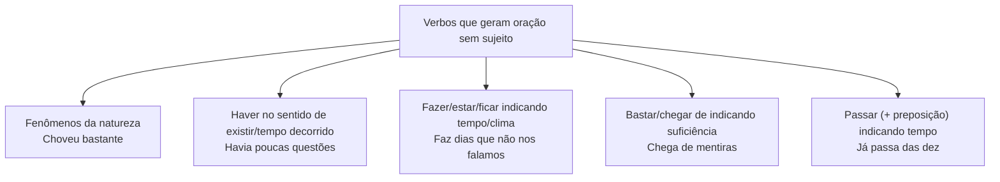
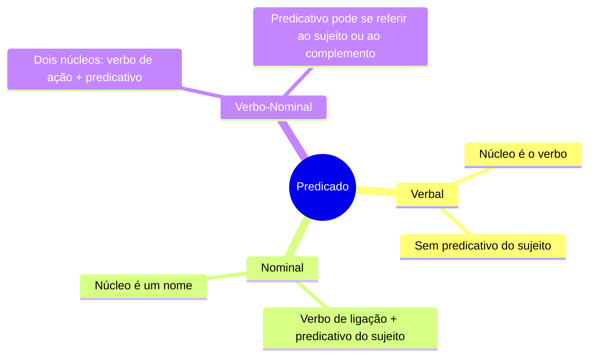

# 1️⃣3️⃣ Sintaxe do Período Simples

⬅️ [[12-Formação-de-Palavras]] | ➡️ [[13b-Sintaxe-do-Período-Simples-Termos]]

> [!important] Relevância prática
> Sintaxe é o "esqueleto" da frase. Quando você entende sujeito, predicado e seus complementos, você resolve automaticamente concordância, regência e pontuação — os três tópicos seguintes dependem 100% do que está aqui.

## 🧠 Frase, Oração e Período

> [!tip] Bizu clássico
> "Que lindo dia de verão!" é **frase** (tem sentido) mas **não é oração** (não tem verbo). Nem toda frase é oração!

## 🧍 Sujeito

> [!example] Sujeito Indeterminado — os 3 casos
> 1. Verbo na 3ª pessoa do **plural**, sem referência anterior: *Procuraram a questão em todos os sites.*
> 2. Verbo no **infinitivo impessoal**: *É proibido fumar aqui.*
> 3. Verbo na 3ª pessoa do **singular** + "se" (índice de indeterminação), com verbo intransitivo/transitivo indireto/de ligação: *Precisa-se de assistentes.*

## 🚫 Oração Sem Sujeito

> [!note] Conceito
> O predicado não é atribuído a nenhum ser — o verbo é **impessoal**.

> [!danger] A pegadinha mais cobrada: o verbo HAVER
> No sentido de **existir**, "haver" é **impessoal** — nunca varia, mesmo com objeto direto no plural.
> ❌ *Haviam muitas tulipas no jardim.*
> ✅ *Havia muitas tulipas no jardim.* (VTD + objeto direto "muitas tulipas")
>
> Se trocar por "existir" (verbo pessoal), aí sim concorda com o sujeito:
> *Existiam muitas tulipas no jardim.* (agora "muitas tulipas" é sujeito)

## 🗣️ Predicado

> [!example] Diferenciando os três
> - Verbal: *O menino brincava com uma bola.* (núcleo = verbo "brincava")
> - Nominal: *A prova era difícil.* (verbo de ligação "era" + predicativo "difícil")
> - Verbo-Nominal: *Os alunos voltaram exaustos da prova.* (voltaram = ação; exaustos = predicativo do sujeito)

## ✍️ Pratique agora
> [!todo]- Exercício de fixação
> Classifique o sujeito: "Fui aprovado no concurso." / "Choveu bastante ontem." / "É importante estudar todo dia."
>
> *Gabarito*: sujeito oculto (eu) / oração sem sujeito (verbo impessoal de fenômeno da natureza) / sujeito oracional ("estudar todo dia").

## ❓ Autoavaliação
> [!question]
> - Consigo justificar por que "haver" (existir) nunca varia?
> - Sei diferenciar predicado nominal de verbo-nominal em qualquer frase nova?

➡️ Continue em [[13b-Sintaxe-do-Período-Simples-Termos]]

#revisar
