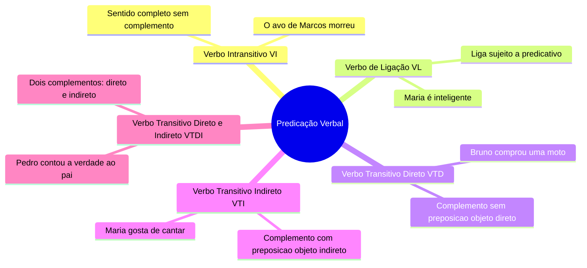
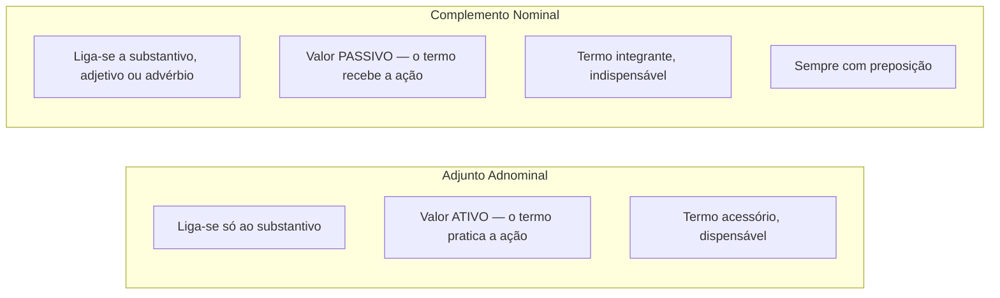
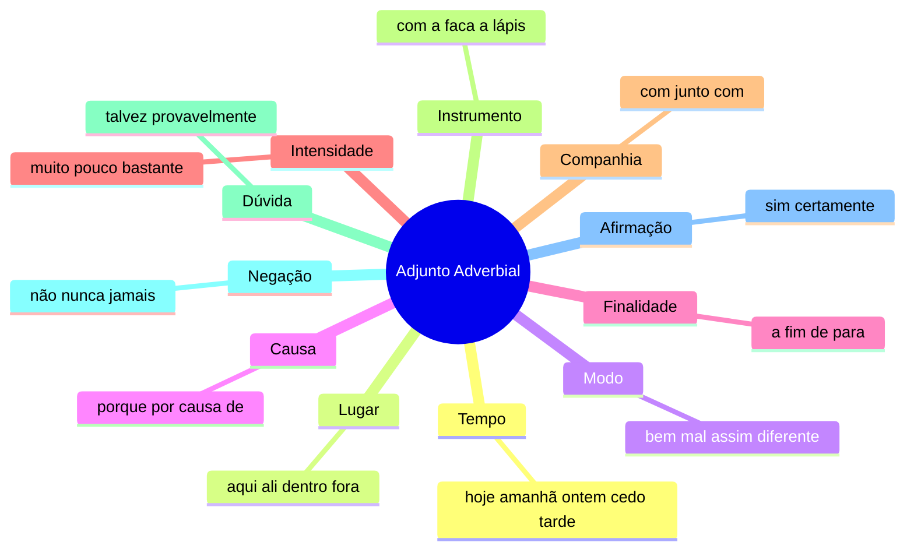
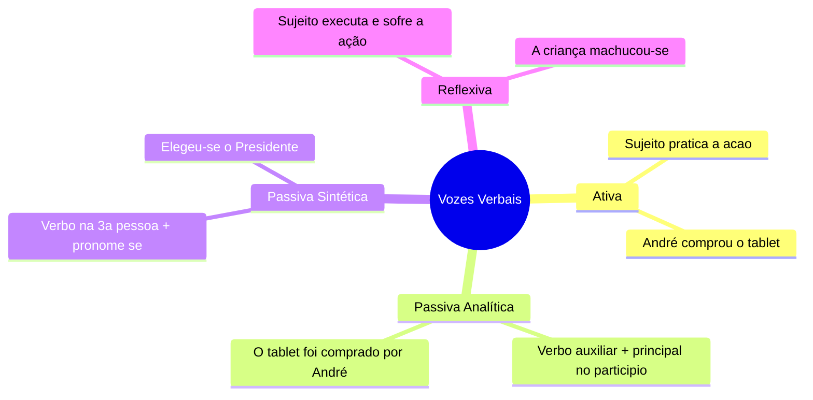

# 1️⃣3️⃣.2 Sintaxe do Período Simples — Termos da Oração

⬅️ [[13-Sintaxe-do-Período-Simples]] | ➡️ [[14-Sintaxe-do-Período-Composto]]

## 🔧 Predicação Verbal

> [!tip] Bizu para descobrir a transitividade
> Pergunte "verbo + o quê?": veio sem preposição → VTD. Pergunte "verbo + de/a/com quê?": veio com preposição → VTI.

## 🎯 Objeto Direto e Objeto Indireto

> [!note] Objeto Direto (OD)
> Completa VTD/VTDI **sem** preposição: *Marcos comprou uma casa.*

> [!example] Objeto Direto Preposicionado (exceção)
> Casos em que o OD **vem com preposição**:
> 1. Nome de pessoa: *Adoramos a Deus.*
> 2. Pronome oblíquo tônico: *Não compreendo nem a ele nem a ti.*
> 3. Para evitar ambiguidade: *Venceram aos franceses os brasileiros.*

> [!note] Objeto Indireto (OI)
> Completa VTI/VTDI **com** preposição: *Bruno gosta de lasanha.*

> [!danger] Pegadinha dos pronomes oblíquos
> - **o, os, a, as**: só objeto direto.
> - **lhe, lhes**: só objeto indireto.
> - **me, te, se, nos, vos**: podem ser os dois — depende da transitividade do verbo.

## 🧩 Complemento Nominal x Adjunto Adnominal

> [!example] O teste decisivo
> - *O amor de pai é incondicional.* → "de pai" = **adjunto adnominal** (o pai **pratica** a ação de amar).
> - *Maria tem muito amor ao pai.* → "ao pai" = **complemento nominal** (o pai **recebe** a ação de ser amado).

## 🧭 Adjunto Adverbial — as circunstâncias mais cobradas

## 🧷 Aposto e Vocativo

> [!note] Tipos de Aposto
> Explicativo, Enumerativo, Distributivo, Comparativo, Resumidor/Recapitulativo, Especificativo, Aposto de oração.

> [!tip] Bizu do aposto
> O aposto pode **substituir** o termo a que se refere sem prejuízo à oração: *Ontem, quarta-feira, lavei meu carro.* → *Quarta-feira, lavei meu carro.* (funciona igual).

> [!note] Vocativo
> Chama a pessoa a quem se fala; **não pertence** nem ao sujeito nem ao predicado; sempre isolado por vírgula. Ex.: *Professor, queremos saber nossas notas.*

## 🔄 Vozes Verbais

> [!note] Agente da Passiva
> Elemento que pratica a ação na voz passiva, geralmente com "por" ou "de": *O humorista foi aplaudido pela plateia.* — Teste: passe para a voz ativa; o agente da passiva vira o sujeito (*A plateia aplaudiu o humorista*).

## ✍️ Pratique agora
> [!todo]- Exercício de fixação
> Classifique os termos destacados: "Maria tem **amor ao pai**." / "**Ontem** estudamos bastante." / "Ana, **você fez a prova**?"
>
> *Gabarito*: complemento nominal / adjunto adverbial de tempo / vocativo ("Ana") + oração principal.

## ❓ Autoavaliação
> [!question]
> - Consigo aplicar o teste "quem pratica x quem recebe a ação" para diferenciar adjunto adnominal de complemento nominal?
> - Sei identificar objeto direto preposicionado nas 3 situações típicas?

#revisar
