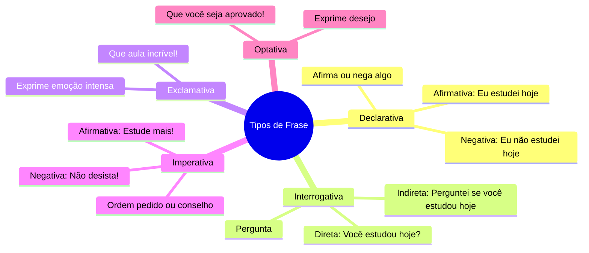
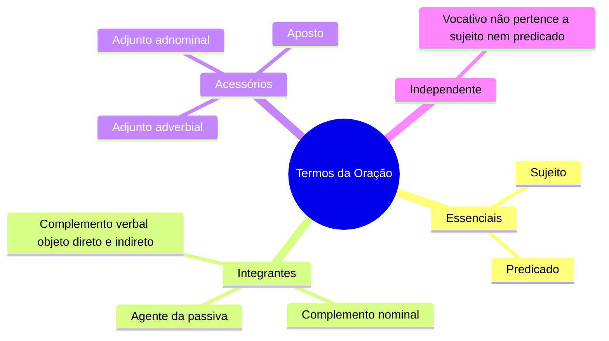

# 1️⃣3️⃣➕ Complemento — Tipos de Frase e Classificação dos Termos da Oração

> Anexar após [[13-Sintaxe-do-Período-Simples]] (antes de [[13b-Sintaxe-do-Período-Simples-Termos]]).

## Tipos de Frase quanto à intenção (faltava por inteiro)

> [!tip] Bizu
> Interrogativa **indireta** não leva ponto de interrogação, porque vira uma oração subordinada substantiva dentro de uma frase declarativa: *Perguntei se você estudou hoje.* (ponto final, não interrogação).

## Classificação dos Termos da Oração (tabela-síntese que faltava)

> [!note] Por que essa classificação importa
> - **Essenciais**: estruturam a oração (sem eles, ela normalmente não existe).
> - **Integrantes**: completam o sentido de verbos e nomes transitivos (retirá-los deixa a frase incompleta).
> - **Acessórios**: podem ser retirados sem prejuízo gramatical, apenas informativo.
> - **Independente**: o vocativo "flutua" na frase, sem função sintática ligada a sujeito/predicado.

## Ordem do sujeito — exemplos que faltavam
> [!example]
> - Direta: *O aluno terminou a prova.* (sujeito antes do predicado)
> - Indireta: *Terminou a prova o aluno.* (sujeito depois do predicado)
> - No meio: *Terminou, enfim, o aluno, a prova.* (sujeito intercalado)

#revisar #complemento
