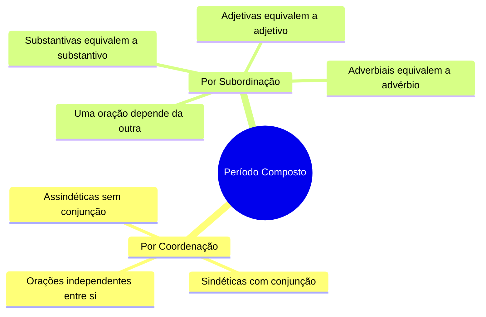
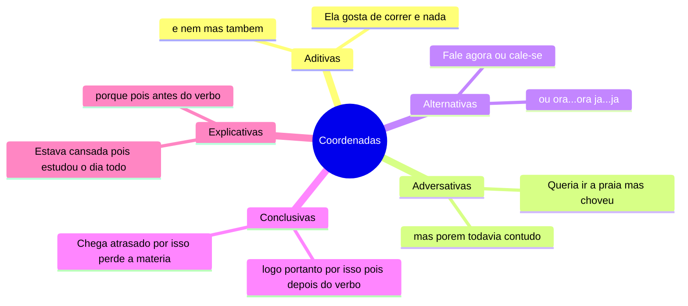
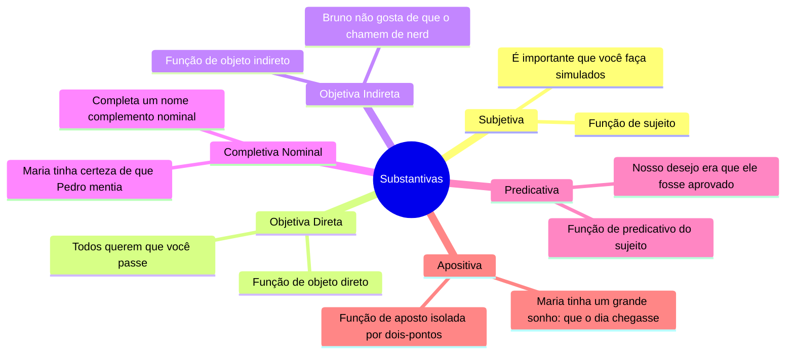
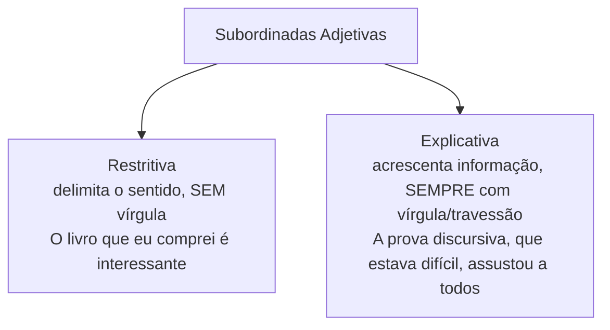
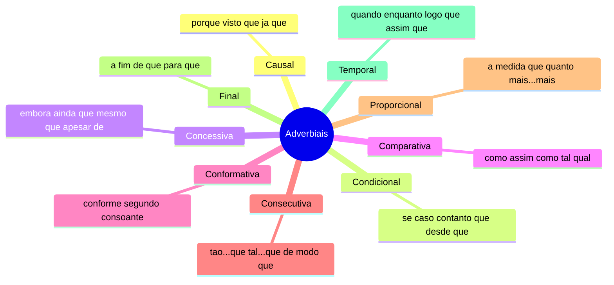
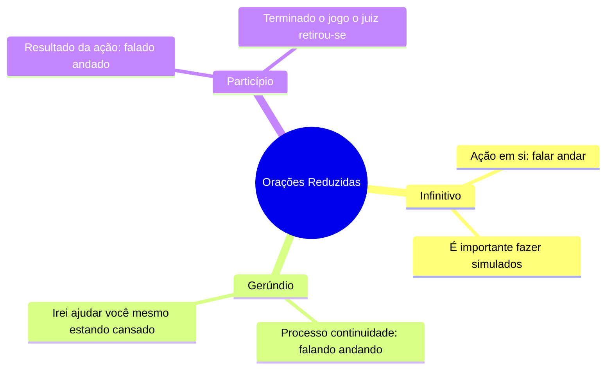

# 1️⃣4️⃣ Sintaxe do Período Composto

⬅️ [[13b-Sintaxe-do-Período-Simples-Termos]] | ➡️ [[15-Semântica]]

> [!important] Relevância prática
> Aqui mora o famoso "Bônus: Orações Subordinadas" da apostila — item que mais assusta, mas que segue uma lógica simples: cada oração subordinada equivale a **uma classe de palavras** (substantivo, adjetivo ou advérbio) dentro da oração principal.

## 🧠 Visão geral

## 🔗 Coordenação

> [!tip] Bizu do "pois" (revisão rápida)
> **Antes** do verbo = explicativa. **Depois** do verbo = conclusiva.

## 🧩 Subordinadas Substantivas — equivalem a um substantivo

> [!danger] Pegadinha de banca
> **Subjetiva** tem gatilho de verbo de ligação + predicativo (*é importante que...*), verbo na voz passiva (*sabe-se que...*) ou verbos como *cumprir, constar, ocorrer, convir*. Já a **Objetiva Direta** exige VTD/VTDI na oração principal (*todos querem que...*).

## 🎨 Subordinadas Adjetivas — equivalem a um adjetivo

> [!tip] Bizu decisivo
> Se **retirar a oração muda o sentido** do que está sendo referido → restritiva (sem vírgula). Se **retirar a oração só perde um detalhe**, mas o sentido geral permanece → explicativa (com vírgula).

## ⏱️ Subordinadas Adverbiais — equivalem a um advérbio

> [!example] Diferenciando causal x concessiva x condicional
> - Causal (motivo real): *Não haverá aula porque será feriado.*
> - Condicional (hipótese): *Convide-me, caso você passe no concurso.*
> - Concessiva (quebra de expectativa): *Irei ajudar você mesmo que eu esteja cansado.*

## ✂️ Orações Reduzidas

> [!note] Conceito
> Orações subordinadas **sem conectivo** (sem conjunção nem pronome relativo), com o verbo em forma nominal.

> [!example] Desenvolvida x Reduzida
> Desenvolvida: *Maria acorda cedo para que não se atrase ao trabalho.* (final, com conectivo)
> Reduzida: *Maria acorda cedo para não se atrasar ao trabalho.* (infinitivo, sem conectivo)

## ✍️ Pratique agora
> [!todo]- Exercício de fixação
> Classifique a oração destacada: "É fundamental **que você tire todas as suas dúvidas**." / "O livro **que eu comprei na livraria** é interessante." / "Ninguém podia atender **enquanto não acabasse a aula**."
>
> *Gabarito*: subordinada substantiva subjetiva / subordinada adjetiva restritiva / subordinada adverbial temporal.

## ❓ Autoavaliação
> [!question]
> - Consigo transformar uma oração desenvolvida em reduzida (e vice-versa) sem erro?
> - Sei justificar, com o teste de "retirar a oração", se uma adjetiva é restritiva ou explicativa?

#revisar
