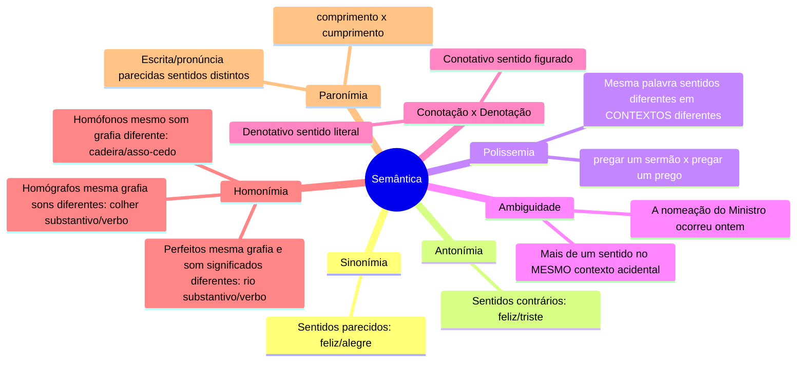

# 1️⃣5️⃣ Semântica

⬅️ [[14-Sintaxe-do-Período-Composto]] | ➡️ [[16-Concordância-Verbal-e-Nominal]]

> [!important] Relevância prática
> Semântica é o estudo do sentido — item indispensável tanto para interpretação de texto quanto para questões que pedem "substitua sem alterar o sentido" ou "aponte a ambiguidade".

## 🧠 Mapa mental

> [!tip] Bizu — Polissemia x Ambiguidade
> Polissemia é **saudável**: a palavra muda de sentido em **contextos diferentes**, sem gerar confusão. Ambiguidade é um **problema de clareza**: dois sentidos possíveis no **mesmo** contexto, gerando dúvida real.

> [!example] Ambiguidade em ação
> *O guarda prendeu o suspeito em sua casa.* — "sua casa" pode ser do suspeito ou do guarda: duplo sentido no mesmo trecho.

## 🔤 Homônimos — os três tipos

| Tipo | Grafia | Som | Exemplo |
|---|---|---|---|
| Homógrafos | igual | diferente | *colher* (substantivo) x *colher* (verbo, com timbre aberto) |
| Homófonos | diferente | igual | *cessão* x *sessão* x *seção* |
| Perfeitos | igual | igual | *rio* (substantivo: curso d'água) x *rio* (verbo: rir) |

> [!danger] Pegadinha — Parônimos famosos
> *comprimento* (medida) x *cumprimento* (saudação) / *tráfego* (trânsito) x *tráfico* (comércio ilegal) / *soar* (som) x *suar* (transpirar).

## ✍️ Pratique agora
> [!todo]- Exercício de fixação
> Classifique: "Ela **rio**" (verbo) x "banhar no **rio**" (substantivo). Homônimos ___? "Eu **suei** muito hoje" x "o **som** vai **soar** alto". Qual par de parônimos aparece?
>
> *Gabarito*: perfeitos (mesma grafia e som) / suar x soar.

## ❓ Autoavaliação
> [!question]
> - Consigo diferenciar polissemia de ambiguidade com meus próprios exemplos?
> - Sei apontar 3 pares de parônimos de cor?

#revisar
