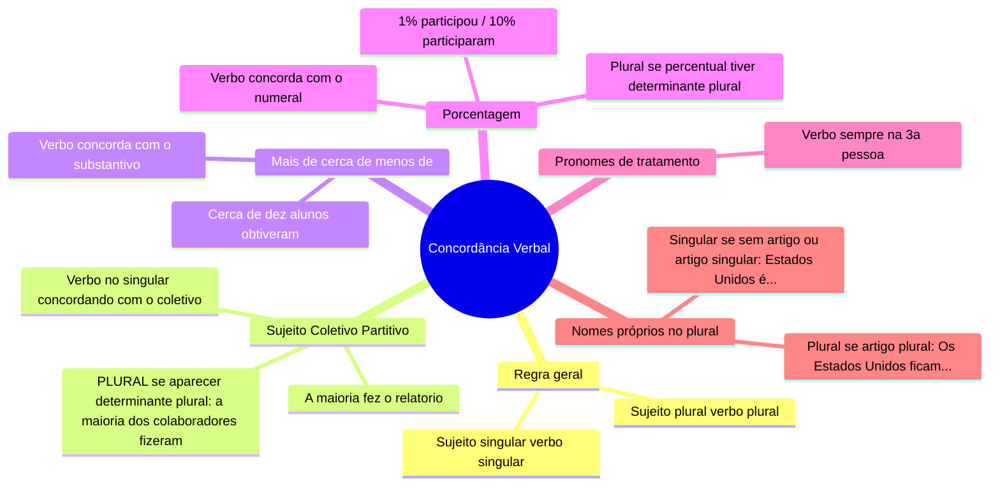
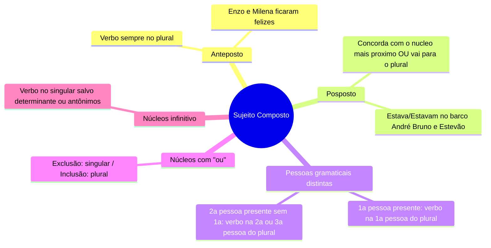
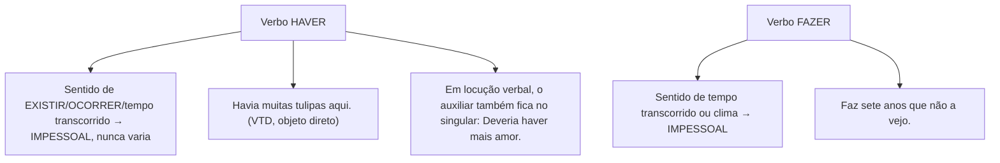
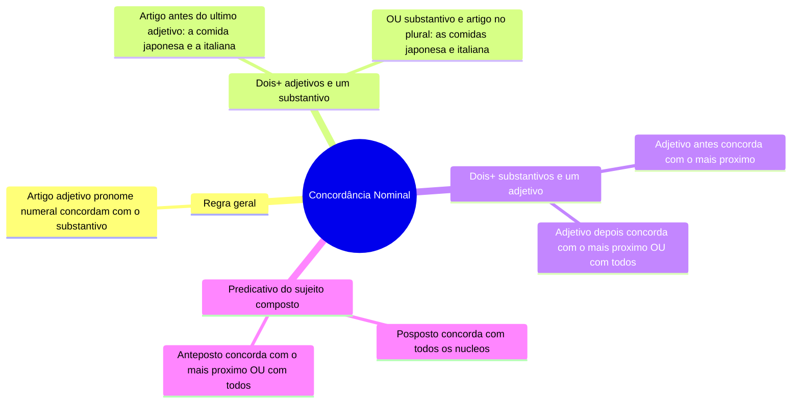

# 1️⃣6️⃣ Concordância Verbal e Nominal

⬅️ [[15-Semântica]] | ➡️ [[17-Regência-Verbal-e-Nominal]]

> [!important] Relevância prática
> Concordância é o tópico mais cobrado em provas objetivas porque tem **exceções lógicas**, não arbitrárias. Entendendo a lógica de cada exceção (em vez de decorar frases soltas), você resolve variações nunca vistas antes.

## 🧠 Concordância Verbal — regra geral e sujeito simples

> [!danger] Pegadinha do coletivo/partitivo
> "A maioria fez" (singular, concorda com "maioria") **ou** "A maioria dos colaboradores fez/fizeram" — aqui as DUAS formas são aceitas (concordando com "maioria" OU com o determinante plural "colaboradores"). O erro é: "A maioria fizeram" (sem determinante plural, plural é errado).

## 🔗 Sujeito Composto

> [!example] "ou" — exclusão x inclusão
> - Exclusão: *Maria ou Helena casará com João.* (só uma das duas)
> - Inclusão: *Machado de Assis ou Lispector representam a literatura clássica.* (ambos podem representar)

## 🧮 Verbo SER — regra especial

> [!note] Regra geral
> Concorda em número e pessoa com o **sujeito**: *Tudo isso é espetacular!*

> [!tip] Bizu — preferência pelo plural
> Se o sujeito está no **singular** e o predicativo no **plural** (ou vice-versa), o verbo tende a concordar com o **plural**: *As notas dele foram a esperança da turma.*

> [!example] Verbo SER impessoal
> Indica hora, data ou distância — concorda com o **numeral**, não tem sujeito:
> *Já são 22h.* / *Até o banco são 2 km.*
> **Exceção**: quando "dia" está mais próximo do numeral: *Hoje é dia 15 de janeiro.*

## 🌊 Verbos impessoais — HAVER e FAZER

> [!danger] A pegadinha mais recorrente de toda a gramática
> ❌ *Haviam muitos problemas.* — ERRADO, mesmo que "pareça" natural.
> ✅ *Havia muitos problemas.* — CERTO, pois "haver" (existir) é sempre impessoal.

## 🎨 Concordância Nominal

> [!note] Palavras variáveis conforme a função (adjetivo x advérbio)
> **Bastante, caro, alto, meio, só**: variam quando são **adjetivos**, ficam invariáveis quando são **advérbios**.
> - *Venderam bastantes livros.* (adjetivo, varia) / *Maria estuda bastante.* (advérbio, invariável)
> - *Os livros estão caros.* (adjetivo) / *Os livros custam caro.* (advérbio)
> - *Coloquei meia xícara de café.* (adjetivo) / *Mariana está meio triste.* (advérbio)

> [!tip] Bizu — "é proibido / é bom / é necessário"
> Variam **só** quando o substantivo vem acompanhado de determinante (artigo):
> - *É proibido entrar.* (invariável, sem artigo) / *É proibida a entrada de animais.* (varia, com artigo "a")

## ✍️ Pratique agora
> [!todo]- Exercício de fixação
> Corrija se necessário: "Haviam muitos alunos na sala." / "A maioria dos professores concordou." / "As meninas ficaram meia cansadas."
>
> *Gabarito*: "Havia muitos alunos..." (impessoal) / correto (concorda com "maioria" ou "professores", ambas aceitas) / "meio cansadas" (advérbio, invariável).

## ❓ Autoavaliação
> [!question]
> - Eu memorizei definitivamente que "haver" (existir) nunca flexiona?
> - Consigo diferenciar "bastante/meio/caro" adjetivo de advérbio em qualquer frase nova?

#revisar
