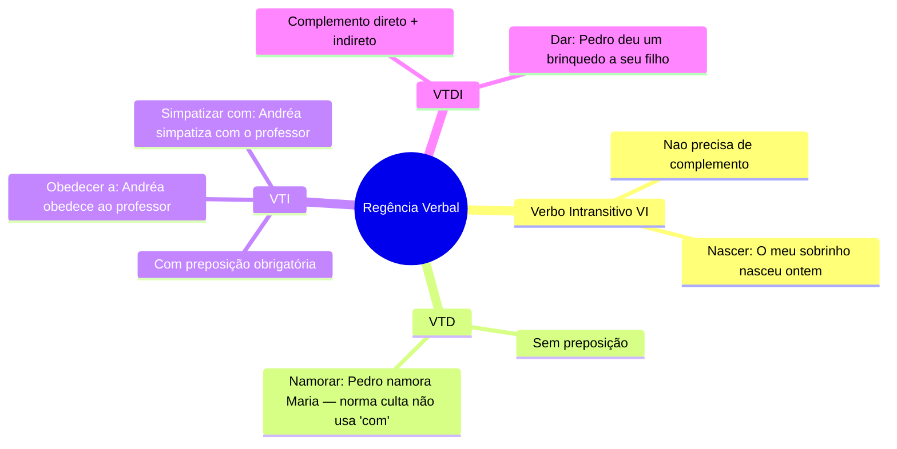
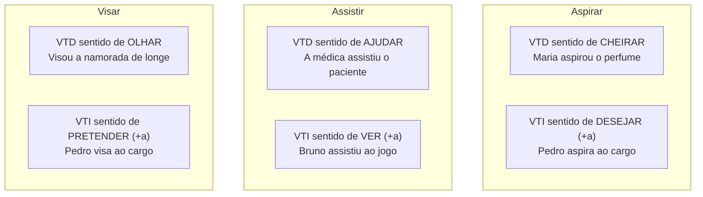
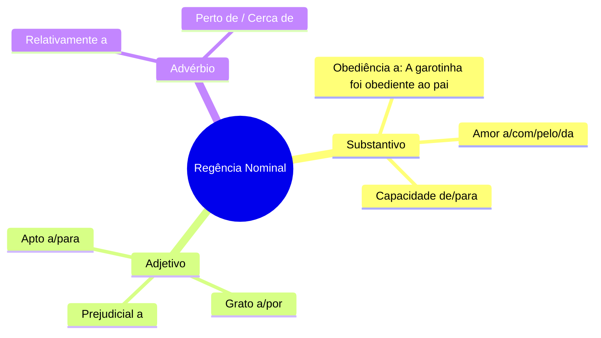

# 1️⃣7️⃣ Regência Verbal e Nominal

⬅️ [[16-Concordância-Verbal-e-Nominal]] | ⬆️ [[00-Índice]]

> [!important] Relevância prática
> Regência é o elo entre sintaxe e crase: saber **qual preposição** cada verbo/nome exige evita erros de crase, de objeto e resolve boa parte das questões de "reescrita sem erro" nas provas. É também o item mais ligado à fala cotidiana ("assistir o filme" x "assistir ao filme").

## 🧠 Conceito

> [!note]
> Regência estabelece a relação entre o termo **regente** (verbo ou nome) e o termo **regido** (complemento), definindo se há ou não preposição — e qual.

## 🔤 Regência Verbal — pelo tipo de verbo

> [!danger] Pegadinha do "chegar"
> Norma culta: **chegar A** algum lugar (não "chegar EM"). *Ela chegou a casa.* (certo, na norma culta) x *Ela chegou em casa.* (coloquial, evitar em prova).

## ⚖️ Verbos de dupla regência (mudam de sentido conforme a preposição)

> [!example] Mais verbos de dupla regência
> - **Lembrar**: VTD (trazer à memória) *Essa música lembra minha infância.* / VTDI (advertir) *Marina lembrou a ele o acordo.* / VTI, com "-se" (recordar) *Eu me lembro da minha infância.*
> - **Implicar**: VTD (causar) *A decisão implicou mudanças.* / VTI (importunar) *Os alunos implicaram com o novato.*
> - **Responder**: VTD (a resposta em si) *Ela respondeu que viria.* / VTI (a pessoa) *Respondeu ao aluno.* / VTDI (os dois) *Amanda respondeu a pergunta ao professor.*

> [!tip] Bizu mestre
> Sempre que um verbo tiver "dois sentidos possíveis" na questão, **primeiro identifique o sentido no contexto**, depois aplique a preposição — a regência muda **de acordo com o significado**, não é aleatória.

## 🧷 Regência Nominal — substantivo, adjetivo, advérbio

> [!note] Bizu — nome e verbo da mesma família
> Muitos substantivos herdam a regência do verbo de origem: *obediência* (de obedecer, regência "a") → *obediente ao pai*.

## ✍️ Pratique agora
> [!todo]- Exercício de fixação
> Complete com a preposição correta (ou marque "sem preposição"): "Ele aspira ___ um cargo melhor." / "Assisti ___ o jogo ontem." / "Ela é grata ___ Deus."
>
> *Gabarito*: "aspira a" (VTI, sentido de desejar) / "assisti ao jogo" (VTI, sentido de ver) / "grata a Deus".

## ❓ Autoavaliação
> [!question]
> - Consigo listar de cor pelo menos 5 verbos de dupla regência com seus dois sentidos?
> - Sei explicar por que "chegar em casa" é evitado na norma culta?

## 🎓 Fechamento do vault
> [!important] Consolidação final (andragogia)
> Volte ao [[00-Índice]] e refaça o checklist de domínio. Se ainda houver itens não marcados, volte à nota correspondente **antes** de considerar o assunto encerrado — revisão ativa vale mais do que releitura passiva.

#revisar
