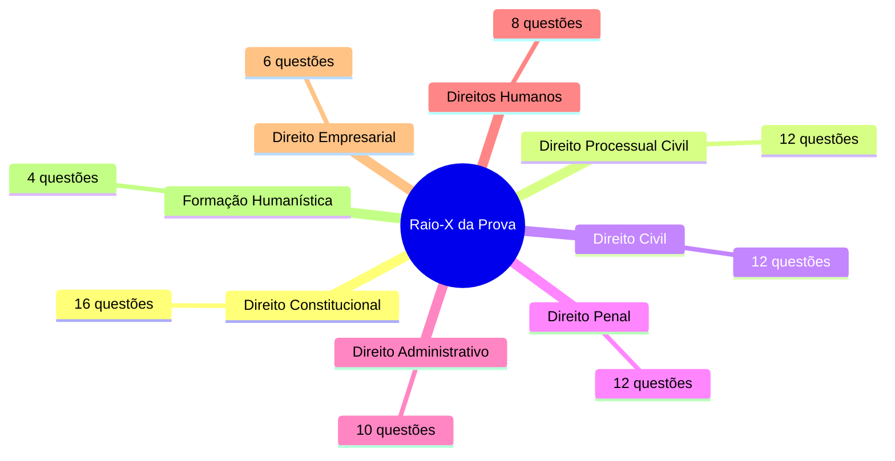

```mermaid
mindmap
  root((Raio-X da Prova))
    Direito Constitucional
      16 questões
    Direito Processual Civil
      12 questões
    Direito Civil
      12 questões
    Direito Penal
      12 questões
    Direito Administrativo
      10 questões
    Direitos Humanos
      8 questões
    Direito Empresarial
      6 questões
    Formação Humanística
      4 questões
```

